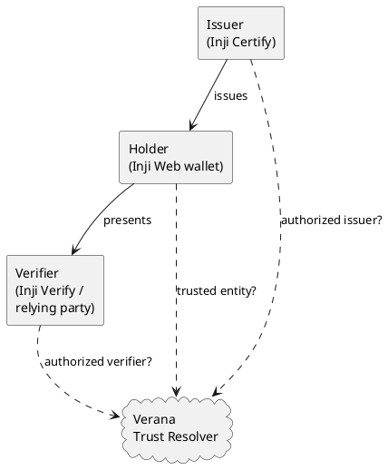

# MOSIP

<p align="center">
  
</p>

**Verifiable trust for MOSIP Inji credentials, on the Verana Trust Network.** A live public pilot that runs real [MOSIP Inji](https://docs.inji.io/) components with a thin Verana trust layer on top.

A digitally signed credential tells you the data wasn't tampered with. It does not tell you whether the issuer is a real, accredited authority, or whether the verifier asking for your data is one you should trust. That gap is where fraud and over-collection live.

This integration wires the Verana Trust Network into the MOSIP Inji stack so that, at every point in the credential lifecycle, a participant can ask the chain "is this party actually trusted, and authorized for this exact credential?" and get a fail-closed answer, before anything sensitive is issued, presented, or accepted.

> A valid signature proves a credential is **authentic**. Verana proves the issuer is **accredited** and the verifier **accountable**. Authenticity is not legitimacy.

Every trust check fails closed: unknown, untrusted, or unauthorized always means deny, never allow.

:::tip Try it now
The fastest way to see the whole thing is the hosted playground: **[playground.mosip.testnet.verana.network](https://playground.mosip.testnet.verana.network)**. It walks through the integration end to end with a live trust-verdict widget, no setup.
:::

## Integrate, don't fork

Every MOSIP component runs its official image; the two Inji UIs (Verify and Web) layer a small browser add-on on top of that image, with no source fork. Verana trust is added as additive pieces: browser-side trust widgets that hook the Inji UI's own network calls and render a verdict, plus on-chain registration and a **Trust Resolver** the components consult. The design started out expecting to fork the Inji apps; the as-built result proved the add-on pattern needs no fork at all.

At the center is the trust triangle, issuer, holder and verifier, each checked against the Verana resolver:



The Trust Resolver answers three questions, and the integration fails closed on all of them:

- **Trusted?** is this DID a trusted entity on the network?
- **Issuer authorized?** is this issuer authorized for this exact credential type?
- **Verifier authorized?** is this verifier authorized to request it?

## The four phases

Each phase is a real, independently verifiable step. The full design and runbooks live in the [`mosip-playground`](https://github.com/verana-labs/mosip-playground) repo.

**Phase 0, issue.** A real Inji Certify deployment becomes a first-class Verana member: it issues a Foundational Resident ID that carries the Verana credential schema, and its DID resolves as trusted and as an authorized issuer for that credential.

**Phase 1, verify the issuer.** Inji Verify checks the credential's signature as usual, then a Verana trust panel shows who issued it and whether they're accredited, failing closed on untrusted or unauthorized issuers. Signature-valid becomes issuer-accredited, with no fork of Inji Verify.

**Phase 2, protect the holder.** Before an Inji Web wallet presents a credential, it asks Verana whether the relying party is a trusted, authorized verifier, shows the holder who is asking, and blocks unknown or over-asking verifiers before any attribute leaves the wallet.

**Phase 3, governance and economics.** The ecosystem governs and funds itself on-chain, under a real Ecosystem Governance Framework. A *grantor* (a delegated accreditor) onboards a second issuer with no transaction from the ecosystem root; credential schemas carry trust deposits and per-issuance and per-verification fees; and misbehaviour is punished by *slashing*, where a member's deposit is burned, then repaid. A second, fully independent ecosystem runs alongside the first, proving the model isn't a single-tenant special case.

## The four verdicts

Upload a credential to [Inji Verify](https://inji-verify-ui.mosip.testnet.verana.network) and the Verana trust panel renders one of four outcomes. This is the whole point of the integration in one screen:

<p align="center">
  
</p>

| Credential | Signature | Verana verdict |
|---|---|---|
| Real Certify-issued Resident ID | valid | **Accredited issuer** |
| Self-signed, valid but not on the network | valid | **Untrusted** |
| Trusted issuer, wrong credential type | valid | **Not accredited** for this type |
| Tampered | invalid | **Rejected** at the signature |

Sample QR codes for every outcome are in the repo under [`docs/test-qrs`](https://github.com/verana-labs/mosip-playground/tree/main/docs/test-qrs).

## Try it yourself

- **Playground**, no setup: [playground.mosip.testnet.verana.network](https://playground.mosip.testnet.verana.network), a guided walkthrough of all four phases with a live resolver widget. Issue a real credential as a seeded resident, then check any party's verdict.
- **Verify a credential**: [Inji Verify](https://inji-verify-ui.mosip.testnet.verana.network), upload a Resident ID QR and watch the MOSIP result next to the Verana panel.
- **Hold and present**: sign in to the [Inji Web wallet](https://inji-web.mosip.testnet.verana.network) and download the Foundational Resident ID; its Verana gate blocks unknown or over-asking verifiers before anything is shared. The [playground](https://playground.mosip.testnet.verana.network) walks this block through end to end.
- **Ask the resolver directly:**

```bash
curl -sG https://resolver.testnet.verana.network/v1/trust/issuer-authorization \
  --data-urlencode 'did=did:web:inji-certify-vs.mosip.testnet.verana.network' \
  --data-urlencode 'vtjscId=https://organization-vs.mosip.testnet.verana.network/vt/schemas-resident-id-jsc.json'
# -> {"authorized": true, ...}
```

Here `vtjscId` is the id of the credential schema the resolver keys authorization on.

## On the Verana chain

The pilot runs on `vna-testnet-1` under a demonstration ecosystem, the **MOSIP Pilot Authority**:

- **Trust Registry [167](https://app.testnet.verana.network/tr/167)**, the ecosystem, browsable in the frontend.
- **Credential schema [241](https://app.testnet.verana.network/tr/cs/241)**, the Foundational Resident ID (`fullName`, `dateOfBirth`, `identifier`).
- An on-chain **Ecosystem Governance Framework** setting membership, accreditation modes, economics, revocation, holder protection, and slashing.

## Under the hood

The integration is built and operated in the open. For the deep design, the phase-by-phase runbooks, and the deployment setup, see:

- the [`verana-labs/mosip-playground`](https://github.com/verana-labs/mosip-playground) repo, with phase write-ups in `docs/`
- MOSIP Inji: [Inji Certify](https://docs.inji.io/inji-certify), [Inji Verify](https://docs.inji.io/inji-verify), [Inji Web](https://docs.inji.io/inji-wallet/inji-web)
- the [Verana Trust Resolver](https://github.com/verana-labs/verre)

:::note
This is a testnet pilot on synthetic identities, with no binding legal obligation. One upstream item is still open: on-chain revocation is recorded, but the resolver does not yet reflect the revoked flag ([verre#107](https://github.com/verana-labs/verre/issues/107)), so a revocation does not yet flip the verdict shown in Inji Verify or the wallet.
:::
