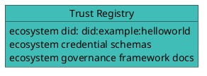

# Examples

## Hello World Ecosystem

An Ecosystem called "Hello World" would like to create a Credential Schema called "Example Credential Schema".

### Create Trust Registry

> In the Verana Verifiable Trust Network:

First, Ecosystem creates its Trust Registry, upload governance framework documents, and creates the "Example Credential Schema".



### Create Credential Schema

> In the Verana Verifiable Trust Network:

Second, Ecosystem will, create the credential schema. For simplicity here we just show the json schema:

```json
{
  "$id": "vpr:verana:mainnet/cs/v1/js/VPR_CREDENTIAL_SCHEMA_ID",
  "$schema": "https://json-schema.org/draft/2020-12/schema",
  "title": "ExampleCredential",
  "description": "ExampleCredential using JsonSchema",
  "type": "object",
  "properties": {
    "credentialSubject": {
      "type": "object",
      "properties": {
        "id": {
          "type": "string",
          "format": "uri"
        },
        "firstName": {
          "type": "string",
          "minLength": 0,
          "maxLength": 256
        },
        "lastName": {
          "type": "string",
          "minLength": 1,
          "maxLength": 256
        },
        "expirationDate": {
          "type": "string",
          "format": "date"
        },
        "countryOfResidence": {
          "type": "string",
          "minLength": 2,
          "maxLength": 2
        }
      },
      "required": [
        "id",
        "lastName",
        "birthDate",
        "expirationDate",
        "countryOfResidence"
      ]
    }
  }
}
```

### Create Json Schema Credential

> Outside of the scope of the Verana Verifiable Trust Network:

Third, Ecosystem controller self-issues (with its ecosystem did) a Json Schema Credential that will refer the Json Schema in the Verana Verifiable Trust Network:

```json
{
  "@context": [
      "https://www.w3.org/ns/credentials/v2"
  ],
  "id": "https://hw-ecosystem/shemas-example-jsc.json",
  "type": ["VerifiableCredential", "JsonSchemaCredential"],
  "issuer": "did:example:helloworld",
  "issuanceDate": "2024-01-01T19:23:24Z",
  "credentialSchema": {
    "id": "https://www.w3.org/ns/credentials/json-schema/v2.json",
    "type": "JsonSchema",
    "digestSRI": "sha384-S57yQDg1MTzF56Oi9DbSQ14u7jBy0RDdx0YbeV7shwhCS88G8SCXeFq82PafhCrW"
  },
  "credentialSubject": {
    "id": "vpr:verana:mainnet/cs/v1/js/12345678",
    "type": "JsonSchema",
    "jsonSchema": {
      "$ref": "vpr:verana:mainnet/cs/v1/js/12345678"
    },
    "digestSRI": "sha384-ABCSGyugst67rs67rdbugsy0RDdx0YbeV7shwhCS88G8SCXeFq82PafhCeZ" 
  }
}
```

