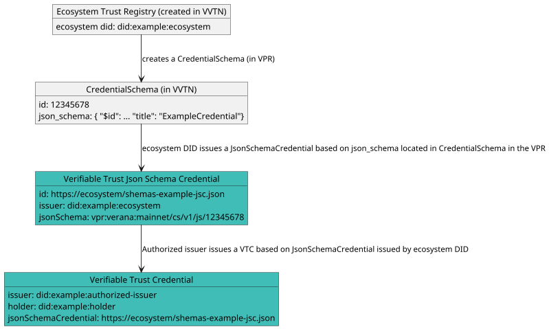

# Credential Schemas

When an ecosystem has created its `Trust Registry` in the VVTN, it can create and manage credential schemas.

Here is the process for publishing a given credential schema, and make it usable by ecosystem participants:

1. Ecosystem creates and configure a `Credential Schema` entry in the VVTN, linked to its `Trust Registry`. Entry includes a **JSON schema**.
2. Ecosystem issues, with its ecosystem DID, a **verifiable trust JSON schema credential**, which is a [json schema credential](https://www.w3.org/TR/vc-json-schema/) linked to the **JSON schema** created in the VVTN.
3. Ecosystem presents, in its DID document the **verifiable trust JSON schema credential** as a [linked verifiable presentation](https://identity.foundation/linked-vp/), and declares the VVTN in a "service" section.

Then, authorized issuers can issue **verifiable trust credentials** linked to the **verifiable trust JSON schema credential** issued by ecosystem DID.



:::note
Data stored in the VVTN is not verified at the time of storage, nor does it need to be. Verification happens outside the scope of the VVTN.

This is not a limitation, it’s a feature. For example, any DID method can be used, and the VPR will never attempt to resolve or validate DIDs itself.

The VVTN provides registrations, not validations, leaving trust decisions and verification where they belong: **with the relying parties**.
:::

## 1. Creating the Credential Schema Entry

In the VVTN, each created `Credential Schema` includes a **JSON schema** that defines the structure of its corresponding **verifiable credential**.

Here is an example of a JSON schema:

```json
{
  "$id": "vpr:verana:mainnet/cs/v1/js/12345678",
  "$schema": "https://json-schema.org/draft/2020-12/schema",
  "title": "ExampleCredential",
  "description": "ExampleCredential using JsonSchema",
  "type": "object",
  "properties": {
    "credentialSubject": {
      "type": "object",
      "properties": {
        "id": {
          "type": "string",
          "format": "uri"
        },
        "firstName": {
          "type": "string",
          "minLength": 0,
          "maxLength": 256
        },
        "lastName": {
          "type": "string",
          "minLength": 1,
          "maxLength": 256
        },
        "expirationDate": {
          "type": "string",
          "format": "date"
        },
        "countryOfResidence": {
          "type": "string",
          "minLength": 2,
          "maxLength": 2
        }
      },
      "required": [
        "id",
        "lastName",
        "birthDate",
        "expirationDate",
        "countryOfResidence"
      ]
    }
  }
}
```

## 2. Creating the JSON Schema Credential

Ecosystem issues, with its ecosystem DID, a **verifiable trust JSON schema credential**, which is a [json schema credential](https://www.w3.org/TR/vc-json-schema/) linked to the **JSON schema** created in the VVTN.

This credential serves as a verifiable proof of:

- Ownership of the `Credential Schema` created in the VVTN;
- Control over the corresponding `Trust Registry` ecosystem DID.

```json
{
  "@context": [
      "https://www.w3.org/ns/credentials/v2"
  ],
  "id": "https://ecosystem/shemas-example-jsc.json",
  "type": ["VerifiableCredential", "JsonSchemaCredential"],
  "issuer": "did:example:ecosystem",
  "issuanceDate": "2024-01-01T19:23:24Z",
  "credentialSchema": {
    "id": "https://www.w3.org/ns/credentials/json-schema/v2.json",
    "type": "JsonSchema",
    "digestSRI": "sha384-S57yQDg1MTzF56Oi9DbSQ14u7jBy0RDdx0YbeV7shwhCS88G8SCXeFq82PafhCrW"
  },
  "credentialSubject": {
    "id": "vpr:verana:mainnet/cs/v1/js/12345678",
    "type": "JsonSchema",
    "jsonSchema": {
      "$ref": "vpr:verana:mainnet/cs/v1/js/12345678"
    },
    "digestSRI": "sha384-ABCSGyugst67rs67rdbugsy0RDdx0YbeV7shwhCS88G8SCXeFq82PafhCeZ" 
  }
}
```

## 3. Updating the Ecosystem DID Document

Finally, ecosystem presents, in its DID document, the **verifiable trust JSON schema credential** as a [linked verifiable presentation](https://identity.foundation/linked-vp/), and declares the VVTN in a "service" section.

This ensures that the credential schema and its controlling trust registry are publicly discoverable and cryptographically verifiable.

```json
"service": [
    {
      "id": "did:example:ecosystem#vpr-schemas-example-jsc-vp",
      "type": "LinkedVerifiablePresentation",
      "serviceEndpoint": ["https://ecosystem/schemas-example-jsc-vp.json"]
    },
    {
      "id": "did:example:trust-registry#vpr-schemas-trust-registry-1234",
      "type": "VerifiablePublicRegistry",
      "version": "1.0",
      "serviceEndpoint": ["vpr:verana:mainnet"]
    }
    ...
  ]
```

Then, authorized issuers can issue **verifiable trust credentials** linked to the **verifiable trust JSON Schema Credential** issued by ecosystem DID.
