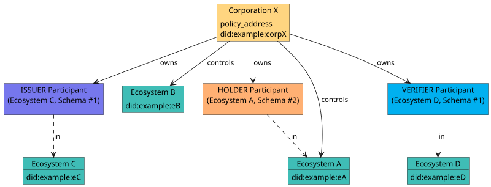

# Corporations

## What is a Corporation?

A **Corporation** is the foundational actor of a Verifiable Public Registry (VPR). It is the VPR-level entity that represents an authority acting in the registry: it controls Ecosystems, owns Participant entries, and holds a Trust Deposit. Almost every other entity in the registry — `Ecosystem`, `CredentialSchema` (through its ecosystem), `Participant`, `GovernanceFrameworkVersion`, `TrustDeposit` — points back to a Corporation through a `corporation_id` foreign key.

A `Corporation` carries VPR-specific attributes and is anchored on-chain by a **`policy_address`** account that signs on its behalf:

- `id` — the numeric primary key other entities reference as `corporation_id`.
- `policy_address` — the on-chain account that signs transactions on behalf of the Corporation. It is globally unique: no two Corporations share the same `policy_address`.
- `did` — the resolvable DID of the Corporation, globally unique across Corporations.
- `language` — primary language tag (BCP 47).
- `active_version` — the active Corporation Governance Framework (CGF) version.

(Spec: [Corporation Management](https://verana-labs.github.io/verifiable-trust-vpr-spec/) — non-normative overview, and the `Corporation` data model, `MOD-CO-MSG-1`.)

:::info Replaces the old "authority"
In earlier versions of Verana, resources were owned by a bare "authority" account. In v4 that loose notion is replaced by the `Corporation` — a first-class, governance-capable entity. Wherever older material said "authority", read **Corporation**.
:::

## Group-based governance

Under the hood, a Corporation's `policy_address` can be any account able to sign — a single key, a multisig, or a **[Cosmos SDK `x/group`](https://docs.cosmos.network/main/build/modules/group) group policy**. The reference implementation provisions it as a group policy, which gives a Corporation **multi-member, on-chain governance** out of the box:

- a **group** holds the Corporation's members, each with a voting `weight`;
- a **group policy** defines the **decision policy** (a threshold or a percentage of the total weight) required to execute a proposal;
- the resulting **`policy_address`** is the Corporation's on-chain identity.

Any action taken on behalf of the Corporation — updating its DID, creating an Ecosystem, granting an operator — is either signed directly by the `policy_address` (through a group proposal that members vote on) or by an authorized **operator** (see below). How the account is provisioned is an implementation concern; the data model only cares that a single `policy_address` signs for the Corporation.

## Operators and delegation

Voting on a group proposal for every routine transaction would be impractical. A Corporation therefore delegates day-to-day execution to **operators**: regular accounts authorized to submit specific message types on the Corporation's behalf.

- The Corporation grants an operator an **`OperatorAuthorization`** that allow-lists the exact message type-URLs the operator may sign, optionally with a spend limit and an expiry.
- A transaction executed by an operator is signed with the operator's key but acts **on behalf of the Corporation** — it is a *delegable* transaction that carries the Corporation as an argument.
- A separate **`VSOperatorAuthorization`** (with per-Participant `ParticipantAuthorizationRecord` entries) delegates the narrower right to manage a Participant's sessions to a verifiable-service operator account.

This separation lets a Corporation keep governance in the hands of its members while allowing automated agents and operators to carry out the high-volume work.

## Controls vs. owns

A Corporation interacts with the VPR in two **independent** ways:

- as the **controller** of zero or more **Ecosystems** — it owns the corresponding `Ecosystem` entries and manages each ecosystem's governance framework (EGF), credential schemas, and root `ECOSYSTEM` Participant entries;
- as the **owner** of zero or more **Participant** entries in zero or more ecosystems — acting as `ISSUER`, `VERIFIER`, `ISSUER_GRANTOR`, `VERIFIER_GRANTOR`, or `HOLDER` for credential schemas of those ecosystems.

The two roles are decoupled: a Corporation may control no ecosystem and only hold Participant entries in third-party ecosystems; or control several ecosystems and additionally hold Participant entries in others; or any combination.

## Governance frameworks: CGF and EGF

A `GovernanceFrameworkVersion` is owned by **exactly one** of an ecosystem or a corporation (XOR):

- an **Ecosystem Governance Framework (EGF)** governs the roles, permissions, and compliance rules **within an ecosystem**;
- a **Corporation Governance Framework (CGF)** governs the **Corporation itself** — how its members reach decisions and operate the entity.

Both are versioned and published as governance-framework documents (URL + `digest_sri`). Version 1 of the CGF is seeded when the Corporation is created.

## Trust deposit is per-Corporation

A Corporation's economic accountability is anchored by a single **`TrustDeposit`**, keyed by `corporation_id`. All trust-deposit growth, yield, and slashing accrue to the Corporation — not to individual accounts or Participant entries. See [Trust Deposit and Reputation](./trust-deposit-and-reputation).

:::tip Ready to create one?
This page is conceptual. For the step-by-step transaction (building `MsgCreateCorporation`, funding the `policy_address`, granting an operator), see the how-to guide [Create a Corporation](../../use/ecosystems/corporation).
:::
