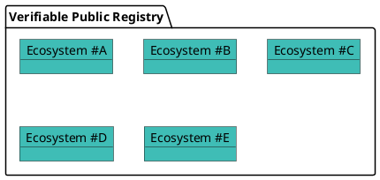
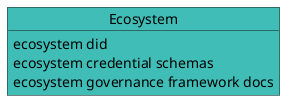

# Ecosystems

## What is an Ecosystem?

An **Ecosystem** is an approved list of recognized participants — ecosystem operators, credential issuers, and verifiers — that are authorized to onboard participants and/or issue and verify certain credentials within the ecosystem, in accordance with the ecosystem's governance rules.

An ecosystem typically exposes APIs that are consumed by services wishing to query its database and take decisions based on the returned result:

- can participant #1 issue a credential for schema ABC of ecosystem E1?
- can participant #2 request credential presentation of a credential issued by issuer DEF from schema GHI of ecosystem E2 in context CONTEXT?

An `Ecosystem` entry is always **controlled by a [Corporation](./corporations)** through a `corporation_id` foreign key. The controlling Corporation manages the ecosystem's governance framework, its credential schemas, and the root `ECOSYSTEM` Participant entries of those schemas.

## The Verifiable Public Registry

Corporations create the Ecosystems they control in the **Verana Verifiable Trust Network**, a Verifiable Public Registry (VPR).

A VPR is a **"registry of registries"**, a public service that provides foundational infrastructure for decentralized trust ecosystems, as specified in the [Verifiable Public Registry (VPR) specification](https://verana-labs.github.io/verifiable-trust-vpr-spec/). It offers Corporation lifecycle and directory services, ecosystem management, and a query API for trust resolution.

In a VPR, each `Ecosystem` entry specifies, at a minimum:

- an ecosystem-controlled resolvable DID;
- one or more ecosystem governance framework document(s);
- zero or more credential schemas.

A VPR is agnostic to the specific DID methods used. Trust resolution is performed externally, outside the VPR, allowing flexibility and interoperability across ecosystems.

:::info Corporation vs. Ecosystem
A **Corporation** is the *actor* — the governance-capable entity that signs transactions and holds the trust deposit. An **Ecosystem** is a *resource* the Corporation controls. One Corporation may control several Ecosystems; a single DID may even back several Ecosystem entries, provided they all share the same controlling Corporation. See [Corporations](./corporations).
:::

:::tip
To create and manage an Ecosystem entry, see the how-to guide [Create an Ecosystem](../../use/ecosystems/ecosystem/create-an-ecosystem).
:::
