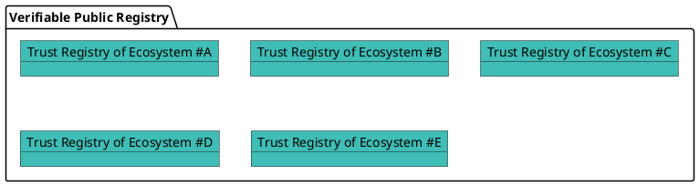
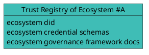

# Introduction to Verifiable Public Registry

## What is a Trust Registry?

A trust registry is an authoritative list of approved participants within an ecosystem, such as registry operators, credential issuers, and verifiers, who are authorized to onboard participants and issue or verify specific credentials in accordance with the ecosystem’s governance rules.

A trust registry typically expose APIs that are consumed by services that would like to query its database, and take decisions based on the returned result:

- is participant #1 recognized by ecosystem E1?
- can participant #1 issue credential for schema ABC of ecosystem E1?
- can participant #2 request credential presentation of credential issued by issuer DEF from schema GHI of ecosystem E2 in context CONTEXT?

## Verifiable Public Registry

Ecosystems creates their trust registry(ies) in the **Verana Verifiable Trust Network (VPR)**, a verifiable public registry (VPR).

A VPR is a **“registry of registries”**, a public, permissionless service that provides foundational infrastructure for decentralized trust ecosystems, as specified in the [Verifiable Public Registry (VPR) specification](https://verana-labs.github.io/verifiable-trust-vpr-spec/).

In a VPR, each created `Trust Registry` specifies:

- an ecosystem controlled resolvable DID
- One or more ecosystem governance framework document(s)
- Zero or more credential schemas

A VPR is agnostic to the specific DID methods used. Trust resolution is performed externally, outside the VPR, allowing flexibility and interoperability across ecosystems.
