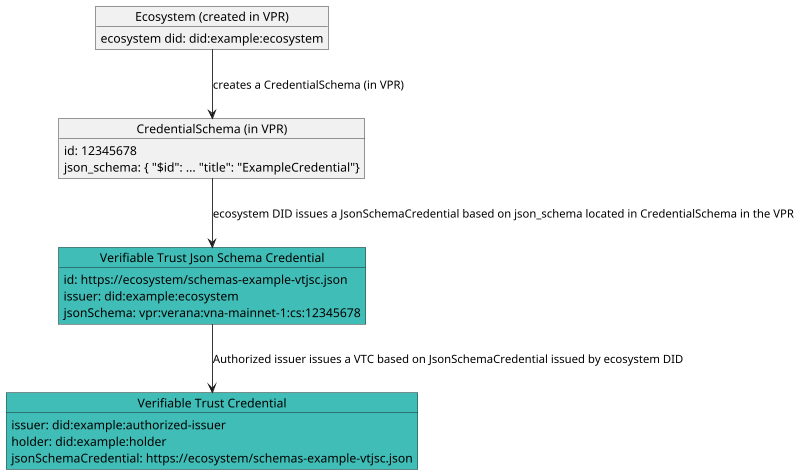

# Credential Schemas

Once a [Corporation](./corporations) controls an [Ecosystem](./ecosystems) in a VPR, it can create and manage that ecosystem's credential schemas.

Here is the process for publishing a given credential schema, and making it usable by ecosystem participants:

1. The ecosystem creates and configures a `Credential Schema` entry in the VPR, linked to its `Ecosystem`. The entry includes a **JSON schema**.
2. The ecosystem issues, with its ecosystem DID, a **Verifiable Trust JSON Schema Credential (VTJSC)**, which is a [json schema credential](https://www.w3.org/TR/vc-json-schema/) linked to the **JSON schema** created in the VPR.
3. The ecosystem presents, in its DID document, the **VTJSC** as a [linked verifiable presentation](https://identity.foundation/linked-vp/), and declares the VPR in a `service` entry.

Then, authorized issuers can issue **verifiable trust credentials (VTCs)** linked to the **VTJSC** issued by the ecosystem DID.



## What a Credential Schema entry configures

Beyond the **JSON schema**, a `Credential Schema` entry carries the policy and business configuration that governs how participants join the schema and how fees are denominated:

- **Onboarding modes** — one per role, which determine how `Participant` entries are created:
  - `issuer_onboarding_mode` and `verifier_onboarding_mode`: `OPEN`, `ECOSYSTEM_VALIDATION_PROCESS`, or `GRANTOR_VALIDATION_PROCESS`.
  - `holder_onboarding_mode`: `ISSUER_VALIDATION_PROCESS` or `PERMISSIONLESS`.

  These are covered in detail in [Onboarding Participants](./onboarding-participants).
- **Per-role validity periods** — `issuer_grantor_validation_validity_period`, `verifier_grantor_validation_validity_period`, `issuer_validation_validity_period`, `verifier_validation_validity_period`, and `holder_validation_validity_period` (in days) — after which an onboarding process expires and must be renewed.
- **Pricing configuration** — `pricing_asset_type` and `pricing_asset` define the asset in which the schema's fees are expressed:
  - `TU` — [trust units](./exchange-rate), converted to native denom through the Exchange Rate oracle at transaction time;
  - `COIN` — a token available on the VPR chain (e.g. `uvna`);
  - `FIAT` — a fiat currency (e.g. `USD`), meaning the chain is used for settlement only and payment happens off-chain.

  Note that trust deposits are always handled in native denom regardless of `pricing_asset_type`.
- **`digest_algorithm`** — the algorithm used to compute the `digestSRI` for credentials issued under this schema.

(Spec: `CredentialSchema` data model; onboarding modes and pricing fields.)

### Schema Authorization Policies

In addition to the schema entry itself, an ecosystem can attach versioned **`SchemaAuthorizationPolicy`** entries to a credential schema. Each policy is scoped to a single role (`ISSUER` or `VERIFIER`) and published as a document (URL + `digest_sri`), with `effective_from` / `effective_until` validity and a `revoked` flag. This lets an ecosystem state, immutably and by version, the rules a corporation must satisfy to act as issuer or verifier of the schema.

(Spec: `SchemaAuthorizationPolicy` data model.)

:::note
Data stored in the VPR is not verified at the time of storage, nor does it need to be. Verification happens outside the scope of the VPR.

This is not a limitation, it’s a feature. For example, any DID method can be used, and the VPR will never attempt to resolve or validate DIDs itself.

The VPR provides registrations, not validations, leaving trust decisions and verification where they belong: **with the relying parties**.
:::

## 1. Creating the Credential Schema Entry

In a VPR, each created `Credential Schema` includes a **JSON schema** that defines the structure of its corresponding **verifiable credential**.

Here is an example of a JSON schema:

```json
{
  "$id": "vpr:verana:vna-mainnet-1:cs:12345678",
  "$schema": "https://json-schema.org/draft/2020-12/schema",
  "title": "ExampleCredential",
  "description": "ExampleCredential using JsonSchema",
  "type": "object",
  "properties": {
    "credentialSubject": {
      "type": "object",
      "properties": {
        "id": {
          "type": "string",
          "format": "uri"
        },
        "firstName": {
          "type": "string",
          "minLength": 0,
          "maxLength": 256
        },
        "lastName": {
          "type": "string",
          "minLength": 1,
          "maxLength": 256
        },
        "countryOfResidence": {
          "type": "string",
          "minLength": 2,
          "maxLength": 2
        }
      },
      "required": [
        "id",
        "lastName",
        "countryOfResidence"
      ]
    }
  }
}
```

:::note The `vpr:` URI scheme
A credential schema stored in a VPR is referenced with a `vpr:` URI of the form `vpr:verana:<vpr-id>:cs:<credential-schema-id>`, where `<vpr-id>` is the identifier of the VPR (the chain id, e.g. `vna-mainnet-1` or `vna-testnet-1`) and `<credential-schema-id>` is the id of the `Credential Schema` entry.

Verifiable services and user agents maintain a list of the VPRs they trust, each declared with the `vpr:verana:<vpr-id>` scheme prefix and the API/RPC/resolver endpoints used to access it, so that a `vpr:` URI can be dereferenced. When creating a schema, `VPR_CHAIN_ID` and `VPR_CREDENTIAL_SCHEMA_ID` may be used as placeholders in `$id`; the VPR replaces them with the concrete values.
:::

## 2. Creating the JSON Schema Credential

Ecosystem issues, with its ecosystem DID, a **Verifiable Trust JSON Schema Credential (VTJSC)**, which is a [json schema credential](https://www.w3.org/TR/vc-json-schema/) linked to the **JSON schema** created in the VPR.

This credential serves as a verifiable proof of:

- control of the `Credential Schema` created in the VPR;
- control over the corresponding `Ecosystem` DID.

A VTJSC must be issued with the ecosystem DID recorded in the VPR, must declare the three types `VerifiableCredential`, `JsonSchemaCredential` and `VerifiableTrustJsonSchemaCredential`, and must reference the VPR `Credential Schema` entry through its `vpr:` URI:

```json
{
  "@context": [
      "https://www.w3.org/ns/credentials/v2"
  ],
  "id": "https://ecosystem/schemas-example-vtjsc.json",
  "type": ["VerifiableCredential", "JsonSchemaCredential", "VerifiableTrustJsonSchemaCredential"],
  "issuer": "did:example:ecosystem",
  "credentialSchema": {
    "id": "https://www.w3.org/ns/credentials/json-schema/v2.json",
    "type": "JsonSchema",
    "digestSRI": "sha384-S57yQDg1MTzF56Oi9DbSQ14u7jBy0RDdx0YbeV7shwhCS88G8SCXeFq82PafhCrW"
  },
  "credentialSubject": {
    "id": "vpr:verana:vna-mainnet-1:cs:12345678",
    "type": "JsonSchema",
    "jsonSchema": {
      "$ref": "vpr:verana:vna-mainnet-1:cs:12345678"
    },
    "digestSRI": "sha384-ABCSGyugst67rs67rdbugsy0RDdx0YbeV7shwhCS88G8SCXeFq82PafhCeZ" 
  }
}
```

## 3. Updating the Ecosystem DID Document

Finally, the ecosystem presents, in its DID document, the **VTJSC** as a [linked verifiable presentation](https://identity.foundation/linked-vp/), and declares the VPR it published the schema in with a `VerifiablePublicRegistry` service entry.

This ensures that the credential schema and its controlling ecosystem are publicly discoverable and cryptographically verifiable.

```json
"service": [
    {
      "id": "did:example:ecosystem#vpr-schemas-example-vtjsc-vp",
      "type": "LinkedVerifiablePresentation",
      "serviceEndpoint": ["https://ecosystem/schemas-example-vtjsc-vp.json"]
    },
    {
      "id": "did:example:ecosystem#vpr-schemas-ecosystem-1234",
      "type": "VerifiablePublicRegistry",
      "version": "1.0",
      "serviceEndpoint": ["vpr:verana:vna-mainnet-1"]
    }
    ...
  ]
```

Two kinds of entries appear here:

- **`LinkedVerifiablePresentation`** — one per published VTJSC. The fragment must start with `#vpr-schemas-` and end with `-vtjsc-vp`; the middle part (`example` above) is an arbitrary qualifier chosen by the ecosystem to keep fragments unique inside the DID document. The `serviceEndpoint` points to the verifiable presentation containing the VTJSC, self-issued and self-presented by the ecosystem DID.
- **`VerifiablePublicRegistry`** — declares the VPR the ecosystem is registered in, with a `version` and a `serviceEndpoint` holding the `vpr:` scheme prefix of that VPR (`vpr:verana:vna-mainnet-1` for Verana mainnet, `vpr:verana:vna-testnet-1` for testnet).

:::note Essential Credential Schemas use reserved fragments
The `-vtjsc-vp` fragment qualifier is free-form for ordinary schemas, but an ecosystem that provides [Essential Credential Schemas (ECS)](../verifiable-trust/ecs) must publish **exactly these five** fragments, one per ECS:

| ECS | DID Document fragment |
|---|---|
| Service | `#vpr-schemas-service-vtjsc-vp` |
| Organization | `#vpr-schemas-org-vtjsc-vp` |
| Persona | `#vpr-schemas-persona-vtjsc-vp` |
| User Agent | `#vpr-schemas-ua-vtjsc-vp` |
| Badge | `#vpr-schemas-badge-vtjsc-vp` |

```json
"service": [
    {
      "id": "did:example:ecosystem#vpr-schemas-service-vtjsc-vp",
      "type": "LinkedVerifiablePresentation",
      "serviceEndpoint": ["https://ecosystem/ecs-service-vtjsc-vp.json"]
    },
    {
      "id": "did:example:ecosystem#vpr-schemas-org-vtjsc-vp",
      "type": "LinkedVerifiablePresentation",
      "serviceEndpoint": ["https://ecosystem/ecs-org-vtjsc-vp.json"]
    },
    {
      "id": "did:example:ecosystem#vpr-schemas-persona-vtjsc-vp",
      "type": "LinkedVerifiablePresentation",
      "serviceEndpoint": ["https://ecosystem/ecs-persona-vtjsc-vp.json"]
    },
    {
      "id": "did:example:ecosystem#vpr-schemas-ua-vtjsc-vp",
      "type": "LinkedVerifiablePresentation",
      "serviceEndpoint": ["https://ecosystem/ecs-ua-vtjsc-vp.json"]
    },
    {
      "id": "did:example:ecosystem#vpr-schemas-badge-vtjsc-vp",
      "type": "LinkedVerifiablePresentation",
      "serviceEndpoint": ["https://ecosystem/ecs-badge-vtjsc-vp.json"]
    }
    ...
  ]
```

An ECS ecosystem must also configure its schema entries accordingly: the Service, Organization and Persona schemas set `holder_onboarding_mode` to `ISSUER_VALIDATION_PROCESS`, and the Badge schema sets `issuer_onboarding_mode` to `OPEN` and `holder_onboarding_mode` to `PERMISSIONLESS`.
:::

Then, authorized issuers can [issue verifiable trust credentials](./issuing-credentials) linked to the **VTJSC** issued by the ecosystem DID.
