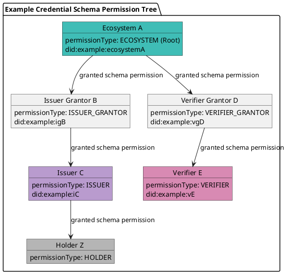
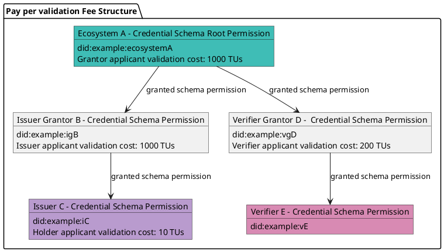
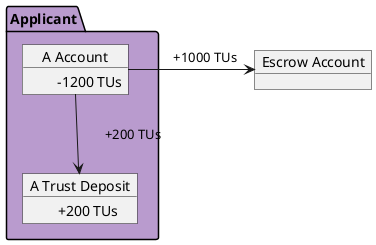
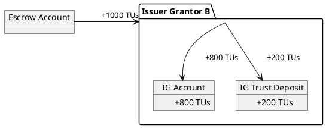

# Onboarding Participants

## Credential Schema Configuration

For each credential schema, ecosystems define how they want to onboard participants. Configuration is set when creating the `Credential Schema` in the VPR. Each `Credential Schema` entry includes:

- The **JSON schema**
- A **PermissionManagementMode** for **issuance policy**, which determines how ISSUER permissions are granted. Modes include:
  - `OPEN`: ISSUER permissions can be created by anyone.
  - `ECOSYSTEM`: ISSUER permissions are granted directly by the **ecosystem**, the trust registry controller
  - `GRANTOR`: ISSUER permissions are granted by one or several issuer grantor(s) (trust registry operator(s) responsible for selecting issuers for the credential schema of this **ecosystem**), selected by the **ecosystem**.

- A **PermissionManagementMode** for **verification policy**, which determines how VERIFIER permissions are granted. Modes include:
  - `OPEN`: VERIFIER permissions can be created by anyone.
  - `ECOSYSTEM`: VERIFIER permissions are granted directly by the **ecosystem**, the trust registry controller
  - `GRANTOR`: VERIFIER permissions are granted by one or several verifier grantor(s) (trust registry operator(s) responsible for selecting verifiers for the credential schema of this **ecosystem**), selected by the **ecosystem**.

- A **permission tree** that defines the roles and relationships involved in managing the schema’s lifecycle. Each created permission in the tree can define business rules - we will talk about business models later.

## Permission Tree Example

Participants can be represented by the below example permission tree:



## Permission Types

Permission types are defined in the table below:

| **Permission Type**   | **Description**                                                  |
|-----------------------|------------------------------------------------------------------|
| ECOSYSTEM    | Create and control trust registries and credential schemas. Recognize other participants by granting permission(s) to them.        |
| ISSUER_GRANTOR    | trust registry operator that grants ISSUER permissions to candidate issuers.                   |
| VERIFIER_GRANTOR  | trust registry operator that grants VERIFIER permissions to candidate verifiers.               |
| ISSUER            | Can issue credentials of this schema.                            |
| VERIFIER          | Can request presentation of credentials of this schema.          |
| HOLDER            | Holds a credential.   |

To participate in an ecosystem and assume a role associated with a specific credential schema:

- if schema is `OPEN` for issuance and/or verification: an entity must self-create its ISSUER and/or VERIFIER permission in order to join the ecosystem as an issuer and/or verifier.

- if schema is not `OPEN` for issuance and/or verification: an entity must complete a validation process to join the ecosystem and obtain the required permission.

## Validation Process

The validation process involves two parties:

- The **applicant** — the entity requesting permission for a credential schema within the ecosystem.  
- The **validator** — an entity that already holds permission for the same credential schema and has been delegated authority to validate applicants and manage permissions.

Running a validation process may involves the payment of trust fees. Trust fee amount to be paid by the applicant is defined in the permission of the validator involved in the validation process (here specified in trust units - TUs). Example:



The table below summarizes the possible combinations of applicants and validators:

| Payee → Payer ↓  | Ecosystem                      | Issuer Grantor                        | Verifier Grantor                    | Issuer                              | Verifier | Holder                                  |
|------------------|-------------------------------------|---------------------------------------|-------------------------------------|-------------------------------------|----------|-----------------------------------------|
| Issuer Grantor   | renewable subscription (1)          |                                       |                                     |                                     |          |                                         |
| Verifier Grantor | renewable subscription (2)          |                                       |                                     |                                     |          |                                         |
| Issuer           | renewable subscription (3)          | renewable subscription (1)            |                                     |                                     |          |                                         |
| Verifier         | renewable subscription (4)          |                                       | renewable subscription (2)          |                                     |          |                                         |
| Holder           |                                     |                                       |                                     | renewable subscription              |          |                                         |

- (1): if *issuer mode* is set to GRANTOR.
- (2): if *verifier mode* is set to GRANTOR.
- (3): if *issuer mode* is set to ECOSYSTEM.
- (4): if *verifier mode* is set to ECOSYSTEM.

*Example of a candidate issuer (applicant) that would like to be granted an ISSUER permission for a credential schema of an ecosystem, by a validator that has a ISSUER_GRANTOR permission:*

```plantuml

actor "Applicant\n(issuer candidate)\nAccount" as ApplicantAccount 
actor "Applicant\n(issuer candidate)\nVUA" as ApplicantBrowser 

actor "Validator\n(issuer grantor)\nVS" as ValidatorVS
actor "Validator\n(issuer grantor)\nAccount" as ValidatorAccount

participant "Verifiable Public Registry" as VPR #3fbdb6

ApplicantAccount --> VPR: create new validation with Validator 
VPR <-- VPR: create validation entry.
ApplicantAccount <-- VPR: validation entry created
ApplicantBrowser --> ValidatorVS: connect to validator VS DID found in validation.perm\nby creating a DIDComm connection
ApplicantBrowser <-- ValidatorVS: DIDComm connection established.
ApplicantBrowser --> ValidatorVS: I want to proceed with validation.id=...
ValidatorVS --> ValidatorVS: load validation with id=...\nand verify the associated validation.perm is referring to me
ApplicantBrowser <-- ValidatorVS: request proof of control\nof validation.applicant account (blind sign)
ApplicantBrowser --> ValidatorVS: send blind sign proof of account
ApplicantBrowser <-- ValidatorVS: proof accepted, you are the controller\nof validation entry, I trust you.
ApplicantBrowser <-- ValidatorVS: which DID do you want to register as an issuer?
ApplicantBrowser --> ValidatorVS: send DID
ValidatorVS --> ValidatorVS: resolve DID and get pub keys
ApplicantBrowser <-- ValidatorVS: request proof of ownership\nof the DID to be registered in the ISSUER permission (blind sign)
ApplicantBrowser --> ValidatorVS: send blind sign proofs
ApplicantBrowser <-- ValidatorVS: proof accepted, you are the controller of this DID, I trust you.
note over ApplicantBrowser, ValidatorVS #EEEEEE: (*optional*) repeat the following until tasks completed
ApplicantBrowser <-- ValidatorVS: Are you a legitimate issuer?\nProve it, by filling forms, sending documents...
ApplicantBrowser --> ValidatorVS: perform requested tasks...
note over ApplicantBrowser, ValidatorVS #EEEEEE: tasks completed
ApplicantBrowser <-- ValidatorVS: Your are a legitimate candidate. I'll now create an ISSUER permission for your account and DID.
ValidatorAccount --> VPR #3fbdb6: set validation.state to VALIDATED\ncreate permission(s) for applicant.
VPR --> ValidatorAccount: Receive trust fees.
ApplicantBrowser <-- ValidatorVS: notify ISSUER permission created for your account and DID.\nDID can now issue credentials of this schema.
```

If defined, the applicant is required to pay validation fees, as set in the issuer grantor's permission configuration.

During the validation process, the applicant must:

- Prove ownership of its DID and VPR key;
- Provide any additional information required by the validator to assess and accept the applicant as an issuer.

The specific requirements and process execution rules must be defined within the **ecosystem governance framework (EGF)** of the ecosystem which is the `Trust Registry` controller.

## Fees

The **total fees** paid by the applicant consists of:

- The validation fees defined in the permission of the validator participating in the validation process, **plus**
- An additional amount equal to the `trust_deposit_rate` of that validation fees, which is **allocated to the applicant’s trust deposit** when the validation process begins.
- network fees (not part of the escrowed amount).

:::tip
Trust deposit is explained in another section
:::

Example, using 20% for `trust_deposit_rate`:



Upon completion of the validation process, **escrowed trust fees are distributed to the validator** as follows:

- A portion defined by `trust_deposit_rate` is allocated to the **validator’s trust deposit**.  
- The remaining amount is **transferred directly to the validator’s wallet**.


