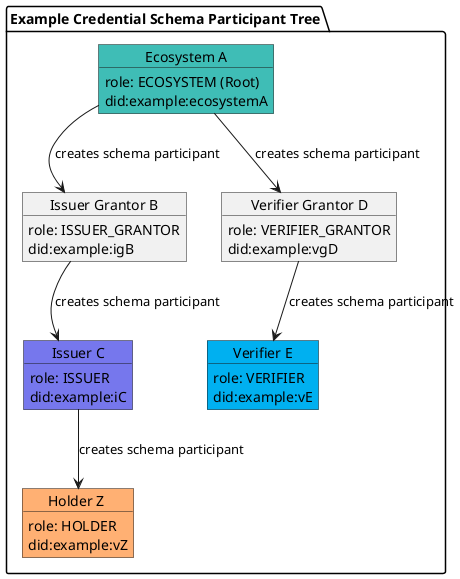
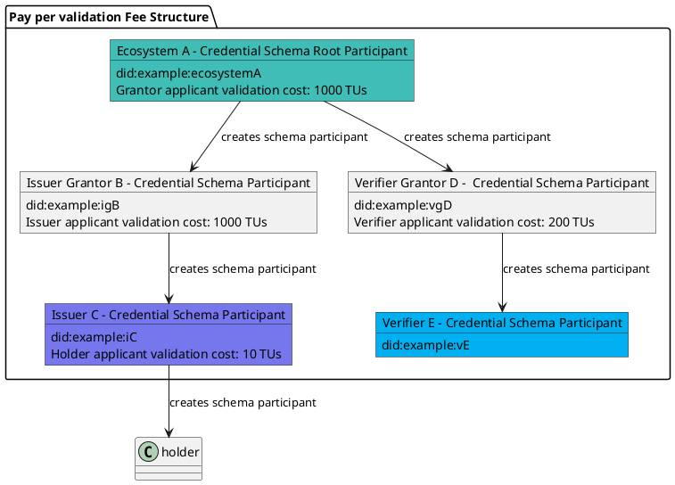
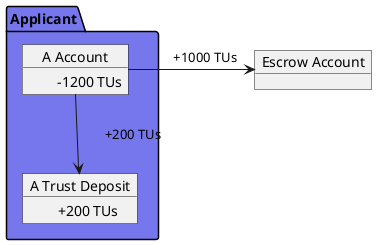
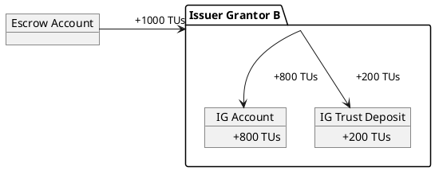

# Onboarding Participants

## Credential Schema Configuration

For each credential schema, an ecosystem defines how it wants to onboard participants. This is configured when creating the `Credential Schema` entry in the VPR. Each entry includes:

- The **JSON schema**.
- An **`issuer_onboarding_mode`** (issuance policy), which determines how `ISSUER` `Participant` entries are created:
  - `OPEN`: `ISSUER` Participants can be self-created by any Corporation.
  - `ECOSYSTEM_VALIDATION_PROCESS`: `ISSUER` Participants are created directly by the controlling ecosystem through an onboarding process.
  - `GRANTOR_VALIDATION_PROCESS`: `ISSUER` Participants are created by one or more issuer grantor(s) — ecosystem operators responsible for onboarding issuers for this schema — selected by the ecosystem, through an onboarding process.
- A **`verifier_onboarding_mode`** (verification policy), which determines how `VERIFIER` `Participant` entries are created, with the same three values (`OPEN`, `ECOSYSTEM_VALIDATION_PROCESS`, `GRANTOR_VALIDATION_PROCESS`).
- A **`holder_onboarding_mode`** (holder policy), which determines how `HOLDER` `Participant` entries are created:
  - `ISSUER_VALIDATION_PROCESS`: `HOLDER` Participants are created directly by issuers, through an onboarding process (used to check credential revocation status).
  - `PERMISSIONLESS`: a holder that wants to obtain credentials from an issuer does not require a `Participant` entry in the VPR.
- A **Participant tree** that defines the roles and relationships involved in managing the schema's lifecycle. Each `Participant` entry in the tree can define business rules — see [Credential Monetization](./credential-monetization).

(Spec: `CredentialSchema` onboarding modes; `Credential Schemas and Participants` section.)

## Participant Tree Example

Participants can be represented by the example Participant tree below:

```plantuml

@startuml
scale max 800 width
 
package "Example Credential Schema Participant Tree" as cs {

    object "Ecosystem A" as tr #3fbdb6 {
        role: ECOSYSTEM (Root)
        did:example:ecosystemA
    }
    object "Issuer Grantor B" as ig {
        role: ISSUER_GRANTOR
        did:example:igB
    }
    object "Issuer C" as issuer #7677ed  {
        role: ISSUER
        did:example:iC
    }
    object "Verifier Grantor D" as vg {
        role: VERIFIER_GRANTOR
        did:example:vgD
    }
    object "Verifier E" as verifier #00b0f0 {
        role: VERIFIER
        did:example:vE
    }

    object "Holder Z " as holder #FFB073 {
        role: HOLDER
        did:example:vZ
    }
}


tr --> ig : creates schema participant
ig --> issuer : creates schema participant

tr --> vg : creates schema participant
vg --> verifier : creates schema participant

issuer --> holder: creates schema participant

@enduml

```

## Participant Roles

Participant roles are defined in the table below. Every `Participant` entry is owned by a [Corporation](./corporations) (through `corporation_id`).

| **Participant Role**   | **Description**                                                  |
|-----------------------|------------------------------------------------------------------|
| ECOSYSTEM    | Create and control ecosystems and credential schemas. Recognize other participants by validating them onto the schema (creating their `Participant` entries).        |
| ISSUER_GRANTOR    | Ecosystem operator that creates `ISSUER` `Participant` entries for candidate issuers.                   |
| VERIFIER_GRANTOR  | Ecosystem operator that creates `VERIFIER` `Participant` entries for candidate verifiers.               |
| ISSUER            | Can issue credentials of this schema.                            |
| VERIFIER          | Can request presentation of credentials of this schema.          |
| HOLDER            | Holds a credential; the `Participant` entry carries credential status (active, revoked, ...). |

To participate in an ecosystem and assume a role associated with a specific credential schema, a Corporation must first have a registered `Corporation` entry in the VPR, and then:

- if the schema is `OPEN` for issuance and/or verification: the Corporation **self-creates** its `ISSUER` and/or `VERIFIER` `Participant` entry.
- if the schema is not `OPEN` for issuance and/or verification: the Corporation must complete an **onboarding process** to obtain its `Participant` entry.

## Onboarding Process

The onboarding process involves two parties:

- The **applicant** — the Corporation requesting a `Participant` entry for a credential schema within the ecosystem.
- The **validator** — a Corporation that already holds a `Participant` entry for the same credential schema and has been delegated authority to validate applicants and create new `Participant` entries.

Running an onboarding process typically involves the payment of trust fees. The trust fee amount to be paid by the applicant is defined by the validator's `Participant` entry (its `validation_fees`), denominated in the schema's `pricing_asset_type` — for example, trust units. Example:

```plantuml

@startuml
scale max 800 width
 
package "Pay per validation Fee Structure" as cs {

    object "Ecosystem A - Credential Schema Root Participant" as tr #3fbdb6 {
        did:example:ecosystemA
        Grantor applicant validation cost: 1000 TUs
    }
    object "Issuer Grantor B - Credential Schema Participant" as ig {
        did:example:igB
        Issuer applicant validation cost: 1000 TUs
    }
    object "Issuer C - Credential Schema Participant" as issuer #7677ed  {
        did:example:iC
        Holder applicant validation cost: 10 TUs
    }
    object "Verifier Grantor D -  Credential Schema Participant" as vg {
        did:example:vgD
        Verifier applicant validation cost: 200 TUs
    }
    object "Verifier E - Credential Schema Participant" as verifier #00b0f0 {
        did:example:vE
    }
}

tr --> ig : creates schema participant
ig --> issuer : creates schema participant
issuer --> holder: creates schema participant
tr --> vg : creates schema participant
vg --> verifier : creates schema participant

@enduml

```

The table below summarizes the possible combinations of applicants and validators:

| Payee → Payer ↓  | Ecosystem                      | Issuer Grantor                        | Verifier Grantor                    | Issuer                              | Verifier | Holder                                  |
|------------------|-------------------------------------|---------------------------------------|-------------------------------------|-------------------------------------|----------|-----------------------------------------|
| Issuer Grantor   | renewable subscription (1)          |                                       |                                     |                                     |          |                                         |
| Verifier Grantor | renewable subscription (2)          |                                       |                                     |                                     |          |                                         |
| Issuer           | renewable subscription (3)          | renewable subscription (1)            |                                     |                                     |          |                                         |
| Verifier         | renewable subscription (4)          |                                       | renewable subscription (2)          |                                     |          |                                         |
| Holder           |                                     |                                       |                                     | renewable subscription (5)          |          |                                         |

- (1): if *issuer onboarding mode* is set to `GRANTOR_VALIDATION_PROCESS`.
- (2): if *verifier onboarding mode* is set to `GRANTOR_VALIDATION_PROCESS`.
- (3): if *issuer onboarding mode* is set to `ECOSYSTEM_VALIDATION_PROCESS`.
- (4): if *verifier onboarding mode* is set to `ECOSYSTEM_VALIDATION_PROCESS`.
- (5): if *holder onboarding mode* is set to `ISSUER_VALIDATION_PROCESS`.

## The `op_state` machine

An onboarding process is tracked directly on the applicant's `Participant` entry through its **`op_state`** field, which moves through:

- **`PENDING`** — the applicant has started the process; the `Participant` entry exists but is not yet effective. Fees are escrowed.
- **`VALIDATED`** — the validator has accepted the applicant and finalized the entry; the `Participant` becomes effective and escrowed trust fees are released to the validator.
- **`TERMINATED`** — the process ended without a valid participant.

The entry also tracks the onboarding-process bookkeeping: `validator_participant_id` (the parent node in the Participant tree), `op_exp` (process expiration), `op_current_fees` / `op_current_deposit` (escrowed amounts), and `op_summary_digest` (an optional digest of the applicant's submitted proofs).

*Example of a candidate issuer (applicant) that wants to obtain an `ISSUER` `Participant` entry for a credential schema of an ecosystem, validated by a validator that holds an `ISSUER_GRANTOR` `Participant` entry:*

```plantuml
scale max 800 width
actor "Applicant\n(issuer candidate)\nAccount" as ApplicantAccount 
actor "Applicant\n(issuer candidate)\nVUA" as ApplicantBrowser 

actor "Validator\n(issuer grantor)\nVS" as ValidatorVS
actor "Validator\n(issuer grantor)\nAccount" as ValidatorAccount

participant "Verifiable Public Registry" as VPR #3fbdb6

ApplicantAccount --> VPR: start onboarding process with Validator
VPR <-- VPR: create applicant Participant entry\n(op_state = PENDING)
ApplicantAccount <-- VPR: applicant Participant entry created
ApplicantBrowser --> ValidatorVS: connect to validator VS DID found in\napplicant_participant.validator_participant\nby creating a DIDComm connection
ApplicantBrowser <-- ValidatorVS: DIDComm connection established.
ApplicantBrowser --> ValidatorVS: I want to proceed with applicant_participant.id=...
ValidatorVS --> ValidatorVS: load applicant Participant with this id\nand verify validator_participant_id refers to me
ApplicantBrowser <-- ValidatorVS: request proof of control\nof applicant_participant.corporation_id account (blind sign)
ApplicantBrowser --> ValidatorVS: send blind sign proof of operator account
ApplicantBrowser <-- ValidatorVS: proof accepted, you are an operator\nof the applicant Participant, I trust you.
ApplicantBrowser <-- ValidatorVS: which DID do you want to register as an issuer?
ApplicantBrowser --> ValidatorVS: send DID
ValidatorVS --> ValidatorVS: resolve DID and get pub keys
ApplicantBrowser <-- ValidatorVS: request proof of ownership\nof the DID to be registered on your `ISSUER` `Participant` entry (blind sign)
ApplicantBrowser --> ValidatorVS: send blind sign proofs
ApplicantBrowser <-- ValidatorVS: proof accepted, you are the controller of this DID, I trust you.
note over ApplicantBrowser, ValidatorVS #EEEEEE: (*optional*) repeat the following until tasks completed
ApplicantBrowser <-- ValidatorVS: Are you a legitimate issuer?\nProve it, by filling forms, sending documents...
ApplicantBrowser --> ValidatorVS: perform requested tasks...
note over ApplicantBrowser, ValidatorVS #EEEEEE: tasks completed
ApplicantBrowser <-- ValidatorVS: You are a legitimate candidate. I'll now finalize your `ISSUER` `Participant` entry.
ValidatorAccount --> VPR #3fbdb6: set applicant_participant.op_state to VALIDATED\n(finalize the `ISSUER` `Participant` entry)
VPR --> ValidatorAccount: Receive trust fees.
ApplicantBrowser <-- ValidatorVS: notify `ISSUER` `Participant` entry validated for your corporation and DID.\nDID can now issue credentials of this schema.
```

Note that the applicant is identified by its **Corporation**: the proof of control requested by the validator is a proof that the connecting party is an **operator of the applicant Corporation** (`applicant_participant.corporation_id`), not a bare account.

During the onboarding process, the applicant must:

- prove control of the applicant Corporation's account (via an operator);
- prove ownership of the DID to be registered on the `Participant` entry;
- provide any additional information required by the validator to assess and accept it.

The specific requirements and execution rules are defined in the **ecosystem governance framework (EGF)** of the controlling ecosystem.

## Fees

The **total fees** paid by the applicant consist of:

- the validation trust fees defined in the validator's `Participant` entry, **plus**
- an additional amount equal to the `trust_deposit_rate` of those validation trust fees, allocated to the **applicant's trust deposit** when the onboarding process begins, **plus**
- network fees (not part of the escrowed amount).

When the schema prices fees in trust units, these TU amounts are converted to native denom at execution time through the [Exchange Rate](./exchange-rate) oracle.

:::tip
Trust deposit is explained in [Trust Deposit and Reputation](./trust-deposit-and-reputation).
:::

Example, using 20% for `trust_deposit_rate`:

```plantuml

@startuml
scale max 1200 width
 


package "Applicant" as issuer #7677ed {
    object "A Account" as issuera {
         \t-1200 TUs
    }
    object "A Trust Deposit" as issuertd {
         \t+200 TUs
    }

}

object "Escrow Account" as escrow

issuera -r-> escrow: \t+1000 TUs
issuera --> issuertd:  \t+200 TUs


@enduml

```

Upon completion of the onboarding process, **escrowed trust fees are distributed to the validator** as follows:

- a portion defined by `trust_deposit_rate` is allocated to the **validator's trust deposit**;
- the remaining amount is **transferred directly to the validator's wallet**.

```plantuml

@startuml
scale max 1200 width

package "Issuer Grantor B" as ig {
    object "IG Account" as iga {
        \t+800 TUs
    }
    object "IG Trust Deposit" as igtd {
        \t+200 TUs
    }
}
object "Escrow Account" as escrow


escrow -r-> ig: \t+1000 TUs \t\t\t\t\t
ig --> iga: \t+800 TUs
ig --> igtd: \t+200 TUs

@enduml

```

:::tip
To run these operations, see the how-to guides under [Participants](../../use/ecosystems/participants/intro): [self-create a Participant](../../use/ecosystems/participants/self-create-a-participant), [run an onboarding process](../../use/ecosystems/participants/run-an-onboarding-process-to-obtain-a-participant), and [set a Participant to validated](../../use/ecosystems/participants/set-participant-to-validated).
:::
