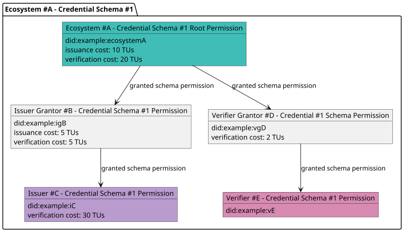
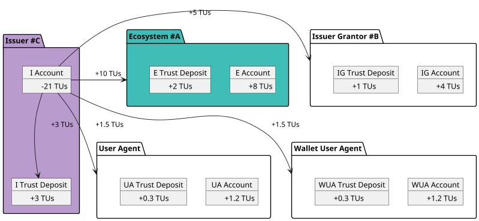
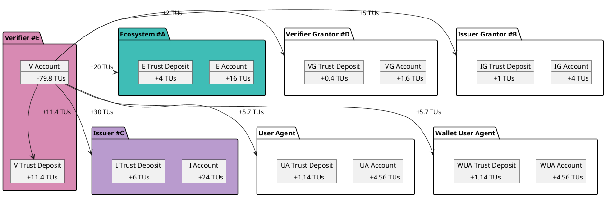

# Credential Monetization

## "Pay-Per" Fees

**Pay-per-issuance** and **pay-per-verification** fees are defined **at the permission level** of participants for a given `Credential Schema` of a given the ecosystem.

Example:

Entities acting as **issuers** or **verifiers** for a given credential schema **may be required to pay trust fees** based on the schema's configuration and permission tree.

If trust fee payment is required, the entity **must execute a transaction** in the VPR to pay the appropriate fees **before issuing or verifying a credential**.

Key points for "Pay-Per" business models

- For a given credential schema, **ecosystem** and their participants may define **pay-per-issuance** (or **pay-per-verification**) trust fees in their respective permissions.

- In such cases, a participant ISSUER (or VERIFIER) **must pay**:
  - The corresponding **issuance** (or **verification**) trust fees **for each involved permission in the tree**;
  - An additional amount equal to the `trust_deposit_rate` of the calculated trust fees, allocated to the **applicant’s trust deposit**;
  - An amount equal to `wallet_user_agent_reward_rate` of the calculated trust fees, used to **reward the wallet user agent** that receives or present the credential;
  - An amount equal to `user_agent_reward_rate` of the calculated trust fees, used to **reward the user agent** (browser, app...).

Example with the permission tree above:

- Total paid by issuer #C for issuing a credential: (10 + 5) * (1 + `user_agent_reward_rate` + `wallet_user_agent_reward_rate` + `trust_deposit_rate`) = 21 TUs
- Total paid by `Verifier E` for verifying a credential: (20 + 5 + 2 + 30) * (1 + `user_agent_reward_rate` + `wallet_user_agent_reward_rate` + `trust_deposit_rate`) = 79.8 TUs

## Fee Distribution Model

Trust fees are **consistently distributed** across participants:

- A portion defined by `trust_deposit_rate` is allocated to the **participant’s trust deposit**.  
- The remaining portion is **transferred directly to the participant’s wallet**.

:::note
**wallet user agents** and **user agents** that implement the verifiable trust specification **must verify** that the ISSUER or VERIFIER has fulfilled the required trust fee payment.  
If not, they **must reject** the issuance or verification request.

The **user agent** and **wallet user agent** may refer to the same implementation.
:::

Distribution example for the issuance by ISSUER #C of a credential, using the permission tree above, 20% for `trust_deposit_rate`, 10% for `wallet_user_agent_reward_rate` and `user_agent_reward_rate`.

Distribution example for the verification by VERIFIER #E of a credential issued by ISSUER #C, using the permission tree above, 20% for `trust_deposit_rate`, 10% for `wallet_user_agent_reward_rate` and `user_agent_reward_rate`.

