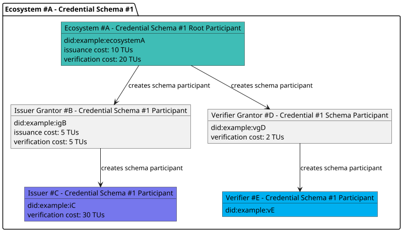
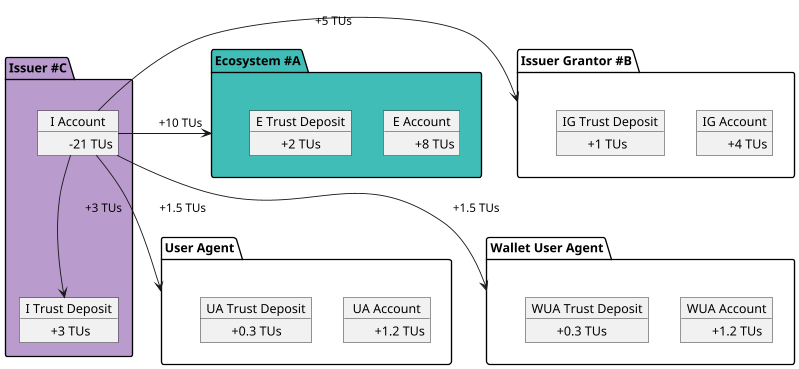
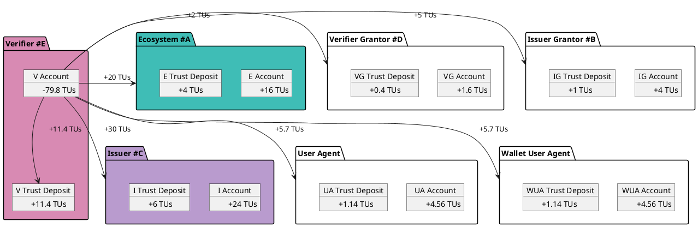

# Credential Monetization

## "Pay-Per" Fees

**Pay-per-issuance** and **pay-per-verification** trust fees are defined **on each `Participant` entry** for each role within the ecosystem, for a given `Credential Schema`.

Example:

```plantuml

@startuml
scale max 800 width
 
package "Ecosystem #A - Credential Schema #1" as cs {

    object "Ecosystem #A - Credential Schema #1 Root Participant" as tr #3fbdb6 {
        did:example:ecosystemA
        issuance cost: 10 TUs
        verification cost: 20 TUs
    }
    object "Issuer Grantor #B - Credential Schema #1 Participant" as ig {
        did:example:igB
        issuance cost: 5 TUs
        verification cost: 5 TUs
    }
    object "Issuer #C - Credential Schema #1 Participant" as issuer #7677ed  {
        did:example:iC
        verification cost: 30 TUs
    }
    object "Verifier Grantor #D - Credential #1 Schema Participant" as vg {
        did:example:vgD
        verification cost: 2 TUs
    }
    object "Verifier #E - Credential Schema #1 Participant" as verifier #00b0f0 {
        did:example:vE
    }
}


tr --> ig : creates schema participant
ig --> issuer : creates schema participant

tr --> vg : creates schema participant
vg --> verifier : creates schema participant

@enduml

```

Corporations acting as **issuers** or **verifiers** for a given credential schema **may be required to pay trust fees** based on the schema's configuration and `Participant` tree.

If trust fee payment is required, the entity **must execute a transaction** in the VPR to pay the appropriate fees **before issuing or verifying a credential**, else the HOLDER agent will not accept the operation.

Key points for "Pay-Per" business models

- For a given credential schema, the **ecosystem** and its participants may define **pay-per-issuance** (or **pay-per-verification**) trust fees on their respective `Participant` entries.

- In such cases, an `ISSUER` (or `VERIFIER`) `Participant` **must pay**:
  - the corresponding **issuance** (or **verification**) trust fees for each involved `Participant` entry along the `Participant` tree;
  - an additional amount equal to the `trust_deposit_rate` of the calculated trust fees, allocated to the **payer's trust deposit**;
  - (optional) an amount equal to `wallet_user_agent_reward_rate` of the calculated trust fees, used to **reward the Wallet User Agent** that receives or presents the credential;
  - (optional) an amount equal to `user_agent_reward_rate` of the calculated trust fees, used to **reward the User Agent** (browser, app...).

Fees denominated in trust units (TUs) are converted to native denom at execution time through the [Exchange Rate](./exchange-rate) oracle.

Example with the Participant tree above:

- Total paid by issuer #C for issuing a credential: (10 + 5) * (1 + `user_agent_reward_rate` + `wallet_user_agent_reward_rate` + `trust_deposit_rate`) = 21 TUs
- Total paid by `Verifier E` for verifying a credential: (20 + 5 + 2 + 30) * (1 + `user_agent_reward_rate` + `wallet_user_agent_reward_rate` + `trust_deposit_rate`) = 79.8 TUs

## Fee Distribution Model

Trust fees are **consistently distributed** across participants:

- A portion defined by `trust_deposit_rate` is allocated to the **participant’s trust deposit**.  
- The remaining portion is **transferred directly to the participant’s wallet**.

:::note
**wallet user agents** and **user agents** that implement the verifiable trust specification **must verify** that the ISSUER or VERIFIER has fulfilled the required trust fee payment.  
If not, they **must reject** the issuance or verification request.

The **user agent** and **wallet user agent** may refer to the same implementation.
:::

Distribution example for the issuance by `ISSUER` #C of a credential, using the `Participant` tree above, 20% for `trust_deposit_rate`, 10% for `wallet_user_agent_reward_rate` and `user_agent_reward_rate`.

```plantuml

@startuml
scale max 800 width
 

package "Ecosystem #A" as tr #3fbdb6 {
    object "E Account" as tra {
         \t+8 TUs
    }
    object "E Trust Deposit" as trtd {
         \t+2 TUs
    }
}

package "Issuer Grantor #B" as ig {
    object "IG Account" as iga {
        \t+4 TUs
    }
    object "IG Trust Deposit" as igtd {
        \t+1 TUs
    }
}
package "Issuer #C" as issuer #b99bce {
    object "I Account" as issuera {
         \t-21 TUs
    }
    object "I Trust Deposit" as issuertd {
         \t+3 TUs
    }

}

package "User Agent" as ua {
    object "UA Account" as uaa {
         \t+1.2 TUs
    }
    object "UA Trust Deposit" as uatd {
        \t+0.3 TUs
    }

}
package "Wallet User Agent" as wua {
    object "WUA Account" as wuaa {
         \t+1.2 TUs
    }
    object "WUA Trust Deposit" as wuatd {
        \t+0.3 TUs
    }

}

issuera -r-> tr: \t+10 TUs

issuera -r-> ig: \t+5 TUs

issuera -d-> ua: \t+1.5 TUs

issuera -d-> wua: \t+1.5 TUs

issuera --> issuertd:  \t+3 TUs

@enduml

```

Distribution example for the verification by `VERIFIER` #E of a credential issued by `ISSUER` #C, using the `Participant` tree above, 20% for `trust_deposit_rate`, 10% for `wallet_user_agent_reward_rate` and `user_agent_reward_rate`.

```plantuml

@startuml
 

package "Ecosystem #A" as tr #3fbdb6 {
    object "E Account" as tra {
         \t+16 TUs
    }
    object "E Trust Deposit" as trtd {
         \t+4 TUs
    }
}

package "Issuer Grantor #B" as ig {
    object "IG Account" as iga {
        \t+4 TUs
    }
    object "IG Trust Deposit" as igtd {
        \t+1 TUs
    }
}
package "Issuer #C" as issuer #b99bce {
    object "I Account" as issuera {
         \t+24 TUs
    }
    object "I Trust Deposit" as issuertd {
         \t+6 TUs
    }

}
package "Verifier Grantor #D" as vg {
    object "VG Account" as vga {
        \t+1.6 TUs
    }
    object "VG Trust Deposit" as vgtd {
        \t+0.4 TUs
    }

}
package "Verifier #E" as verifier #D88AB3 {
    object "V Account" as verifiera {
        \t-79.8 TUs
    }
    object "V Trust Deposit" as verifiertd {
        \t+11.4 TUs
    }

}
package "User Agent" as ua {
    object "UA Account" as uaa {
         \t+4.56 TUs
    }
    object "UA Trust Deposit" as uatd {
        \t+1.14 TUs
    }

}
package "Wallet User Agent" as wua {
    object "WUA Account" as wuaa {
         \t+4.56 TUs
    }
    object "WUA Trust Deposit" as wuatd {
        \t+1.14 TUs
    }

}


verifiera -r-> tr: \t+20 TUs

verifiera -r-> vg: \t+2 TUs

verifiera -r-> ig: \t+5 TUs

verifiera -d-> issuer: \t+30 TUs

verifiera -d-> ua: \t+5.7 TUs

verifiera -d-> wua: \t+5.7 TUs

verifiera --> verifiertd:  \t+11.4 TUs

@enduml

```
