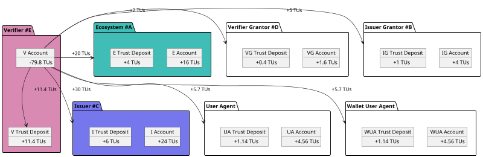

# Trust Deposit and Reputation

## Trust Deposit

A **Trust Deposit** is a stake within the a VPR that grows automatically as participants interact with the ecosystem. Each participant maintains their own individual trust deposit, which reflects their activity and contribution to the trust network.

### How Trust Deposits Grow

- **validation process**:  
  When a validation process is executed, the **trust deposits of both the applicant and the validator** increase.

- **credential issuance & verification**:  
  If the ecosystem has enabled **pay-per-issuance** and/or **pay-per-verification**, the **trust deposits of all participants** involved in the permission tree grow each time a credential is issued or verified.  
  Additionally, if applicable, the trust deposits of the involved user agent and wallet user agent are also incremented.

- **service directory participation**:  
  Registering or renewing a DID in the **service directory** increases the **trust deposit** of the participant who executes the transaction.

### Conceptual Model

The **trust deposit** functions like a **percentage-based deduction** applied to circulating trust fees. These deductions accumulate in individual deposits as a reflection of ongoing participation and service provision.

For example, in the case of **verification Fees** (as detailed in the [Credential Monetization](./70-credential-monetization.md) section), a portion of each fee is redistributed to grow the trust deposits of the relevant actors in the verification process.

- Each time fees are charged, an additional **20%** is added and allocated to the **trust deposit** of the participant executing the transaction. This amount is also linked to the specific **permission** that authorized the transaction.

- When fees are distributed to other participants (e.g., issuers, grantors, etc.), **20%** of the distributed amount is redirected to their **trust deposit**, while the remaining **80%** is **liquid and immediately available** for use.

- The percentage allocated to trust deposits (e.g., 20%) is configurable and defined by the **VPR governance authority**.

### Core Purposes

The **trust deposit** mechanism is designed to ensure that participants within an ecosystem **adhere to the rules defined in its ecosystem governance framework (EGF)**. It serves as both an incentive and an enforcement tool within decentralized trust infrastructures.

| **Purpose**                          | **Description**                                                                                      |
|--------------------------------------|------------------------------------------------------------------------------------------------------|
| **Incentivize Good Behavior**        | Participants risk losing part of their deposit if they behave dishonestly or violate governance rules. |
| **Signal Serious Intent**            | Requires participants to have "skin in the game," discouraging spam, fraud, and low-effort engagement. |
| **Enable Slashing**                  | Deposits can be partially or fully slashed when participants breach trust policies or contractual roles. |
| **Support Decentralized Governance** | Serves as the economic foundation for decentralized permission management, assignment, and revocation. |
| **Ecosystem-Specific Control**       | Each ecosystem can only slash the portion of a participant’s deposit that corresponds to activity within that ecosystem. |
| **Non-Custodial**                    | Trust Deposits are held on-chain within a VPR and are not under the control of any centralized authority. |

<Image url="/img/verifiable-service.png" floating="none" caption="Example of trust reputation" maxWidth="300px"/>

### Slash

Each ecosystem defines, in its **ecosystem governance framework (EGF)**, the rules that participants must follow to remain in good standing. The EGF also specifies the conditions under which a **slash** — a penalty applied to a participant’s trust deposit — may occur.

When a participant is **slashed**:

- The corresponding portion of their **trust deposit** is forfeited, based on the severity or type of violation.
- Their ability to perform actions within the ecosystem (e.g., issuing or verifying credentials) is **suspended**.
- To regain active status, the participant must **replenish the slashed amount** of their trust deposit.

This mechanism ensures accountability and alignment with the ecosystem’s trust and governance policies.

### Trust Deposit-Based Reputation

Because network activity and trust deposit data are publicly accessible, each participant naturally builds a **digital trust reputation** over time. This reputation reflects both their positive contributions and any violations within the ecosystems they engage in.

Key reputation signals include:

- **Growth of trust deposit**: Active, rule-abiding participants see their trust deposit increase as they contribute value to the network.
- **Ecosystem - specific history**: For each ecosystem a participant is involved in, their **trust deposit history** is transparently visible to all other participants.
- **Credential activity**: The number of **credentials issued and/or verified** by the participant within each ecosystem is publicly observable.
- **Behavioral accountability**: Any **dishonest or malicious activity** — especially if penalized through slashing — remains permanently associated with the participant’s account.

This transparent data can be used to compute a **reputation score** or **star rating**, enabling trust-based decisions across the network.
