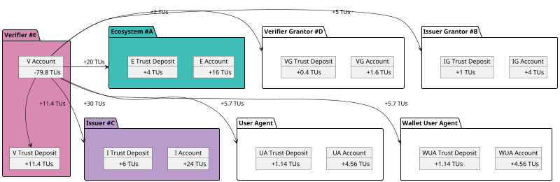

# Trust Deposit and Reputation

## Trust Deposit

A **Trust Deposit** is a stake within a VPR that grows automatically as participants interact with the ecosystem. Each `TrustDeposit` is keyed to a **[Corporation](./corporations)** (`corporation_id`): the deposit is held **per-Corporation**, not per-account or per-Participant-entry. It reflects the Corporation's activity and contribution across every ecosystem it participates in.

### How Trust Deposits Grow

- **onboarding process**:  
  When an onboarding process is executed, the **trust deposits of both the applicant and the validator Corporations** increase.

- **credential issuance & verification**:  
  If the ecosystem has enabled **pay-per-issuance** and/or **pay-per-verification**, the **trust deposits of all Corporations** whose `Participant` entries are involved in the tree grow each time a credential is issued or verified.  
  Additionally, if applicable, the trust deposits of the involved user agent and wallet user agent are also incremented.

- **registry participation**:  
  Registering `Participant` entries and other trust operations in the VPR increases the **trust deposit** of the Corporation that executes the transaction.

### Conceptual Model

The **trust deposit** functions like a **percentage-based deduction** applied to circulating trust fees. These deductions accumulate in individual deposits as a reflection of ongoing participation and service provision.

For example, in the case of **verification Fees** (as detailed in the [Credential Monetization](./credential-monetization) section), a portion of each fee is redistributed to grow the trust deposits of the relevant actors in the verification process.

```plantuml

@startuml
scale max 800 width
 

package "Ecosystem #A" as tr #3fbdb6 {
    object "E Account" as tra {
         \t+16 TUs
    }
    object "E Trust Deposit" as trtd {
         \t+4 TUs
    }
}

package "Issuer Grantor #B" as ig {
    object "IG Account" as iga {
        \t+4 TUs
    }
    object "IG Trust Deposit" as igtd {
        \t+1 TUs
    }
}
package "Issuer #C" as issuer #b99bce {
    object "I Account" as issuera {
         \t+24 TUs
    }
    object "I Trust Deposit" as issuertd {
         \t+6 TUs
    }

}
package "Verifier Grantor #D" as vg {
    object "VG Account" as vga {
        \t+1.6 TUs
    }
    object "VG Trust Deposit" as vgtd {
        \t+0.4 TUs
    }

}
package "Verifier #E" as verifier #D88AB3 {
    object "V Account" as verifiera {
        \t-79.8 TUs
    }
    object "V Trust Deposit" as verifiertd {
        \t+11.4 TUs
    }

}
package "User Agent" as ua {
    object "UA Account" as uaa {
         \t+4.56 TUs
    }
    object "UA Trust Deposit" as uatd {
        \t+1.14 TUs
    }

}
package "Wallet User Agent" as wua {
    object "WUA Account" as wuaa {
         \t+4.56 TUs
    }
    object "WUA Trust Deposit" as wuatd {
        \t+1.14 TUs
    }

}


verifiera -r-> tr: \t+20 TUs

verifiera -r-> vg: \t+2 TUs

verifiera -r-> ig: \t+5 TUs

verifiera -d-> issuer: \t+30 TUs

verifiera -d-> ua: \t+5.7 TUs

verifiera -d-> wua: \t+5.7 TUs

verifiera --> verifiertd:  \t+11.4 TUs

@enduml

```

- Each time fees are charged, an additional **20%** (`trust_deposit_rate`) is added and allocated to the **trust deposit** of the Corporation executing the transaction. This amount is also linked to the specific `Participant` entry that authorized the transaction (tracked in the entry's `deposit` field).

- When fees are distributed to other participants (e.g., issuers, grantors, etc.), **20%** of the distributed amount is redirected to their **trust deposit**, while the remaining **80%** is **liquid and immediately available** for use.

- The percentage allocated to trust deposits (`trust_deposit_rate`, default 20%) is a global variable configurable by the **VPR governance authority**.

### Trust Deposit Yield

Trust deposits are not idle stakes — they **generate yield**. Block execution fees are distributed not only to network validators, but also to **trust deposit holders**. This is governed by three global variables:

- `trust_deposit_block_reward_share` (default 20%) — the percentage of each block reward that must be distributed to trust deposit holders;
- `trust_deposit_max_yield_rate` — the maximum yearly yield, in percent, a trust deposit holder can obtain from block rewards;
- `trust_deposit_share_value` — the value of one share of trust deposit, in native denom. Each `TrustDeposit` records a `share` of the module's total deposit rather than a raw amount; the share value starts at 1 and **increases over time as yield is produced**, so a Corporation's deposit appreciates automatically.

Yield is one more reason a trust deposit is **non-withdrawable**: locking value into the system sustains token demand and prevents exit-and-rejoin arbitrage on an appreciated deposit.

### Core Purposes

The **trust deposit** mechanism is designed to ensure that participants within an ecosystem **adhere to the rules defined in its ecosystem governance framework (EGF)**. It serves as both an incentive and an enforcement tool within decentralized trust infrastructures.

| **Purpose**                          | **Description**                                                                                      |
|--------------------------------------|------------------------------------------------------------------------------------------------------|
| **Incentivize Good Behavior**        | Participants risk losing part of their deposit if they behave dishonestly or violate governance rules. |
| **Signal Serious Intent**            | Requires participants to have "skin in the game," discouraging spam, fraud, and low-effort engagement. |
| **Dispute Resolution**                  | Deposits can be partially or fully frozen if a participant has been suspected of misconduct. During the hold period, the ecosystem evaluates whether the participant’s actions caused actual harm. If harm is confirmed, the held deposit may be used—partially or fully—to compensate for the damage. If no harm is found, the deposit is released back to the participant. |
| **Enable Slashing**                  | Deposits can be partially or fully slashed when participants breach trust policies or contractual roles. |
| **Support Decentralized Governance** | Serves as the economic foundation for decentralized participant management, assignment, and revocation. |
| **Ecosystem-Specific Control**       | Each ecosystem can only slash the portion of a participant’s deposit that corresponds to activity within that ecosystem. |
| **Non-Custodial**                    | Trust Deposits are held on-chain within a VPR and are not under the control of any centralized authority. |

<Image url="/img/verifiable-service.png" floating="none" caption="Example of trust reputation" maxWidth="300px" border="1px solid #DDDDDD" align="center"/>

### Slash

Slashing operates at **two independent levels**:

- **network-level penalties** — if a participant violates the **VPR governance framework** or engages in fraudulent activity, their trust deposit may be partially or fully slashed by the **VPR's governance authority**.
- **ecosystem-level penalties** — if a participant operates within an ecosystem (as a grantor, issuer, verifier, or holder) and fails to comply with that ecosystem's governance framework (EGF), their **ecosystem-specific** trust deposit can be slashed by the corresponding **ecosystem governance authority**. Each ecosystem can only slash the portion of a Corporation's deposit that corresponds to activity within that ecosystem.

Each ecosystem defines, in its **ecosystem governance framework (EGF)**, the rules that participants must follow to remain in good standing, and the conditions under which a **slash** may occur.

Before executing an ecosystem-level slash, the ecosystem must:

- Assess Harm: Determine whether the participant’s actions caused measurable harm to the ecosystem or its members.
- Compensation Request: Provide the participant with the opportunity to compensate affected parties directly.
- Unresolved Dispute: If the dispute cannot be resolved and harm is evidenced, the ecosystem may authorize a slash.

When a participant is **slashed**:

- The corresponding portion of their **trust deposit** is forfeited, based on the severity or type of violation.
- Their ability to perform actions within the ecosystem (e.g., issuing or verifying credentials) is **suspended**.
- To regain active status, the participant must **replenish the slashed amount** of their trust deposit.

This mechanism ensures accountability and alignment with the ecosystem’s trust and governance policies.

### Trust Deposit-Based Reputation

Because network activity and trust deposit data are publicly accessible, each participant naturally builds a **digital trust reputation** over time. This reputation reflects both their positive contributions and any violations within the ecosystems they engage in.

Key reputation signals include:

- **Growth of trust deposit**: Active, rule-abiding participants see their trust deposit increase as they contribute value to the network.
- **Ecosystem - specific history**: For each ecosystem a participant is involved in, their **trust deposit history** is transparently visible to all other participants.
- **Credential activity**: The number of **credentials issued and/or verified** by the participant within each ecosystem is publicly observable.
- **Behavioral accountability**: Any **dishonest or malicious activity** — especially if penalized through slashing — remains permanently associated with the participant’s account.

This transparent data can be used to compute a **reputation score** or **star rating**, enabling trust-based decisions across the network.
