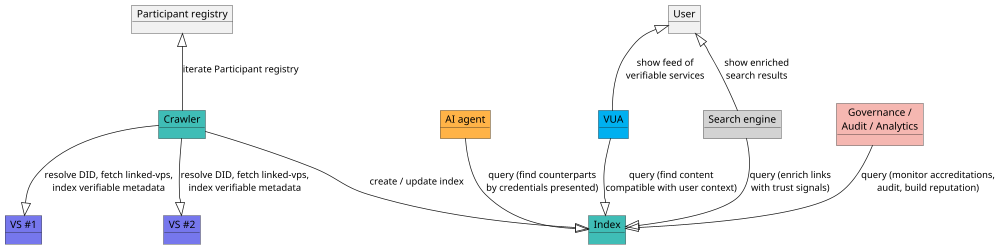

# DID Indexing

**DID indexing** is how verifiable services (VSs) — and the DIDs that identify them — are discovered in v4: crawlers build searchable, trust-typed indexes directly over the VPR's **`Participant` registry**.

:::info No more "DID Directory"
Earlier versions of Verana exposed a dedicated **DID Directory**: a separate database where anyone registered a DID for crawlers to index. That entity no longer exists. Discovery in v4 is built **directly over the `Participant` registry**. Content integrity is handled by a separate, unrelated primitive — see [Digest](./digest).
:::

## DID Indexing over the Participant registry

The `Participant` registry is the foundation for building **searchable indexes of verifiable services (VSs) and the verifiable metadata they expose**. Crawlers iterate over `Participant` entries, resolve each service identifier (currently a DID, extensible in the future), verify that the service is a verifiable service, and extract its verifiable metadata — most notably the credentials presented through [linked-vp](https://identity.foundation/linked-vp/) — together with the ecosystem memberships, credential-schema permissions, and trust-deposit level associated with the controlling [Corporation](./corporations).

Everything a crawler needs is published as `service` entries of the DID Document: the `LinkedVerifiablePresentation` entries carrying the service's Essential Credential Schema credentials (`#vpr-schemas-service-vtc-vp`, plus `#vpr-schemas-org-vtc-vp` or `#vpr-schemas-persona-vtc-vp`), and the consumable endpoints (a mandatory `DIDCommMessaging` entry, and optionally MCP, A2A, or a website). See [Trust Resolution](../verifiable-trust/trust-resolution) for the full DID Document layout.

Unlike a traditional web index, this index is **trust-typed**: every entry carries cryptographically verifiable claims about *what* the service is, *who* operates it, and *under which governance frameworks* it is accredited. This unlocks discovery use cases that traditional search engines cannot serve.

## Who consumes the index

- **AI agents** — before delegating a task or accepting a connection, an agent queries the index to find counterparts whose **presented credentials match the capabilities required** (e.g. a KYC issuer recognized by a target ecosystem, or an MCP-style service whose operator holds a recognized organization credential). It can restrict the search to a specific ecosystem or schema, and rank candidates by trust-deposit size, accreditations held, slashing history, or credential freshness. Because every indexed claim is anchored in the VPR, an agent can verify a counterpart end-to-end *before* interacting.
- **Verifiable User Agents (VUAs)** — social browsers, agentic browsers, and similar clients use the index to **find content and services compatible with the user's context**: *"show only services accredited under ecosystem X"*, *"show services that accept the credentials currently in my wallet"*, *"show issuers of schema Y operating in jurisdiction Z"*. The result is a feed of VSs for which a proof of trust can be displayed to the user before connection.
- **Search engines** — trust-aware and traditional, form-based engines return ordinary links to VSs enriched with verifiable trust signals.
- **Governance authorities, auditors, and analytics services** — monitor accredited issuers, verifiers, and grantors; map the supply chain of trust behind a service or credential; and combine indexed metadata with on-chain history to produce reputational signals at the Corporation level.

:::tip Unbiased by design
An indexer can be run as a container alongside a locally deployed VPR node for total **unlinkability**, then power a familiar search prompt. Results are not biased nor manipulable, because **they rely on verifiable data**.
:::
