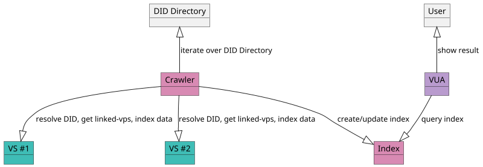

# DID Directory

## What is the DID Directory?

The **DID directory** is a public database of [DIDs](https://www.w3.org/TR/did-1.0/) maintained within a **verifiable public registry (VPR)**. It allows crawlers and search engines to index metadata associated with **verifiable services (VSs)** provided by these DIDs.

Search engines can iterate over the DID directory and index VSs based on available metadata, such as the **DID document**, **presented credentials**, and other publicly declared attributes.

The service directory is essential for **verifiable user agents (VUAs)**, including specialized browsers like **social browsers** or **chatbot browsers**. However, it can also be used by traditional, form-based search engines to return simple links that provide access to Verifiable Services.

Any participant can register a DID in the DID directory by submitting a transaction to the VPR.

### Search the Service Directory

Indexer can be run as a container with a locally deployed VPR node for total **unlinkability**. It is then easy to deploy the search engine and provide a fancy familiar prompt:

**Great to know**: results are not biased nor manipulable 😀, because **they rely on verifiable data**.
