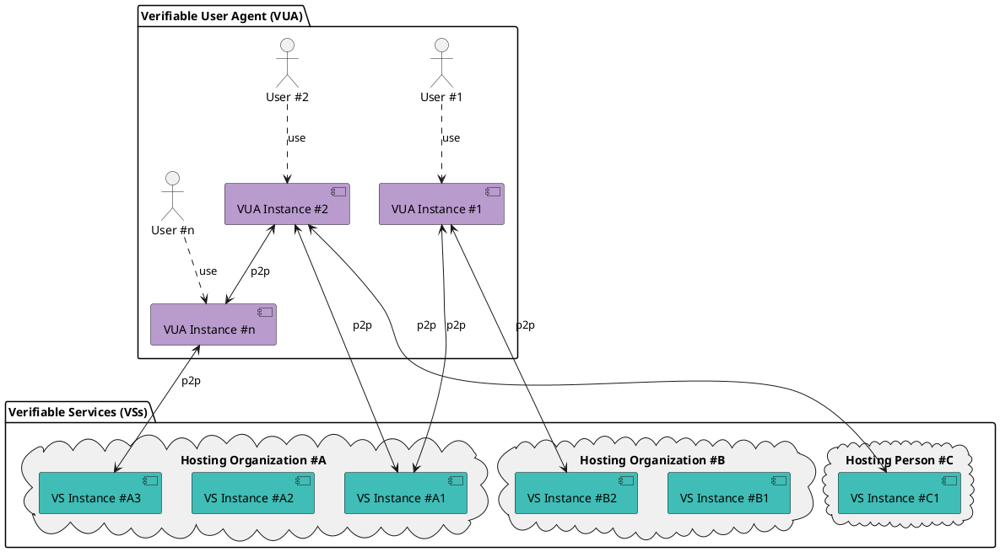
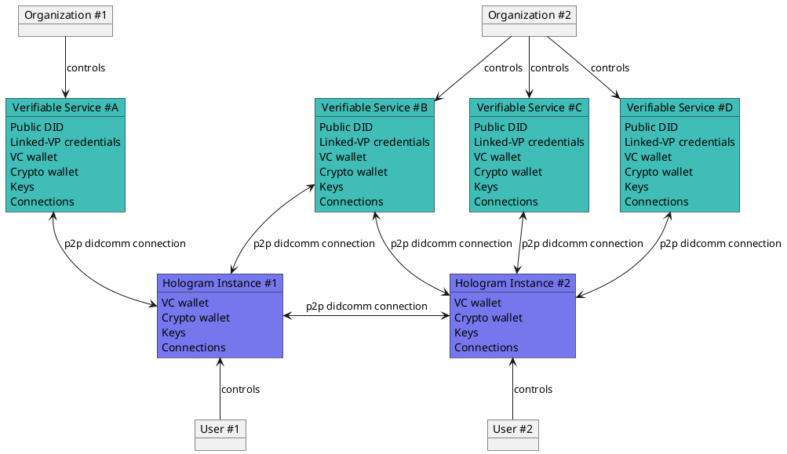

# Pre-Intro

```plantuml
@startuml


package "Verifiable Services (VSs)" {
  cloud "Hosting Organization #A" as hostingA #f0f0f0{
    [VS Instance #A1] as AVS1 #3fbdb6
    [VS Instance #A2] as AVS2 #3fbdb6
    [VS Instance #A3] as AVS3 #3fbdb6
    
    }

    cloud "Hosting Organization #B" as hostingB #f0f0f0 {
    [VS Instance #B1] as BVS1 #3fbdb6
    [VS Instance #B2] as BVS2 #3fbdb6
    
    
    }

    cloud "Hosting Person #C" as hostingC #f0f0f0 {
    [VS Instance #C1] as CVS1 #3fbdb6
    
    
    }
}

package "Verifiable User Agent (VUA)" as App {
    actor "User #1" as user1
actor "User #2" as user2
actor "User #n" as usern
  [VUA Instance #1] as VUA1 #b99bce
  [VUA Instance #2] as VUA2 #b99bce
  [VUA Instance #n] as VUAn #b99bce
  
}


VUA1 <--> AVS1 : p2p
VUA1 <--> BVS2 : p2p

VUA2 <--> AVS1 : p2p
VUA2 <--> CVS1 : p2p

VUAn <--> AVS3 : p2p

VUA2 <--> VUAn : p2p


user1 ..> VUA1 : use
user2 ..> VUA2 : use
usern ..> VUAn : use


@enduml

```

```plantuml

@startuml
scale max 1200 width
 

object "User #1" as u1 {
         
}

object "Hologram Instance #1" as hi1 #7677ed {
    VC wallet
    Crypto wallet
    Keys
    Connections
}

object "User #2" as u2 {
         
}

object "Hologram Instance #2" as hi2 #7677ed {
    VC wallet
    Crypto wallet
    Keys
    Connections
}


object "Verifiable Service #A" as vsa #3fbdb6 {
    Public DID
    Linked-VP credentials
    VC wallet
    Crypto wallet
    Keys
    Connections
}
object "Verifiable Service #B" as vsb #3fbdb6 {
    Public DID
    Linked-VP credentials
    VC wallet
    Crypto wallet
    Keys
    Connections
}
object "Verifiable Service #C" as vsc #3fbdb6 {
    Public DID
    Linked-VP credentials
    VC wallet
    Crypto wallet
    Keys
    Connections
}
object "Verifiable Service #D" as vsd #3fbdb6 {
    Public DID
    Linked-VP credentials
    VC wallet
    Crypto wallet
    Keys
    Connections
}

object "Organization #1" as o1 {
         
}

object "Organization #2" as o2 {
         
}

o1 -d-> vsa: controls
o2 -d-> vsb: controls
o2 -d-> vsc: controls
o2 -d-> vsd: controls

u1 -u-> hi1: controls
u2 -u-> hi2: controls

hi1 <-> hi2: p2p didcomm connection

hi1 <-u-> vsa: p2p didcomm connection
hi1 <-u-> vsb: p2p didcomm connection

hi2 <-u-> vsb: p2p didcomm connection
hi2 <-u-> vsc: p2p didcomm connection
hi2 <-u-> vsd: p2p didcomm connection

@enduml
```