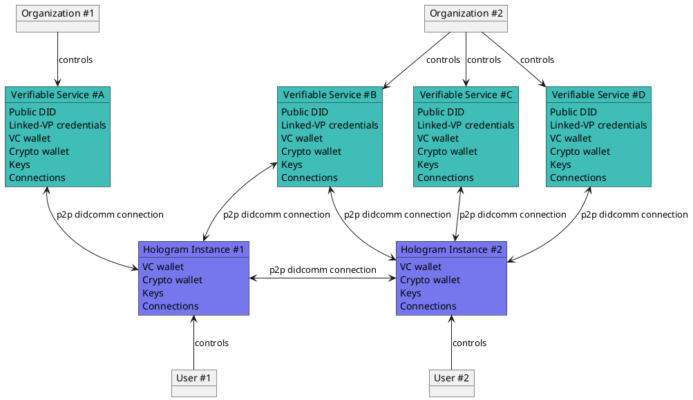

# Pre-Intro

```plantuml

@startuml
scale max 1200 width
 

object "User #1" as u1 {
         
}

object "Hologram Instance #1" as hi1 #7677ed {
    VC wallet
    Crypto wallet
    Keys
    Connections
}

object "User #2" as u2 {
         
}

object "Hologram Instance #2" as hi2 #7677ed {
    VC wallet
    Crypto wallet
    Keys
    Connections
}


object "Verifiable Service #A" as vsa #3fbdb6 {
    Public DID
    Linked-VP credentials
    VC wallet
    Crypto wallet
    Keys
    Connections
}
object "Verifiable Service #B" as vsb #3fbdb6 {
    Public DID
    Linked-VP credentials
    VC wallet
    Crypto wallet
    Keys
    Connections
}
object "Verifiable Service #C" as vsc #3fbdb6 {
    Public DID
    Linked-VP credentials
    VC wallet
    Crypto wallet
    Keys
    Connections
}
object "Verifiable Service #D" as vsd #3fbdb6 {
    Public DID
    Linked-VP credentials
    VC wallet
    Crypto wallet
    Keys
    Connections
}

object "Organization #1" as o1 {
         
}

object "Organization #2" as o2 {
         
}

o1 -d-> vsa: controls
o2 -d-> vsb: controls
o2 -d-> vsc: controls
o2 -d-> vsd: controls

u1 -u-> hi1: controls
u2 -u-> hi2: controls

hi1 <-> hi2: p2p didcomm connection

hi1 <-u-> vsa: p2p didcomm connection
hi1 <-u-> vsb: p2p didcomm connection

hi2 <-u-> vsb: p2p didcomm connection
hi2 <-u-> vsc: p2p didcomm connection
hi2 <-u-> vsd: p2p didcomm connection

@enduml
```