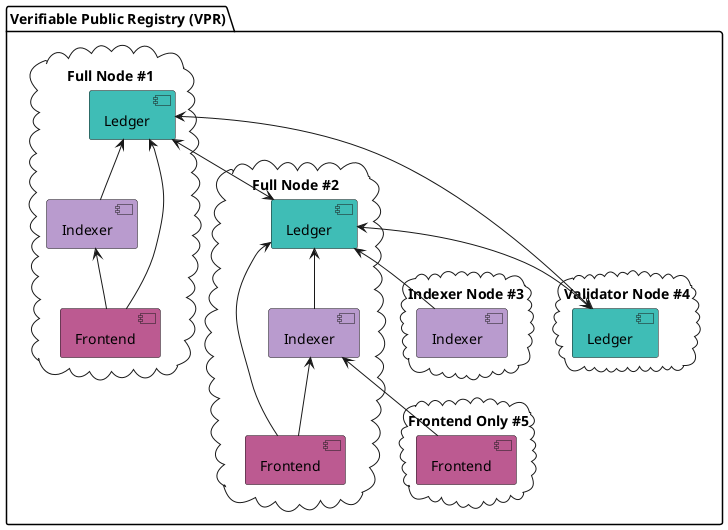
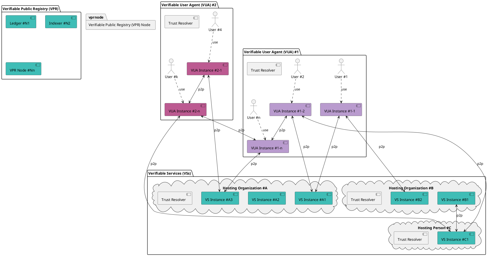

# Built for Decentralization

```plantuml
@startuml


package "Verifiable Public Registry (VPR)" as vpr {
  cloud "Full Node #1" as fullnode1 {
    [Ledger] as ledger1 #3fbdb6 
    [Indexer] as indexer1 #b99bce
    [Frontend] as frontend1 #BC5A91

  ledger1 <-- indexer1
  ledger1 <-- frontend1
  indexer1 <-- frontend1
  
}

cloud "Full Node #2" as fullnode2 {
    [Ledger] as ledger2 #3fbdb6 
    [Indexer] as indexer2 #b99bce
    [Frontend] as frontend2 #BC5A91

  ledger2 <-- indexer2
  ledger2 <-- frontend2
  indexer2 <-- frontend2
  
}

cloud "Indexer Node #3" as indexernode3 {
    [Indexer] as indexer3 #b99bce

  ledger2 <-- indexer3
  
}

cloud "Validator Node #4" as valnode4 {
    [Ledger] as ledger4 #3fbdb6 
}

cloud "Frontend Only #5" as fenode5 {
   
    [Frontend] as frontend5 #BC5A91

  indexer2 <--  frontend5
 
  
}

ledger1 <--> ledger2
ledger1 <--> ledger4
ledger2 <--> ledger4


}


```

```plantuml
@startuml

package "Verifiable Public Registry (VPR)" as vpr {
    [VPR Node #N1] as VPR1 #3fbdb6 
    [VPR Node #N2] as VPR2 #3fbdb6
    [VPR Node #Nn] as VPRn #3fbdb6
}

package "Verifiable Public Registry (VPR) Node" as vprnode {
    [Ledger #N1] as VPR1 #3fbdb6 
    [Indexer #N2] as VPR2 #3fbdb6
    [VPR Node #Nn] as VPRn #3fbdb6
}


package "Verifiable Services (VSs)" {
  cloud "Hosting Organization #A" as hostingA #f0f0f0{
    [VS Instance #A1] as AVS1 #3fbdb6
    [VS Instance #A2] as AVS2 #3fbdb6
    [VS Instance #A3] as AVS3 #3fbdb6
    [Trust Resolver] as AVS1tr

    }

    cloud "Hosting Organization #B" as hostingB #f0f0f0 {
    [VS Instance #B1] as BVS1 #3fbdb6
    [VS Instance #B2] as BVS2 #3fbdb6
    
        [Trust Resolver] as BVS1tr

    }

    cloud "Hosting Person #C" as hostingC #f0f0f0 {
    [VS Instance #C1] as CVS1 #3fbdb6
    
    [Trust Resolver] as CVS1tr
    
    }
}

package "Verifiable User Agent (VUA) #1" as App1 {
    actor "User #1" as user1
actor "User #2" as user2
actor "User #n" as usern
  [VUA Instance #1-1] as VUA11 #b99bce
  [VUA Instance #1-2] as VUA12 #b99bce
  [VUA Instance #1-n] as VUA1n #b99bce
  [Trust Resolver] as VUA1tr
}

package "Verifiable User Agent (VUA) #2" as App2 {
    actor "User #4" as user4
actor "User #k" as userk
  [VUA Instance #2-1] as VUA21 #BC5A91
  [VUA Instance #2-n] as VUA2n #BC5A91
  [Trust Resolver] as VUA2tr
}

VUA11 <--> AVS1 : p2p
VUA11 <--> BVS2 : p2p

VUA21 <--> AVS3 : p2p

VUA12 <--> AVS1 : p2p
VUA12 <--> CVS1 : p2p

VUA1n <--> AVS3 : p2p

VUA12 <--> VUA1n : p2p

VUA21 <--> VUA2n : p2p

user1 ..> VUA11 : use
user2 ..> VUA12 : use
usern ..> VUA1n : use
user4 ..> VUA21 : use
userk ..> VUA2n : use


VUA2n <--> VUA1n : p2p

VUA2n <--> CVS1 : p2p

BVS1 <--> CVS1 : p2p

@enduml

```

:::tip
Verifiable services can be hosted anywhere, based on service provider (organization, person) decision.
:::
