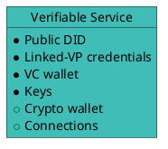
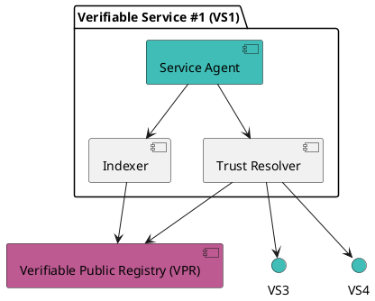
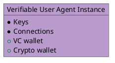
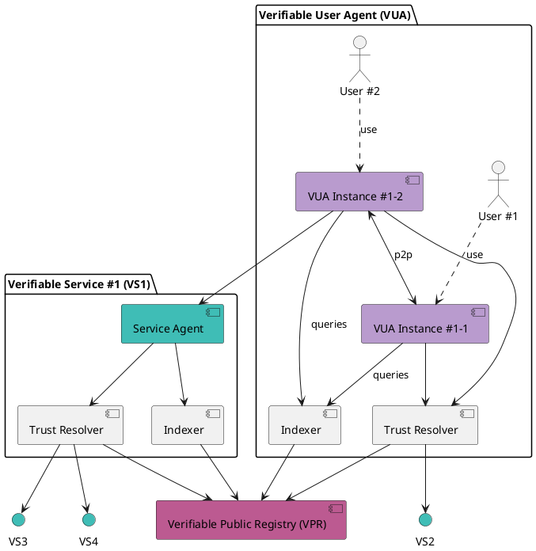
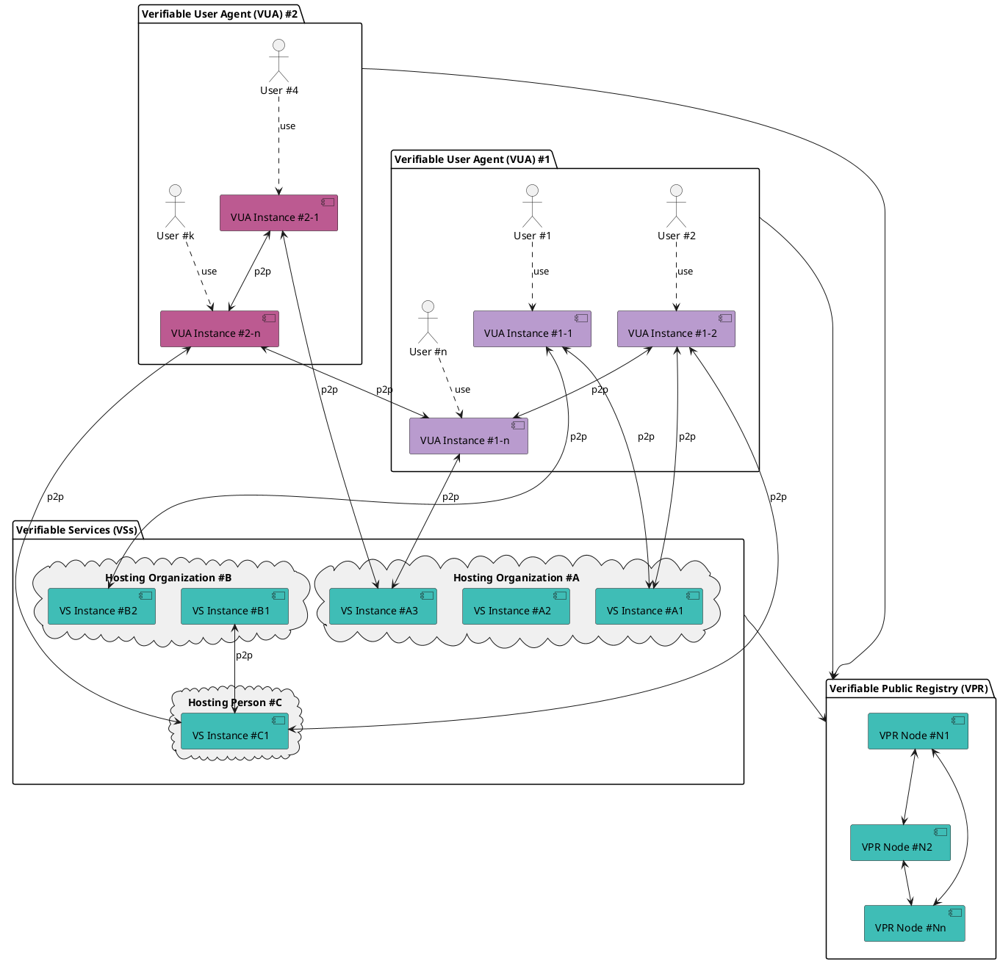

# Verifiable Trust Components

## Verifiable Service (VS)

A verifiable service (VS) is a service, uniquely identified by a DID, that can authenticate itself to a peer by presenting verifiable credentials before any connection is initiated.

Peers wishing to connect to a VS can **review the verifiable credentials presented by the service**, verify their legitimacy through trust resolution, and **decide whether to proceed with the connection based on the outcome**.

A VS is also required to verify the trustworthiness of peers attempting to connect to it, whether those peers are other verifiable services (VS) or verifiable user agents (VUAs), and must reject connections from non-verifiable peers.

Furthermore, if a verifiable service wants to issue credentials or request credential presentation, **it must first prove that it is authorized to perform these actions**. Otherwise, the peer must refuse the request.

:::tip
All the verifications are performed by the VS by using the trust resolver. Indexer is used for service discovery.
:::

Examples of verifiable services include:

- chatbot services, such as services built for [Hologram Messaging](https://hologram.zone)
- decentralized social channels;
- etc...

## Verifiable User Agent (VUA)

A verifiable user agent (VUA) is software, such as a browser, app, or wallet, designed to connect with verifiable services (VS) and other VUAs. When establishing connections, a VUA must verify the identity and trustworthiness of its peers and allow connections only to compliant VS or VUA peers.

As part of this process, the verifiable user agent (VUA) must perform trust resolution by:

- Verifying the verifiable credentials presented by peers;

- Querying verifiable public registries (VPRs) to confirm that the credentials were issued by recognized and authorized issuers.

This ensures that all connections are established on the basis of verifiable trust, rather than assumptions.

In addition, VUAs can query an index (the DID directory, managed by the VPR - see below) that catalogs all known verifiable services (VSs), to search VSs compatible with the VUA or VSs that present a certain type of credential. This enables:

- users to search for and discover relevant services: for example, within a social browser VUA, a user could search for a social channel VS by querying the index for an influencer’s name.

- VUA vendors to require VSs to present a certain type of credential (free or paid) for being listed in the VUA, of for having specific features in the VUA (premium, etc).

[Hologram Messaging](https://hologram.zone), a chatbot and AI agent browser, is the **first known verifiable user agent**.

## Verifiable Public Registry (VPR)

### Trust Registries

A VPR is a **“registry of registries”**, a public, permissionless service that provides foundational infrastructure for decentralized trust ecosystems, as specified in the [Verifiable Public Registry (VPR) specification](https://verana-labs.github.io/verifiable-trust-vpr-spec/).

It is used by ecosystems that want to define credential schemas and who can issue or verify credentials of these schemas.

Purpose of a VPR is to answer these questions:

- is participant #1 **recognized** by ecosystem E1?
- can participant #1 **issue credential** for schema ABC of ecosystem E1?
- can participant #2 request **credential presentation** of credential issued by issuer DEF from schema GHI of ecosystem E2 in context CONTEXT?

[VPRs are detailed here](../verifiable-public-registry/20-trust-registries.md)

### DID Directory

Added to trust registry features, the VPR provides a **DID directory**: a public database of [DIDs](https://www.w3.org/TR/did-1.0/). It allows crawlers and search engines to index metadata associated with **verifiable services (VSs)** provided by these DIDs.

## Build for decentralization

Connections between verifiable services (VSs) and/or verifiable user agents (VUAs) are fully decentralized and verifiable.

In the example below, we have two verifiable user agents #1 and #2 from different vendors. Instances of these compliant VUAs can establish connections with other instances, and with verifiable services from all organizations. Verifiable services can connect to other verifiable services.

:::tip
Verifiable services can be hosted anywhere, based on service provider (organization, person) decision.
:::
