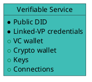
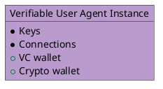
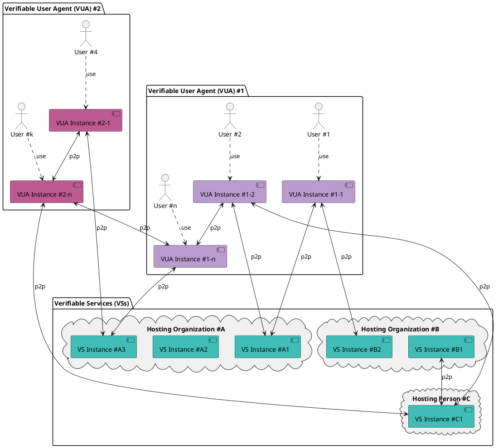

# Introduction to Verifiable Trust

## Verifiable Service (VS)

A **Verifiable Service (VS)** is a service, identified with a DID, that is capable, by presenting **verifiable credentials**, of identifying itself to a peer *before any connection is established*.

Peers wishing to connect to a VS can **review the verifiable credentials presented by the service**, verify their legitimacy through trust resolution, and **decide whether to proceed with the connection based on the outcome**.

A VS is also required to verify the trustworthiness of peers attempting to connect to it, whether those peers are other verifiable services (VS) or verifiable user agents (VUAs), and must reject connections from non-verifiable peers.

Furthermore, if a verifiable service wants to issue credentials or request credential presentation, **it must first prove that it is authorized to perform these actions**. Otherwise, the peer must refuse the request.

Examples of verifiable services includes services built for [Hologram Messaging](https://hologram.zone).

## Verifiable User Agent (VUA)

A verifiable user agent (VUA) is software, such as a browser, app, or wallet, designed to connect with verifiable services (VS) and other VUAs. When establishing connections, a VUA must verify the identity and trustworthiness of its peers and allow connections only to compliant VS or VUA peers.

As part of this process, the VUA must perform trust resolution by:

- Verifying the verifiable credentials presented by the peers
- Querying verifiable public registries (VPRs) to confirm that these credentials were issued by recognized and authorized issuers.

This ensures that all connections are based on verifiable trust, not assumptions.

[Hologram Messaging](https://hologram.zone), a chatbot and AI agent browser, is the **first known verifiable user agent**.

## Build for decentralization

Connections between verifiable services (VSs) and/or verifiable user agents (VUAs) are fully decentralized and verifiable.

In the example below, we have two verifiable user agents #1 and #2 from different vendors. Instances of these compliant VUAs can establish connections with other instances, and with verifiable services from all organizations. Verifiable services can connect to other verifiable services.

:::tip
Verifiable services can be hosted anywhere, based on service provider (organization, person) decision.
:::

