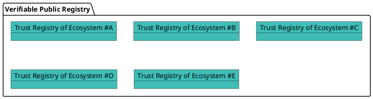
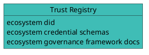
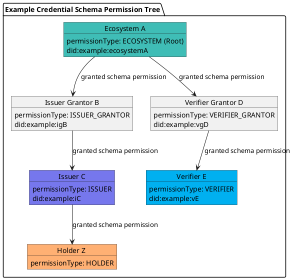

# Verifiable Public Registry

A **Verifiable Public Registry (VPR)** is a **“registry of registries”**, a public service that provides foundational infrastructure for decentralized trust ecosystems.

The **Verana Verifiable Trust Network** is an *implementation* of a Verifiable Public Registry.

A VPR offers:

- **Trust Registry Management**:  
  Ecosystems can create and manage their own **Trust Registries**, each with:
  - Defined **Credential Schemas**
  - Assigned roles for **Issuers**, **Verifiers**, and **Grantors** (Trust Registry Operators)
  - Custom **business models** and permission policies

- **Query API for Trust Resolution**:  
  A standardized API used by **Verifiable Services (VSs)** and **Verifiable User Agents (VUAs)** to perform trust resolution, enabling them to query registry data and validate roles and permissions in real time. Query API must include support for the [TRQP](https://trustoverip.github.io/tswg-trust-registry-protocol/).



#### Trust Registries

*This section is non-normative.*

Each **Trust Registry** must provide, at a minimum:

- an Ecosystem controlled **resolvable DID**
- One or more **Governance Framework** document(s)
- Zero or more **Credential Schemas**

The **Verifiable Public Registry (VPR)** is agnostic to the specific **DID methods** used. Trust resolution is performed externally, outside the VPR, allowing flexibility and interoperability across ecosystems.



### Credential Schemas and Permissions

[[ref: Credential schemas]] are created and managed by trust registry controller **ecosystems**. Each **credential schema** includes, at a minimum:

- A **JSON Schema** that defines the structure of the corresponding **verifiable credential**
- A **PermissionManagementMode** for **issuance policy**, which determines how `ISSUER` permissions are granted. Modes include:
  - `OPEN`: `ISSUER` permissions can be created by anyone.
  - `ECOSYSTEM`: `ISSUER` permissions are granted directly by the **ecosystem**, the trust registry controller
  - `GRANTOR`: `ISSUER` permissions are granted by one or several issuer grantor(s) (trust registry operator(s) responsible for selecting issuers for the credential schema of this **ecosystem**), selected by the **ecosystem**.
- A **PermissionManagementMode** for **verification policy**, which determines how `VERIFIER` permissions are granted. Modes include:
  - `OPEN`: `VERIFIER` permissions can be created by anyone.
  - `ECOSYSTEM`: `VERIFIER` permissions are granted directly by the **ecosystem**, the Trust Registry controller
  - `GRANTOR`: `VERIFIER` permissions are granted by one or several verifier grantor(s) (trust registry operator(s) responsible for selecting verifiers for the credential schema of this **ecosystem**), selected by the **ecosystem**.
- A **Permission tree** that defines the roles and relationships involved in managing the schema’s lifecycle. Each created permission in the tree can define business rules, see below Business Models.



Participant roles are defined in the table below:

| **Participant Role**   | **Description**                                                  |
|-----------------------|------------------------------------------------------------------|
| **Ecosystem**    | Create and control trust registries and credential Schemas. Recognize other participants by granting permission(s) to them.        |
| **Issuer Grantor**    | Trust Registry operator that grants Issuer permissions to candidate issuers.                   |
| **Verifier Grantor**  | Trust Registry operator that grants Verifier permissions to candidate verifiers.               |
| **Issuer**            | Can issue credentials of this schema.                            |
| **Verifier**          | Can request presentation of credentials of this schema.          |
| **Holder**            | Holds a credential.   |

Example of a Json Schema credential schema:

```json
{
  "$id": "vpr:verana:mainnet/cs/v1/js/VPR_CREDENTIAL_SCHEMA_ID",
  "$schema": "https://json-schema.org/draft/2020-12/schema",
  "title": "ExampleCredential",
  "description": "ExampleCredential using JsonSchema",
  "type": "object",
  "properties": {
    "credentialSubject": {
      "type": "object",
      "properties": {
        "id": {
          "type": "string",
          "format": "uri"
        },
        "firstName": {
          "type": "string",
          "minLength": 0,
          "maxLength": 256
        },
        "lastName": {
          "type": "string",
          "minLength": 1,
          "maxLength": 256
        },
        "expirationDate": {
          "type": "string",
          "format": "date"
        },
        "countryOfResidence": {
          "type": "string",
          "minLength": 2,
          "maxLength": 2
        }
      },
      "required": [
        "id",
        "lastName",
        "birthDate",
        "expirationDate",
        "countryOfResidence"
      ]
    }
  }
}
```
