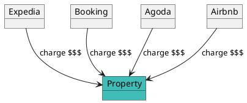
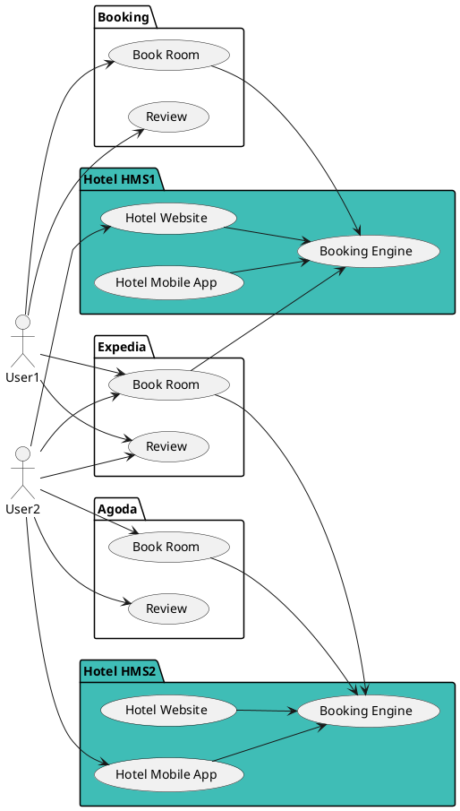
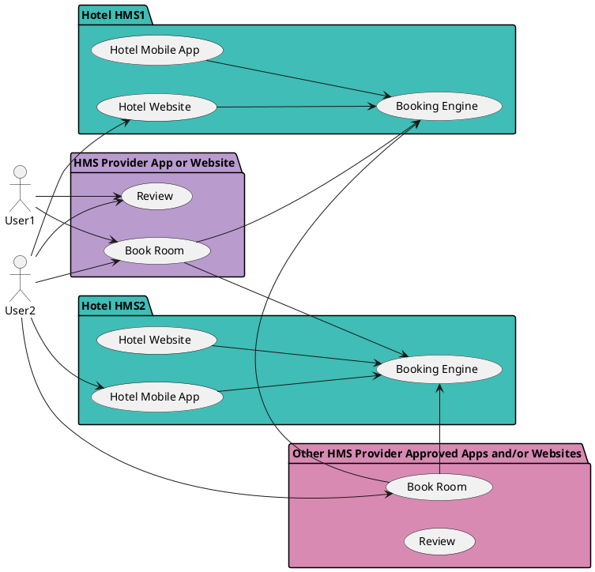

# Case Studies

Remember the purpose of Verana:

- fight against vendor lock-in;
- make the Internet decentralized again;
- protect end-user and organization data;
- enable new privacy-preserving business models;
- let Ecosystems self-govern and onboard participants that are rewarded for the value they are adding to the Ecosystems.

Verana is a solution to the centralization problem that currently exists in the Internet.

Everything starts with *HOW* we have access to the information.

## E-commerce

Let's take a simple example: you'd like to launch a new brand of kid shoes.

1. you design
2. you produce
3. you sell

The first 2 points (design and produce) 

## Hotels

### Being Searchable: Hotel Discovery

The Hotel vertical is an interesting example of a domination that can be reversed.

At the moment, most (or all) users are using brokering services to book their hotels. These brokering services, such as booking.com, expedia, or others, have reached a market domination that is capturing a huge part of the hotel's revenues, indirectly increasing the room cost for users.
Worst, users think they pay less, but obviously at the end they all pay more, because these intermediaries capture part of the value.

All hotels must rely on centralized platforms to be searchable. If they do not appear on these platforms, they do not even exist and will get no reservations.

> If your property is not searchable in broker services, you have no reservations!

### Hotel Management Systems

For managing your property(ies), there are currently a lot of Hotel Management Systems. Most are paid proprietary solutions, others are open source solutions, cloud based or self-hosted.

In order to prevent vendor lock-in, using an open source solution looks attractive:

- you can host the software anywhere (cloud, self hosted), and in theory move your hosted instance to a new location when needed;
- you have access to, and own your data.
- Property Management System (PMS), Booking Engine, Hotel Website draft for quick hotel website, Hotel Mobile App skeleton for building a custom Hotel mobile app, are usually provided as open source modules.

Usually, business models of these open source solutions are based on:

- the purchasing of software module add-ons, such as Hotel Channel Manager to integrate to main brokers like booking, expedia...,
- custom software development,
- hosting.

At the end, these solutions are efficient for managing the hotel, but does not provide visibility, that is always delegated to brokers.

Users are usually reaching the hotel using the brokers, even if sometimes they can access directly the hotel website if theur are returning customers:

### Use Verana to instantly make all Hotels visible

Instead of only relying on brokers for getting room reservations, Open Source HMS Software Providers can:

- create an Ecosystem in the Verana Trust Network, and for this Ecosystem, define an Hotel credential schema.
- add the Verifiable Trust stack to their Open Source software.
- build a global mobile app or website as a verifiable user agent, named "HMS Provider App or Website" in the diagram below, a broker competitor service that will be available for all Hotels that are using their software.

2. Now, Hotels that are using the open source software can:

- Automatically be searchable in software vendor global mobile app
- Request their users to download the global mobile app for ej doing their check-in, open their room, etc

3. As the global mobile app is in their device, users can book the same hotel, or any hotel using the same HMS directly from the "HMS Provider App or Website".

