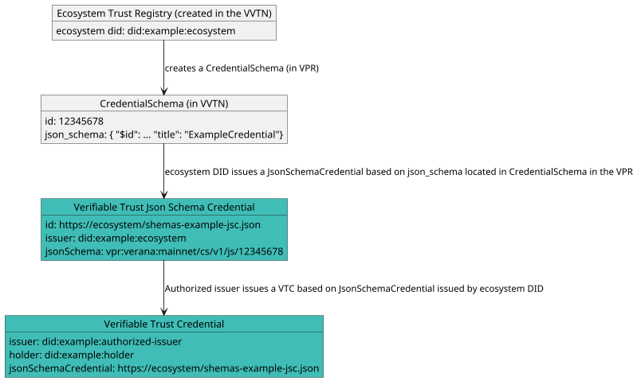

# Verifiable Trust Credential

Data stored in the Verana Verifiable Trust Network (VVTN) is not verified at the time of storage, nor does it need to be. Verification happens outside the scope of the VVTN.

This is not a limitation, it’s a feature. For example, any DID method can be used, and the VVTN will never attempt to resolve or validate DIDs itself.

The VPR provides registrations, not validations, leaving trust decisions and verification where they belong: **with the relying parties**.

To make things verifiable, for a given credential schema:

- Ecosystem creates a Credential Json Schema in the VVTN, linked to its Ecosystem DID.
- Ecosystem issues, with its DID, a **Json Schema Credential** linked to its credential **Json Schema** in the VVTN
- Then, authorized issuers can issue **Verifiable Trust Credentials** linked to the **Json Schema Credential** issued by Ecosystem DID.

.



## Json Schema Credentials

*This section is non-normative.*

To prove that data stored in a VPR, such as a credential json schema, is authentic, after creating the JSON Schema, the **Ecosystem owner** of the Trust Registry issues a [JSON Schema Credential](https://www.w3.org/TR/vc-json-schema/) using the **DID registered as the Trust Registry’s Ecosystem identifier** in the VVTN.

This credential serves as a verifiable proof of:

- Ownership of the **Credential Schema**
- Control over the corresponding **Trust Registry Ecosystem DID**.

```json
{
  "@context": [
      "https://www.w3.org/ns/credentials/v2"
  ],
  "id": "https://ecosystem/shemas-example-jsc.json",
  "type": ["VerifiableCredential", "JsonSchemaCredential"],
  "issuer": "did:example:ecosystem",
  "issuanceDate": "2024-01-01T19:23:24Z",
  "credentialSchema": {
    "id": "https://www.w3.org/ns/credentials/json-schema/v2.json",
    "type": "JsonSchema",
    "digestSRI": "sha384-S57yQDg1MTzF56Oi9DbSQ14u7jBy0RDdx0YbeV7shwhCS88G8SCXeFq82PafhCrW"
  },
  "credentialSubject": {
    "id": "vpr:verana:mainnet/cs/v1/js/12345678",
    "type": "JsonSchema",
    "jsonSchema": {
      "$ref": "vpr:verana:mainnet/cs/v1/js/12345678"
    },
    "digestSRI": "sha384-ABCSGyugst67rs67rdbugsy0RDdx0YbeV7shwhCS88G8SCXeFq82PafhCeZ" 
  }
}
```
