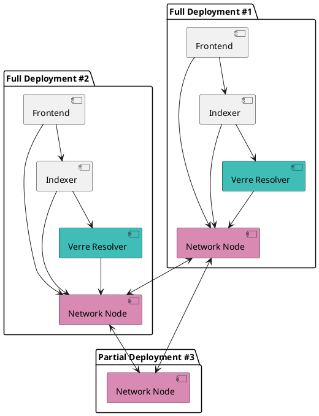

# Components

## Built for decentralization

The Verana Verifiable Trust Network is composed of 4 essential components:

| **Component**   | **Purpose**                                                  |
|-----------------------|------------------------------------------------------------------|
| [Network Node (verana-blockchain)](https://github.com/verana-labs/verana-blockchain)    | a cosmos-SDK [VPR](https://verana-labs.github.io/verifiable-trust-vpr-spec/) implementation       |
| [Verre](https://github.com/verana-labs/verre) **Ver**ana **Re**solver   | typescript library for resolving trust|
| [Indexer](#)  | Container for indexing ledger data by resolving trust|
| [Verana Frontend](https://github.com/verana-labs/verana-frontend)  | End-user Verana Frontend for using VPR features|

:::tip
These components can be run by anyone and hosted anywhere. For security considerations, it is best for Verana Network users to run all components. But this is not required and depends on use case: you can run node only, deploy a frontend and use indexer + node of a third party...
:::
