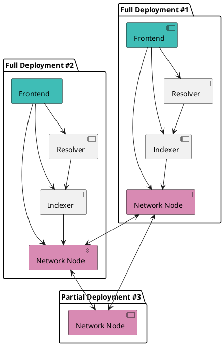

# Verana Infrastructure

🌐 **Verana** is a **decentralized infrastructure** made up of **core components** plus a suite of **add-on modules** for extended functionality.

## Core Components

| **Component**   | **Purpose**                                                  |
|-----------------------|------------------------------------------------------------------|
| [Network Node (verana-blockchain)](https://github.com/verana-labs/verana-blockchain)    | a cosmos-SDK [Verifiable Public Registry](https://verana-labs.github.io/verifiable-trust-vpr-spec/) implementation       |
| [Indexer (verana-indexer)](https://github.com/verana-labs/verana-indexer)  | Container for indexing ledger data|
| [Trust Resolver (verana-resolver)](https://github.com/verana-labs/verana-resolver)  | Provide an extensive REST API for searching indexed and verified data. Includes a [Trust Registry Query Protocol (TRQP) v2 endpoint](https://trustoverip.github.io/tswg-trust-registry-protocol/)|
| [Verana Frontend (verana-frontend) ](https://github.com/verana-labs/verana-frontend)  | End-user Verana Frontend for using VPR features|

:::tip
These components can be run by anyone and hosted anywhere. For security considerations, it is **suggested**, for **Verifiable Service** and/or **Verifiable User Agent** providers, to run all essential components.
:::

## Add-on Modules

- a [ping.pub block explorer](https://github.com/verana-labs/pingpub-explorer);
- a [faucet chatbot](https://github.com/verana-labs/verana-faucet-hologram-chatbot).
