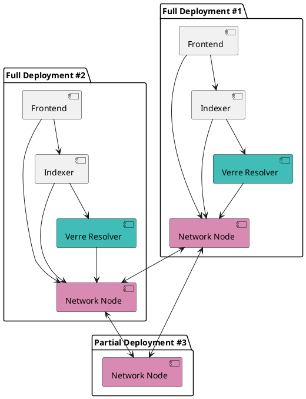

# Verana Components

🌐 **Verana** is an Infrastructure Built for Decentralization, and is composed of **essential components** and other **adds-on** components.

## Essential Components

| **Component**   | **Purpose**                                                  |
|-----------------------|------------------------------------------------------------------|
| [Network Node (verana-blockchain)](https://github.com/verana-labs/verana-blockchain)    | a cosmos-SDK [VPR](https://verana-labs.github.io/verifiable-trust-vpr-spec/) implementation       |
| [Verre](https://github.com/verana-labs/verre) **Ver**ana **Re**solver   | typescript library for resolving trust|
| [Indexer](#)  | Container for indexing ledger data by resolving trust. Provide an extensive REST API for searching any data, and includes a [Trust Registry Query Protocol (TRQP) v2 endpoint](https://trustoverip.github.io/tswg-trust-registry-protocol/)|
| [Verana Frontend](https://github.com/verana-labs/verana-frontend)  | End-user Verana Frontend for using VPR features|

:::tip
These components can be run by anyone and hosted anywhere. For security considerations, it is **suggested**, for **Verifiable Service** and/or **Verifiable User Agent** providers, to run all essential components.
:::

## Adds-on Components

- a [ping.pub block explorer](https://github.com/verana-labs/pingpub-explorer);
- a [faucet chatbot](https://github.com/verana-labs/verana-faucet-hologram-chatbot).
