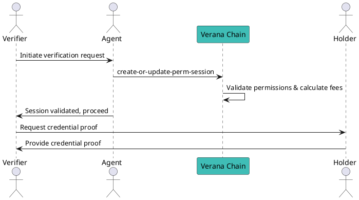

# Credential Verification Guide

This guide explains how to verify Verifiable Credentials (VCs) within an ecosystem using the Verana blockchain. It covers the prerequisites, steps, and monetization process involved in verification.

---

## Prerequisites

Before you can verify credentials:
- You must hold an **active Verifier permission** for the relevant Credential Schema.
- The permission must be in `VALIDATED` state.
- Ensure you have sufficient funds to cover:
  - Transaction fees.
  - Any applicable **verification fees** as defined in the Ecosystem Governance Framework (EGF).

To confirm your permission status:
```bash
veranad q perm list-permissions --node $NODE_RPC --output json
```

---

## Overview of Verification Flow

1. **Verifier** requests credential proof from a **Holder**.
2. **Agent** prepares the request and initiates the verification session on-chain.
3. The Verana blockchain validates the session, calculates fees, and enforces trust deposit rules.
4. The Holder responds with the credential proof, and verification is completed off-chain by the Verifier.

---

## Why a Permission Session?

A **Permission Session** ensures:
- **Correct fee distribution** to Issuer, Verifier, and Ecosystem roles.
- Compliance with trust deposit rules.
- Secure linkage between Verifier, Agent, and Holder during verification.

Without a valid session, verification requests **will fail** because the trust fee mechanism cannot execute.

---

## Create a Permission Session for Verification

### Syntax
```bash
veranad tx perm create-or-update-perm-session <session-id> <agent-perm-id> \
  [--wallet-agent-perm-id <id>] [--issuer-perm-id <id>] [--verifier-perm-id <id>] \
  --from <user> --chain-id <chain-id> --keyring-backend test --fees <amount>
```

**Parameters:**
- `<session-id>`: UUID for this verification session.
- `<agent-perm-id>`: Permission ID of the agent initiating the verification.
- `<wallet-agent-perm-id>`: Permission ID of the wallet agent handling the Holder's wallet.
- `[issuer-perm-id]`: Leave empty for verification.
- `<verifier-perm-id>`: Permission ID of the Verifier performing verification.

**Example:**
```bash
SESSION_ID=$(uuidgen)
veranad tx perm create-or-update-perm-session $SESSION_ID 45 \
  --wallet-agent-perm-id 50 --verifier-perm-id 60 \
  --from $USER_ACC  --keyring-backend test --chain-id $CHAIN_ID --fees 600000uvna --node $NODE_RPC
```

---

## Verification Workflow Diagram



---

## Fee Flow and Monetization

Verification fees are calculated and distributed as per the **permission hierarchy** and the **EGF policy**. The on-chain process ensures:
- Ecosystem Controller receives its share.
- Issuer (of the credential) receives its share.
- Verifier pays applicable fees before verification can proceed.

For detailed fee distribution logic, see [Credential Monetization Guide](../../learn/verifiable-public-registry/credential-monetization).

---

## Key CLI References

- **Create Permission Session:**  
  `veranad tx perm create-or-update-perm-session`
- **Check Permission Status:**  
  `veranad q perm list-permissions`

---

## What's Next?

After completing verification:
- Review verification outcomes in your application.
- Maintain compliance with your ecosystem's policies on proof storage and audit logs.

For issuing credentials, see [Issuance Guide](90-issuance-guide.md).