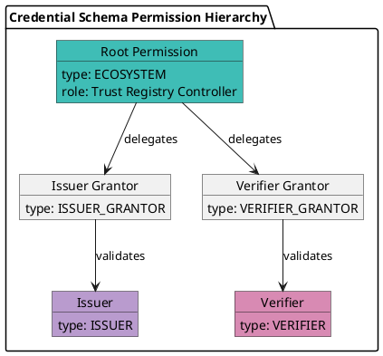

# Create and Manage Credential Schemas

This document provides comprehensive CLI commands for the Credential Schema (cs) module in the Verana blockchain.

## Module Overview

```bash
veranad tx cs
Transactions commands for the cs module

Usage:
  veranad tx cs [flags]
  veranad tx cs [command]

Available Commands:
  archive                  Archive or unarchive a credential schema
  create-credential-schema Create a new credential schema
  update                   Update a credential schema's validity periods
```

---

### Environment Setup

#### Set Environment Variables

```bash
USER_ACC="mat-test-acc"
USER_ACC_LIT=verana1sxau0xyttphpck7vhlvt8s82ez70nlzw2mhya0
CHAIN_ID="vna-testnet-1"
NODE_RPC=http://node1.testnet.verana.network:26657
```

*These variables are required to target the correct environment (testnet, mainnet, or local). Adjust values accordingly.*

> **Prerequisite:** Ensure the `veranad` binary is installed and up-to-date.  
> See [Install or Update Veranad Binary](/docs/next/run/network/run-a-node/prerequisites).

See [Install from Source](/docs/next/run/network/run-a-node/local-node-isolated) for detailed instructions.

---

### Define your Trust Registry ID and Schema ID

```bash
TRUST_REG_ID=5
SCHEMA_ID=10
```

> **Note:** The following examples assume you have set `TRUST_REG_ID` and `SCHEMA_ID` as shown above.

---

## Transaction Commands

### 1. Create Credential Schema

Creates a new credential schema linked to an existing trust registry.

**Syntax:**
```bash
veranad tx cs create-credential-schema <trust-registry-id> <json-schema> <issuer-grantor-validity> <verifier-grantor-validity> <issuer-validity> <verifier-validity> <holder-validity> <issuer-perm-mode> <verifier-perm-mode> --from <user> --chain-id <chain-id> --keyring-backend test --fees <amount> --gas auto
```

**Parameters:**
- `<trust-registry-id>`: Numeric ID of the trust registry
- `<json-schema>`: JSON schema (inline string or from file prefixed with `@`)
- `<issuer-grantor-validity>`: Validity period for issuer grantor (in days)
- `<verifier-grantor-validity>`: Validity period for verifier grantor (in days)
- `<issuer-validity>`: Validity period for issuer (in days)
- `<verifier-validity>`: Validity period for verifier (in days)
- `<holder-validity>`: Validity period for holder (in days)
- `<issuer-perm-mode>` and `<verifier-perm-mode>`: Control how Issuer and Verifier permissions are granted for this schema. These values must be integers corresponding to one of the modes in the table below.

#### Permission Management Modes for Issuer and Verifier

| Value | Mode Name            | Description                                                              |
|-------|-----------------------|--------------------------------------------------------------------------|
| `1`   | OPEN                 | Anyone can self-create the permission without validation.               |
| `2`   | GRANTOR_VALIDATION   | Requires validation by a Grantor permission holder (Issuer or Verifier).|
| `3`   | ECOSYSTEM            | Requires validation by the Ecosystem controller (Trust Registry owner).|

> **Tip:** Choose the mode based on your ecosystem onboarding policy. See [Onboarding Process](20-onboarding.md) for details.

**Example (inline JSON schema):**
```bash
veranad tx cs create-credential-schema ${TRUST_REG_ID} '{"$schema":"https://json-schema.org/draft/2020-12/schema","$id":"/vpr/v1/cs/js/1","type":"object","properties":{"name":{"type":"string"}},"required":["name"],"additionalProperties":false}' 365 365 180 180 180 1 1 --from $USER_ACC --chain-id $CHAIN_ID --keyring-backend test --fees 600000uvna --node $NODE_RPC
```

**Example (using JSON file):**
```bash
# Save schema to file first
cat > schema.json << 'EOF'
{
    "$schema": "https://json-schema.org/draft/2020-12/schema",
    "$id": "vpr:verana:mainnet/cs/v1/js/VPR_CREDENTIAL_SCHEMA_ID",
    "type": "object",
    "$defs": {},
    "properties": {
        "name": {
            "type": "string"
        },
        "email": {
            "type": "string",
            "format": "email"
        }
    },
    "required": ["name"],
    "additionalProperties": false
}
EOF

# Use in command (you'll need to escape or quote properly)
veranad tx cs create-credential-schema ${TRUST_REG_ID} "$(cat schema.json)" 365 365 180 180 180 1 1 --from $USER_ACC --chain-id $CHAIN_ID --keyring-backend test --fees 600000uvna --node $NODE_RPC
```

### Listing Credential Schemas

To list all existing Credential Schemas and find their IDs, run:

```bash
veranad q cs list-schemas --node $NODE_RPC  --output json
```

Use this output to identify the `id` of the credential schema you want to manage.

---

### 2. Update Credential Schema

Updates the validity periods of an existing credential schema.

**Syntax:**
```bash
veranad tx cs update <credential-schema-id> <issuer-grantor-validity> <verifier-grantor-validity> <issuer-validity> <verifier-validity> <holder-validity> --from <user> --chain-id <chain-id> --keyring-backend test --fees <amount>
```

**Example:**
```bash
veranad tx cs update ${TRUST_REG_ID} 365 365 280 280 280 --from $USER_ACC --chain-id $CHAIN_ID --keyring-backend test --fees 600000uvna --node $NODE_RPC
```

---

### 3. Archive Credential Schema

Archives or unarchives a credential schema.

**Syntax:**
```bash
veranad tx cs archive <credential-schema-id> <archive-flag> --from <user> --chain-id <chain-id> --keyring-backend test --fees <amount>
```

**Parameters:**
- `<credential-schema-id>`: Numeric ID of the credential schema
- `<archive-flag>`: Boolean (`true` to archive, `false` to unarchive)

**Examples:**
```bash
veranad tx cs archive ${TRUST_REG_ID} true --from $USER_ACC --chain-id $CHAIN_ID --keyring-backend test --fees 600000uvna --node $NODE_RPC
veranad tx cs archive ${TRUST_REG_ID} false --from $USER_ACC --chain-id $CHAIN_ID --keyring-backend test --fees 600000uvna --node $NODE_RPC
```

### 4. Create a root permission


**syntax**

```bash
veranad tx perm create-root-perm -h
Create a new root perm for a credential schema. Can only be executed by the trust registry controller.

Usage:
  veranad tx perm create-root-perm [schema-id] [did] [validation-fees] [issuance-fees] [verification-fees] [flags]
```

**Parameters:**
- `<schema-id>`: The ID of the credential schema for which to create the root permission.
- `<did>`: The DID of the grantee (the entity that will hold the root permission).
- `<validation-fees>`: Fee (in trust units) charged for running a validation process.
- `<issuance-fees>`: Fee (in trust units) applied to issuance actions for this schema.
- `<verification-fees>`: Fee (in trust units) applied to verification actions for this schema.

> **Note:** These fees define the trust fee model for the ecosystem and are enforced by the Verifiable Public Registry. The actual values should comply with the rules specified in your Ecosystem Governance Framework (EGF).

The root permission is a special permission that can only be created by the Trust Registry controller.  
It acts as the top-level authority for a credential schema and is required to delegate other permissions (e.g., Grantor, Issuer, Verifier) according to the Ecosystem Governance Framework.

Without a root permission, no permission hierarchy can be established under this schema.

### Why is Root Permission Mandatory?

The root permission of type **ECOSYSTEM** serves as the **anchor for the permission tree**. It establishes the top-level authority for a credential schema, without which no other permissions (Issuer, Verifier, or Grantor) can be created.  

**Key Reasons:**
- It defines the trust framework and fee structure (validation, issuance, verification).
- It provides a governance root for delegating permissions through a hierarchy.
- Validation processes depend on it to identify the controlling authority and enforce trust deposit rules.

Without a root permission:
- No Issuer or Verifier can be authorized.
- No validation process can start.
- The ecosystem for that schema is effectively non-functional.

#### Hierarchy Overview:



This tree illustrates why **the root permission must exist first**: it enables the rest of the ecosystem roles through controlled delegation.

examples:

```bash
veranad tx perm create-root-perm $SCHEMA_ID did:example:123456789abcdefghi 1000000 1000000 1000000 --from $USER_ACC --chain-id $CHAIN_ID --keyring-backend test --fees 600000uvna --node $NODE_RPC
```


#### Query the permissions for testing

```bash
veranad q perm list-permissions --node $NODE_RPC  --output json
```


---

## Parameter Details

### JSON Schema Requirements
- Must be valid JSON Schema (Draft 2020-12 or later)
- Include `$schema`, `$id`, `type`, and `properties`
- Properly escape inline JSON or use file with `@filename.json`

### Validity Periods
- Specified in days
- Common values:
  - 365 = 1 year

### Permission Management Modes
- Integer values representing modes for issuer and verifier
- See module documentation for mode definitions

---

## Permission Types

Permissions define roles for entities within an Ecosystem:

| Type ID | Permission Type     | Description                                      |
|---------|----------------------|--------------------------------------------------|
| 1       | ISSUER              | Entity authorized to issue credentials.          |
| 2       | VERIFIER            | Entity authorized to verify credentials.         |
| 3       | ISSUER-GRANTOR      | Entity that validates ISSUER applicants.         |
| 4       | VERIFIER-GRANTOR    | Entity that validates VERIFIER applicants.       |
| 5       | ECOSYSTEM           | Ecosystem controller with governance authority.  |
| 6       | HOLDER              | Entity holding Verifiable Credentials.           |

Refer to [Permission Module Spec](https://verana-labs.github.io/verifiable-trust-vpr-spec/#permission-module) for the full specification.

---

## Validation Rules
- Only trust registry controller can create/update/archive schemas
- JSON schema must be valid and parseable
- Cannot archive an already archived schema
- Validity periods must be positive integers

---

## Common Error Scenarios
- Invalid JSON schema format
- Unauthorized controller attempting modification
- Negative or zero validity periods
- Missing or incorrect parameters

---

## Transaction Fees
- Use `--fees` to specify fees (e.g., `60000uvna`)
- Use `--gas auto` for automatic gas estimation

---

## Next Steps
- Verify your schema and permissions via queries:
```bash
veranad q cs list-schemas --node $NODE_RPC --output json
veranad q perm list-permissions --node $NODE_RPC --output json
```
- Proceed to onboarding participants: see [Join an Ecosystem](20-onboarding.md).
