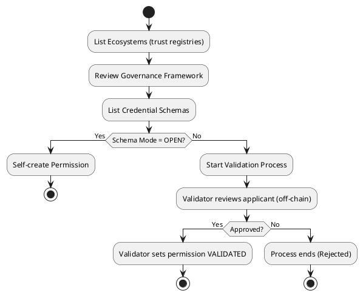

# Join an Ecosystem

Learn how to join an ecosystem and obtain permissions for issuing, verifying, or holding credentials.

## Quick Decision Flow

```
What role do you need?
    ↓
Check the schema configuration (issuer and verifier modes)
    ↓
If mode = OPEN → Self-create permission
If mode = GRANTOR or ECOSYSTEM → Start a validation process
    ↓
Once permission is granted, act as Issuer / Verifier / Holder
```



## Core Concepts

### Permission Management Modes

| Mode ID | Mode Name           | Meaning                                                  |
|---------|---------------------|----------------------------------------------------------|
| 1       | OPEN                | Self-create your permission—no validation required.      |
| 2       | GRANTOR_VALIDATION  | A Grantor (Issuer Grantor or Verifier Grantor) must validate you. |
| 3       | ECOSYSTEM           | The Ecosystem controller must validate you.              |

### Permission Types

| ID | Role              | Description                                                  |
|----|-------------------|--------------------------------------------------------------|
| 1  | Issuer            | Can issue credentials for this schema.                      |
| 2  | Verifier          | Can request verification of credentials for this schema.    |
| 3  | Issuer-Grantor    | Validates issuers and grants them permissions.              |
| 4  | Verifier-Grantor  | Validates verifiers and grants them permissions.            |
| 5  | Ecosystem         | Controls trust registry and manages schema governance.      |
| 6  | Holder            | Holds credentials issued under this schema.                 |

## Onboarding Steps

### 1. List Available Ecosystems
```bash
veranad q tr list-trust-registries --node $NODE_RPC --output json
```

**Example Output:**
```json
{
  "trust_registries": [
    {
      "id": "1",
      "did": "did:example:ecosystemA",
      "controller": "verana1abcdxyz...",
      "aka": "https://ecosystem.example",
      "active_version": 1,
      "versions": [
        {
          "version": 1,
          "documents": [
            {
              "language": "en",
              "url": "https://example.com/egf.pdf",
              "digest_sri": "sha384-abc123..."
            }
          ]
        }
      ]
    }
  ]
}
```

---

### 2. Review Governance Framework

Locate the `doc-url` for the chosen ecosystem and verify its `digest_sri` hash to ensure the governance framework is authentic.

---

### 3. Identify Credential Schemas
```bash
veranad q cs list-schemas --node $NODE_RPC --output json
```

**Example Output:**
```json
{
  "schemas": [
    {
      "id": "5",
      "tr_id": "1",
      "json_schema": "{\"$schema\":\"https://json-schema.org/draft/2020-12/schema\",\"$id\":\"/vpr/v1/cs/js/1\",\"type\":\"object\",\"properties\":{\"name\":{\"type\":\"string\"}},\"required\":[\"name\"]}",
      "issuer_perm_management_mode": "OPEN",
      "verifier_perm_management_mode": "GRANTOR_VALIDATION"
    }
  ]
}
```

Set your schema ID for subsequent commands:

```bash
SCHEMA_ID=5
```

---

### 4. Determine Your Path

Based on the schema configuration and the role you want to assume, your onboarding path differs:

| Role              | OPEN Mode                              | ECOSYSTEM Mode                                        | GRANTOR Mode                                              |
|-------------------|---------------------------------------|--------------------------------------------------------|-----------------------------------------------------------|
| Issuer Grantor    | N/A                                   | N/A                                                    | Validation process with Ecosystem validator              |
| Issuer            | **Self-create** (Permission type = 1) | Validation with Ecosystem (Permission type = 5)        | Validation with Issuer Grantor (Permission type = 3)     |
| Holder            | Self-create Issuer, then self-issue   | Validation with Issuer, then get credential            | Validation with Issuer, then get credential              |
| Verifier Grantor  | N/A                                   | N/A                                                    | Validation process with Ecosystem validator              |
| Verifier          | **Self-create** (Permission type = 2) | Validation with Ecosystem (Permission type = 5)        | Validation with Verifier Grantor (Permission type = 4)   |

- **OPEN Mode**: You can self-create the permission directly.
- **GRANTOR or ECOSYSTEM Mode**: You must start a validation process with the appropriate validator.

---

### 5. Self-Create a Permission (OPEN Mode)

Use this for Issuer or Verifier roles when the schema allows **OPEN** mode.

**Syntax:**
```bash
veranad tx perm create-perm <schema-id> <permission-type> <did> \
  --from <user> --chain-id <chain-id> --keyring-backend test --fees <amount> --gas auto
```

**Example:**
```bash
veranad tx perm create-perm $SCHEMA_ID 1 did:example:123456789abcdefghi \
  --from $USER_ACC --chain-id $CHAIN_ID --keyring-backend test --fees 600000uvna --node $NODE_RPC
```

---

### 6. Start a Validation Process (GRANTOR or ECOSYSTEM Mode)

If the schema requires validation, you cannot self-create the permission. Instead:

1. Identify the validator (Grantor or Ecosystem) based on the schema policy.
2. Start the validation process:

**Syntax:**
```bash
veranad tx perm start-perm-vp <schema-id> <permission-type> <did> \
  --from $USER_ACC --chain-id $CHAIN_ID --fees 600000uvna --node $NODE_RPC
```

**Example:**
```bash
veranad tx perm start-perm-vp $SCHEMA_ID 1 did:example:123456789abcdefghi \
  --from $USER_ACC --chain-id $CHAIN_ID --keyring-backend test --fees 600000uvna --node $NODE_RPC
```

📌 **What happens next?**

- A validation entry is created on-chain.
- Off-chain, the validator contacts you (usually via DIDComm) to:
  - Prove control of your DID and Verana account.
  - Provide required documents defined in the Ecosystem Governance Framework (EGF).
- Once approved, the validator marks the process as validated and your permission is activated.

---

### Verify Your Permissions

After onboarding, verify your permissions with:

```bash
veranad q perm list-permissions --node $NODE_RPC --output json
```

## Advanced Details

- **Off-chain validation** involves steps such as proof of DID control, sharing documents, and completing other checks.
- Some roles may require **paying validation fees** and a **trust deposit** as part of the onboarding process.
- If you are a **Holder**, you typically obtain credentials from an Issuer or self-issue if you already have Issuer permission.
- For more information on the validation process, see [Validation Process Guide](../../learn/verifiable-public-registry/onboarding-participants#validation-process).

