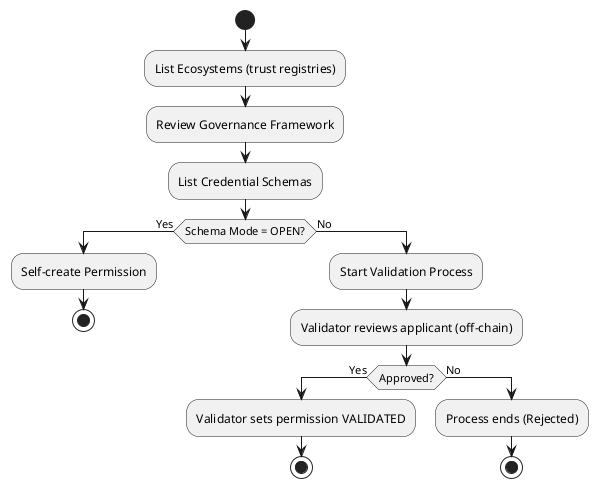

# Join an Ecosystem

## Module Overview

```bash
veranad tx perm               
Transactions commands for the perm module

Usage:
  veranad tx perm [flags]
  veranad tx perm [command]

Available Commands:
  cancel-perm-vp-request        Cancel a pending perm VP request
  confirm-vp-termination        Confirm the termination of a perm VP
  create-or-update-perm-session Create or update a perm session
  create-perm                   Create a new perm for open schemas
  create-root-perm              Create a new root perm for a credential schema
  extend-perm                   Extend a perm's effective duration
  renew-perm-vp                 Renew a perm validation process
  repay-perm-slashed-td         Repay a slashed perm's trust deposit
  request-vp-termination        Request termination of a perm validation process
  revoke-perm                   Revoke a perm
  set-perm-vp-validated         Set perm validation process to validated state
  slash-perm-td                 Slash a perm's trust deposit
  start-perm-vp                 Start a new perm validation process
```

---

## Before You Start: How Schema Rules Affect Onboarding

When joining an ecosystem, your onboarding path depends on **permission management modes** configured in the **Credential Schema**.  
For each schema:

- **Issuer Perm Management Mode** and **Verifier Perm Management Mode** can be:
  - `1` = **OPEN** → you can self-create the permission.
  - `2` = **GRANTOR_VALIDATION** → you need validation from a Grantor.
  - `3` = **ECOSYSTEM** → you need validation from an Ecosystem-level validator.

See [Create a Credential Schema](../17-create-a-credential-schema.md) for how these modes are defined.

---

### Permission Types

| Type ID | Role              |
|---------|-------------------|
| 1       | Issuer           |
| 2       | Verifier         |
| 3       | Issuer-Grantor   |
| 4       | Verifier-Grantor |
| 5       | Ecosystem        |
| 6       | Holder           |

These types are required when creating permissions or running validation processes.

---

## Onboarding Process

### 1. List available Ecosystems

```bash
veranad q tr list-trust-registries --node $NODE_RPC --output json
```

---

### 2. Review the Governance Framework

Check the governance framework URL (`doc-url`) and verify its `digest_sri` hash matches.

---

### 3. Identify Credential Schemas

List schemas for the selected Trust Registry:

```bash
veranad q cs list-schemas --node $NODE_RPC --output json
```

Set your Schema ID for further steps:

```bash
SCHEMA_ID=5
```

---

### 4. Determine Onboarding Path

Based on **schema configuration** and your target **permission type**, the required action varies:

#### For Issuance Permissions (or VC issuance):

| Role              | OPEN Mode                              | ECOSYSTEM Mode                                        | GRANTOR Mode                                              |
|-------------------|---------------------------------------|--------------------------------------------------------|-----------------------------------------------------------|
| Issuer Grantor    | N/A                                   | N/A                                                    | Validation process with Ecosystem validator              |
| Issuer            | **Self-create** (Permission type = 1) | Validation with Ecosystem (Permission type = 5)        | Validation with Issuer Grantor (Permission type = 3)     |
| Holder            | Self-create Issuer, then self-issue   | Validation with Issuer, then get credential            | Validation with Issuer, then get credential              |

#### For Verification Permissions:

| Role              | OPEN Mode                              | ECOSYSTEM Mode                                        | GRANTOR Mode                                              |
|-------------------|---------------------------------------|--------------------------------------------------------|-----------------------------------------------------------|
| Verifier Grantor  | N/A                                   | N/A                                                    | Validation process with Ecosystem validator              |
| Verifier          | **Self-create** (Permission type = 2) | Validation with Ecosystem (Permission type = 5)        | Validation with Verifier Grantor (Permission type = 4)   |

---

## 5. Self-Create a Permission (OPEN Mode)

Use this for Issuer or Verifier roles when the schema allows **OPEN** mode.

**Syntax:**
```bash
veranad tx perm create-perm <schema-id> <permission-type> <did> --from <user> --chain-id <chain-id> --keyring-backend test --fees <amount> --gas auto
```

**Example:**
```bash
veranad tx perm create-perm $SCHEMA_ID 1 did:example:123456789abcdefghi \
  --from $USER_ACC --chain-id $CHAIN_ID --keyring-backend test --fees 600000uvna --node $NODE_RPC
```

---

## 6. Start a Validation Process (GRANTOR or ECOSYSTEM Mode)

If the schema requires **validation**, you cannot self-create the permission. Instead:

1. Request a validator (Grantor or Ecosystem) based on the schema policy.
2. Start the validation process using:

```bash
veranad tx perm start-perm-vp <schema-id> <permission-type> <did> --from $USER_ACC --chain-id $CHAIN_ID --fees 600000uvna --node $NODE_RPC
```

**Example:**
```bash
veranad tx perm start-perm-vp $SCHEMA_ID 1 did:example:123456789abcdefghi \
  --from $USER_ACC --chain-id $CHAIN_ID --keyring-backend test --fees 600000uvna --node $NODE_RPC
```

---

### Verify Permissions
```bash
veranad q perm list-permissions --node $NODE_RPC --output json
```

---

✅ **Next Step:** If acting as a validator, see the [Validation Process Guide](../../learn/verifiable-public-registry/onboarding-participants#validation-process).

**Note:** For schema creation and permission modes, see [Create a Credential Schema](create-a-credential-schema).

(Visual flow diagram placeholder)
# Join an Ecosystem

## Overview

Joining an ecosystem means obtaining the **permissions** required to issue, verify, or hold credentials for a specific **Credential Schema**.  
Your onboarding path depends on:

- The **role** you want to assume (Issuer, Verifier, Holder, etc.)
- The **permission management mode** set by the ecosystem for that schema.

---

## Decision Flow: How Do I Join?

```
What role do you need?
    ↓
Check the schema configuration (issuer and verifier modes)
    ↓
If mode = OPEN → Self-create permission
If mode = GRANTOR or ECOSYSTEM → Start a validation process
    ↓
Once permission is granted, act as Issuer / Verifier / Holder
```

---

## Permission Management Modes

| Mode ID | Mode Name          | Meaning                                                 |
|---------|--------------------|---------------------------------------------------------|
| 1       | OPEN              | Self-create your permission—no validation required.     |
| 2       | GRANTOR_VALIDATION| A Grantor (Issuer Grantor or Verifier Grantor) must validate you. |
| 3       | ECOSYSTEM         | The Ecosystem controller must validate you.            |

---

## Permission Types (used in CLI)

| ID | Role              | Description                                                  |
|----|-------------------|--------------------------------------------------------------|
| 1  | Issuer           | Can issue credentials for this schema.                      |
| 2  | Verifier         | Can request verification of credentials for this schema.    |
| 3  | Issuer-Grantor   | Validates issuers and grants them permissions.              |
| 4  | Verifier-Grantor | Validates verifiers and grants them permissions.            |
| 5  | Ecosystem        | Controls trust registry and manages schema governance.      |
| 6  | Holder           | Holds credentials issued under this schema.                 |

---

## Important Notes Before You Start

- **Validation involves off-chain steps** (proof of DID control, sharing documents, completing checks).
- Some roles may require **paying validation fees** and a **trust deposit** (see [Validation Process](../../learn/verifiable-public-registry/onboarding-participants#validation-process)).
- If you’re a **Holder**, you typically obtain credentials from an Issuer (or self-issue if you already have Issuer permission).

---

## Onboarding Steps (CLI)

### 1. List Available Ecosystems
```bash
veranad q tr list-trust-registries --node $NODE_RPC --output json
```

**Example Output:**
```json
{
  "trust_registries": [
    {
      "id": "1",
      "did": "did:example:ecosystemA",
      "controller": "verana1abcdxyz...",
      "aka": "https://ecosystem.example",
      "active_version": 1,
      "versions": [
        {
          "version": 1,
          "documents": [
            {
              "language": "en",
              "url": "https://example.com/egf.pdf",
              "digest_sri": "sha384-abc123..."
            }
          ]
        }
      ]
    }
  ]
}
```

---

### 2. Review Governance Framework
Locate the `doc-url` for the chosen ecosystem and verify its `digest_sri`.

---

### 3. Identify Credential Schemas
```bash
veranad q cs list-schemas --node $NODE_RPC --output json
```

**Example Output:**
```json
{
  "schemas": [
    {
      "id": "5",
      "tr_id": "1",
      "json_schema": "{\"$schema\":\"https://json-schema.org/draft/2020-12/schema\",\"$id\":\"/vpr/v1/cs/js/1\",\"type\":\"object\",\"properties\":{\"name\":{\"type\":\"string\"}},\"required\":[\"name\"]}",
      "issuer_perm_management_mode": "OPEN",
      "verifier_perm_management_mode": "GRANTOR_VALIDATION"
    }
  ]
}
```

Set:
```bash
SCHEMA_ID=5
```

---

### 4. Determine Your Path
- **OPEN Mode** → Self-create your permission.
- **GRANTOR or ECOSYSTEM Mode** → Run a validation process.

---

### 5. Self-Create a Permission (OPEN Mode)

**Syntax:**
```bash
veranad tx perm create-perm <schema-id> <permission-type> <did> \
  --from <user> --chain-id <chain-id> --keyring-backend test --fees <amount> --gas auto
```

**Example (create Issuer permission):**
```bash
veranad tx perm create-perm $SCHEMA_ID 1 did:example:123456789abcdefghi \
  --from $USER_ACC --chain-id $CHAIN_ID --keyring-backend test --fees 600000uvna --node $NODE_RPC
```

---

### 6. Start a Validation Process (GRANTOR or ECOSYSTEM Mode)

If validation is required:

1. Identify the validator (Grantor or Ecosystem).
2. Start the process:

**Syntax:**
```bash
veranad tx perm start-perm-vp <schema-id> <permission-type> <did> \
  --from $USER_ACC --chain-id $CHAIN_ID --fees 600000uvna --node $NODE_RPC
```

**Example (request Issuer permission):**
```bash
veranad tx perm start-perm-vp $SCHEMA_ID 1 did:example:123456789abcdefghi \
  --from $USER_ACC --chain-id $CHAIN_ID --keyring-backend test --fees 600000uvna --node $NODE_RPC
```

📌 **What happens next?**
- A validation entry is created on-chain.
- Off-chain, the validator contacts you (usually via DIDComm) to:
  - Prove control of your DID and Verana account.
  - Provide required documents defined in the EGF.
- Once approved, the validator marks the process as validated and your permission is activated.

---

### Verify Your Permissions
```bash
veranad q perm list-permissions --node $NODE_RPC --output json
```

---

## Visual Flow Diagram

