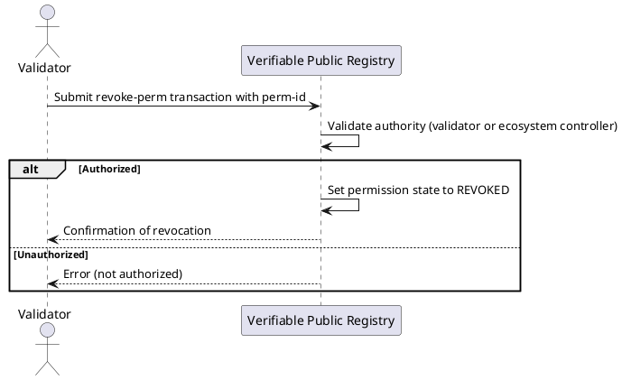

# Revoke a Permission


## Overview

Permission revocation is the process of invalidating an active permission within an ecosystem. This action is usually performed by:

- A validator who granted the permission during a validation process.
- The ecosystem trust registry controller.

Typical scenarios for revocation include:
- Violation of ecosystem governance framework (EGF) rules.
- Misuse of permissions by the grantee.
- Voluntary withdrawal by the validator or trust registry controller.

---

## CLI Command

```bash
veranad tx perm revoke-perm <perm-id> --from <user> --chain-id <chain-id> --keyring-backend test --fees <amount> --gas auto
```

**Parameters:**
- `<perm-id>`: UUID of the permission to revoke.
- `--from`: The validator or ecosystem controller executing the command.

**Example:**
```bash
veranad tx perm revoke-perm 123e4567-e89b-12d3-a456-426614174000 --from $USER_ACC --chain-id $CHAIN_ID --keyring-backend test --fees 600000uvna --node $NODE_RPC
```

---

## Visual Flow Diagram



---

## Query After Revocation

Check the status of the permission:

```bash
veranad q perm list-permissions --node $NODE_RPC --output json
```

**Example Output:**
```json
{
  "permissions": [
    {
      "id": "123e4567-e89b-12d3-a456-426614174000",
      "status": "REVOKED",
      "grantee": "did:example:abc123",
      "type": "ISSUER",
      "schema_id": "5"
    }
  ]
}
```

If for some reason a Validator wishes to revoke one of its applicant's permission, it should be the following way:
