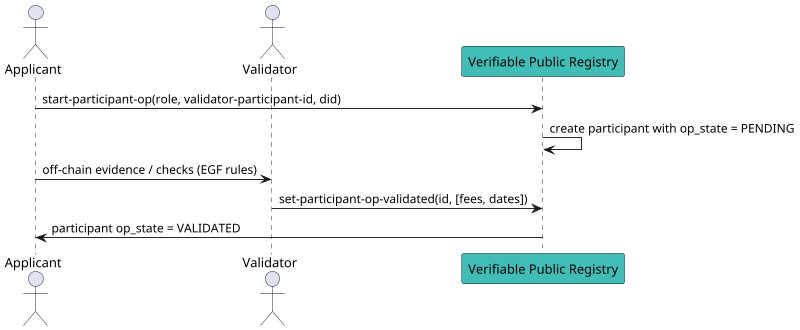

import Tabs from '@theme/Tabs';
import TabItem from '@theme/TabItem';

# Run an Onboarding Process to Obtain a Participant

Use this flow when you want to join an ecosystem's **credential schema** but self-creation is **not** allowed (the schema's management mode is not `OPEN`), or when a validator charges `validation_fees`. It starts a participant **onboarding process (OP)** — the v4 replacement for the old Validation Process (VP) — via `MsgStartParticipantOP` (`MOD-PP-MSG-1`).

Refer to the [learn section](../../../learn/verifiable-public-registry/onboarding-participants) for background on onboarding processes.

## When do you need an onboarding process?

- Schema issuer mode `GRANTOR_VALIDATION_PROCESS` → apply under an **ISSUER_GRANTOR** participant.
- Schema issuer mode `ECOSYSTEM_VALIDATION_PROCESS` → apply under the **root (ECOSYSTEM)** participant.
- Schema verifier mode `GRANTOR_VALIDATION_PROCESS` → apply under a **VERIFIER_GRANTOR** participant.
- Schema verifier mode `ECOSYSTEM_VALIDATION_PROCESS` → apply under the **root (ECOSYSTEM)** participant.
- **Holder**: if the selected Issuer charges `validation_fees`, the Holder runs an onboarding process under that **Issuer**.

> In `OPEN` mode the applicant [self-creates](./self-create-a-participant) the participant and does **not** run an onboarding process.

## What the chain does

- Creates a **participant entry** with `op_state = PENDING`.
- Accounts for any **trust deposit and fees** defined by the ecosystem and validator.
- The participant becomes usable only **after** the validator sets it to **VALIDATED** — see [Set Participant to Validated](./set-participant-to-validated).

:::warning Prerequisites
This is a **delegable** transaction executed on behalf of a Corporation. Before running it you need:
1. A **Corporation** (`policy_address`) that owns the applying Verifiable Service — see [Create a Corporation](../corporation).
2. The policy funded with `uvna` for fees and deposit.
3. An **operator** granted authorization for `/verana.pp.v1.MsgStartParticipantOP` via [Grant Operator Authorization](../delegation/grant-operator-authorization).
4. The numeric **validator participant ID** you are applying under — find it with `veranad query pp list-participants`.

Sign with `--from <operator>` and pass the corporation with `--corporation <policy_address>`.
:::

## Message Parameters

| Name | Description | Mandatory |
|------|-------------|-----------|
| `role` | One of `issuer`, `verifier`, `issuer-grantor`, `verifier-grantor`, `ecosystem`, `holder`. | yes |
| `validator-participant-id` | Participant ID you apply under (root / grantor / issuer). | yes |
| `did` | DID for this participant (must conform to DID syntax). | yes |
| `--corporation` | `policy_address` of the applying Corporation. | yes |
| `--validation-fees` / `--issuance-fees` / `--verification-fees` | Optional requested fees (JSON `OptionalUInt64`, e.g. `{"value":100}`); the validator may modify them. | no |

## Post the Message

<Tabs>
  <TabItem value="cli" label="CLI" default>

### Usage
```bash
veranad tx pp start-participant-op [role] [validator-participant-id] [did] \
  --corporation <policy_address> \
  --from <operator> --chain-id <chain-id> --keyring-backend test --fees 750000uvna --gas auto --node $NODE_RPC
```

### Example — apply as ISSUER_GRANTOR under the root (ECOSYSTEM) validator

```bash
CORPORATION=verana1n64en27u7qckklkk4twkkun5h6v5dsur7g6l4pfmfhydvfru9upq5w4nlu
OPERATOR=verana1aesnnc4fvar4wyaryvj9y4sty9vsw69hgymw7q
VALIDATOR_PARTICIPANT_ID=1   # ecosystem root participant

veranad tx pp start-participant-op issuer-grantor $VALIDATOR_PARTICIPANT_ID \
  did:example:18c0deef42d88ad05c25093ca7f60d46 \
  --corporation $CORPORATION \
  --from $OPERATOR --chain-id $CHAIN_ID --keyring-backend test --fees 750000uvna --gas auto --node $NODE_RPC --yes
```

### Real result

Succeeds with `code: 0`, creates participant **2** in `PENDING` state, and emits `start_participant_op` (txhash `2D4BDC66999C1B726DC97D80C2B515CB7D70280DB6D8885D1471DF7EF0D7D09A`):

```yaml
- type: message
  attributes:
  - key: action
    value: /verana.pp.v1.MsgStartParticipantOP
- type: start_participant_op
  attributes:
  - key: participant_id
    value: "2"
  - key: validator_participant_id
    value: "1"
  - key: role
    value: ISSUER_GRANTOR
  - key: fees
    value: "0"
  - key: deposit
    value: "0"
  - key: corporation_id
    value: "6"
```

  </TabItem>

  <TabItem value="frontend" label="Frontend">
The frontend will surface this flow once onboarding features are fully exposed. For now, use the CLI.
  </TabItem>
</Tabs>

## Verify the request was recorded

```bash
veranad query pp get-participant 2 --node $NODE_RPC --output json
```

Look for `op_state: "PENDING"` and `validator_participant_id` pointing at the validator you applied under.

## Off-chain interaction

After submitting, contact the **validator's DID** (via DIDComm or the channel specified in the EGF) to provide evidence and complete checks (KYC/compliance, capability proofs). When satisfied, the validator calls [Set Participant to Validated](./set-participant-to-validated) to activate your participant.

## Flow Diagram


