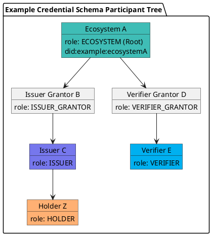

import Tabs from '@theme/Tabs';
import TabItem from '@theme/TabItem';

# Revoke a Participant

Revocation invalidates an existing participant (`MOD-PP-MSG-9`, `MsgRevokeParticipant`). Per the CLI, it can be executed by **one of three actors**:

- An **ancestor validator** in the participant branch (up to the root ECOSYSTEM participant).
- The **participant's own Corporation** (self-revocation), regardless of schema mode.
- The **Ecosystem controller** (the Corporation that owns the schema's Ecosystem).

:::warning Prerequisites
This is a **delegable** transaction executed on behalf of a Corporation. Before running it you need:
1. A **Corporation** (`policy_address`) authorized to revoke — an ancestor validator's Corporation, the participant's own Corporation, or the Ecosystem controller — see [Create a Corporation](../corporation).
2. The policy funded with `uvna` for fees.
3. An **operator** granted authorization for `/verana.pp.v1.MsgRevokeParticipant` via [Grant Operator Authorization](../delegation/grant-operator-authorization).

Sign with `--from <operator>` and pass the corporation with `--corporation <policy_address>`.
:::

## Message Parameters

| Name | Description | Mandatory |
|------|-------------|-----------|
| `id` | Numeric ID of the participant to revoke. | yes |
| `--corporation` | `policy_address` of the revoking Corporation. | yes |

## Effects

When preconditions pass, the chain sets `revoked` and `modified` to `now` and records the revoking Corporation. Per the current spec, revocation does **not** adjust deposits in this method.

## Post the Message

<Tabs>
  <TabItem value="cli" label="CLI" default>

### Usage
```bash
veranad tx pp revoke-participant <id> \
  --corporation <policy_address> \
  --from <operator> --chain-id <chain-id> --keyring-backend test --fees 750000uvna --gas auto --node $NODE_RPC
```

### Example
```bash
CORPORATION=verana1n64en27u7qckklkk4twkkun5h6v5dsur7g6l4pfmfhydvfru9upq5w4nlu
OPERATOR=verana1aesnnc4fvar4wyaryvj9y4sty9vsw69hgymw7q

veranad tx pp revoke-participant 4 \
  --corporation $CORPORATION \
  --from $OPERATOR --chain-id $CHAIN_ID --keyring-backend test --fees 750000uvna --gas auto --node $NODE_RPC --yes
```

### Real result

Succeeds with `code: 0` and emits `revoke_participant` (txhash `3BECF3A7B2838C7D0CF31B82C0335563CE2AB052541823E76481E6D8172AA3E6`):

```yaml
- type: message
  attributes:
  - key: action
    value: /verana.pp.v1.MsgRevokeParticipant
- type: revoke_participant
  attributes:
  - key: participant_id
    value: "4"
  - key: revoked_at
    value: 2026-07-10 08:08:14.922045 +0000 UTC
  - key: corporation
    value: verana1n64en27u7qckklkk4twkkun5h6v5dsur7g6l4pfmfhydvfru9upq5w4nlu
```

  </TabItem>

  <TabItem value="frontend" label="Frontend">
    :::tip
    TODO: When available in the UI, links and screenshots will be added here.
    :::
  </TabItem>
</Tabs>

## Verify on chain
```bash
veranad query pp get-participant 4 --node $NODE_RPC --output json
```
Check that `revoked` is set (real testnet value: `2026-07-10T08:08:14.922045Z`).

## Who can revoke? (Example tree)



## See also
- [Create a Root Participant](./create-a-root-participant)
- [Slash a Participant Deposit](./slash-a-participant)
