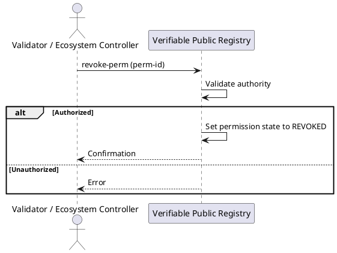

import Tabs from '@theme/Tabs';
import TabItem from '@theme/TabItem';

# Revoke a Permission

Invalidate an active permission. Revocation is typically used when a grantee violates the **Ecosystem Governance Framework (EGF)**, can no longer comply, or when the validator/controller decides to remove the authorization.

**Who can run this?**
- The **validator** that granted/validated the permission, or
- The **Ecosystem controller** (root permission holder for the schema).

**Effects**
- The permission state is set to **REVOKED** immediately.
- **No funds are moved by this action**. Trust deposits remain as is. Use **Slash** if you need to deduct funds, or **Termination** to end a permission and free eligible deposits.

## Message Parameters

| Name    | Description                             | Mandatory |
|---------|------------------------------------------|-----------|
| perm-id | Numeric ID of the permission to revoke   | yes       |

## Post the Message

<Tabs>
  <TabItem value="cli" label="CLI" default>

### Usage

```bash
veranad tx perm revoke-perm <perm-id> \
  --from <validator-or-controller-account> --chain-id <chain-id> --keyring-backend test --fees <amount> --gas auto --node $NODE_RPC
```

### Copy‑pasteable example

```bash
USER_ACC="mat-test-acc"
CHAIN_ID="vna-testnet-1"
NODE_RPC=http://node1.testnet.verana.network:26657
PERM_ID=10

veranad tx perm revoke-perm $PERM_ID \
  --from $USER_ACC --chain-id $CHAIN_ID --keyring-backend test --fees 600000uvna --gas auto --node $NODE_RPC
```

  </TabItem>

  <TabItem value="frontend" label="Frontend">
    :::todo
    When available in the UI, link and screenshots will be added here.
    :::
  </TabItem>
</Tabs>

## Verify on chain

```bash
veranad q perm list-permissions --node $NODE_RPC --output json \
| jq '.permissions[] | select(.id == "'$PERM_ID'")'
```
Expected: `"status": "REVOKED"` (or `vp_state`/status field reflecting revocation in your build).

## Flow



## See also
- [Slash a permission deposit](./slash-a-permission)
- [Repay a slashed permission deposit](./repay-a-slashed-permission-deposit)
- [Request permission termination](./request-permission-termination)