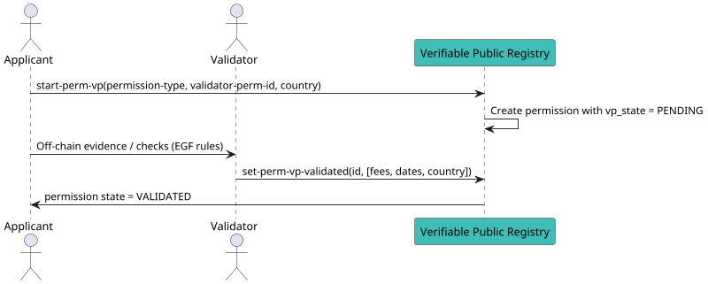

# Run a Validation Process to Obtain a Permission

This method is used by any **applicant** who wants to join an ecosystem’s **credential schema** when self‑creation is **not** allowed (schema mode ≠ `OPEN`), or when a validator charges `validation_fees` (e.g., some Holder flows).

Refer to the [learn section](../../../learn/verifiable-public-registry/onboarding-participants) for background on validation processes.

---

## When do you need a validation process?

- If schema’s `issuer_perm_management_mode = ECOSYSTEM` → apply under the **root (ECOSYSTEM) permission** of that schema.  
- If schema’s `issuer_perm_management_mode = GRANTOR_VALIDATION` → apply under an **ISSUER_GRANTOR** permission.  
- If schema’s `verifier_perm_management_mode = ECOSYSTEM` → apply under the **root (ECOSYSTEM) permission**.  
- If schema’s `verifier_perm_management_mode = GRANTOR_VALIDATION` → apply under a **VERIFIER_GRANTOR** permission.  
- **Holder**: if the selected Issuer charges `validation_fees`, the Holder must run a validation process under that **Issuer**.

> In `OPEN` mode the applicant **self‑creates** the permission and does **not** run a validation process.

---

## What the chain does

- Creates a **permission entry** with `vp_state = PENDING`.
- Locks / accounts for any **trust deposit and fees** as defined by the ecosystem and validator settings.
- The permission becomes usable only **after** the validator sets it to **VALIDATED**.

---

## Prerequisites

- You know the **permission type** you’re applying for (issuer, verifier, issuer‑grantor, verifier‑grantor, holder).
- You have the **validator permission ID** to apply under (root / grantor / issuer).
- You have sufficient balance to cover **gas** (and any deposit/fees computed by policy).

To locate validator permissions:
```bash
veranad q perm list-permissions --node $NODE_RPC --output json | jq
```

---

## Message Parameters

| Name                | Description                                                                                      | Mandatory |
|---------------------|--------------------------------------------------------------------------------------------------|-----------|
| `permission-type`   | One of: `issuer`, `verifier`, `issuer-grantor`, `verifier-grantor`, `holder`                     | yes       |
| `validator-perm-id` | The **permission ID** of the validator you apply under (root/grantor/issuer depending on role)  | yes       |
| `country`           | Applicant’s ISO 3166‑1 **alpha‑2** country code                                                  | yes       |

---

## Post the Message

import Tabs from '@theme/Tabs';
import TabItem from '@theme/TabItem';

<Tabs>
  <TabItem value="cli" label="CLI" default>

### Usage
```bash
veranad tx perm start-perm-vp <permission-type> <validator-perm-id> <country> \
  --from <user> --chain-id <chain-id> --keyring-backend test --fees <amount> --gas auto --node $NODE_RPC
```

### Examples

**1) Apply as ISSUER_GRANTOR under the root (ECOSYSTEM) validator**
```bash
VALIDATOR_PERM_ID=2   # ecosystem root perm for schema 5
veranad tx perm start-perm-vp issuer-grantor $VALIDATOR_PERM_ID US \
  --from $USER_ACC --chain-id $CHAIN_ID --keyring-backend test --fees 600000uvna --gas auto --node $NODE_RPC
```

**2) Apply as ISSUER under the ISSUER_GRANTOR**
```bash
VALIDATOR_PERM_ID=2   # issuer-grantor perm id
veranad tx perm start-perm-vp issuer $VALIDATOR_PERM_ID US \
  --from $USER_ACC --chain-id $CHAIN_ID --keyring-backend test --fees 600000uvna --gas auto --node $NODE_RPC
```


**3) Apply as VERIFIER under a VERIFIER_GRANTOR**
```bash
VALIDATOR_PERM_ID=41  # verifier-grantor perm id
veranad tx perm start-perm-vp verifier $VALIDATOR_PERM_ID GB \
  --from $USER_ACC --chain-id $CHAIN_ID --keyring-backend test --fees 600000uvna --gas auto --node $NODE_RPC
```

**4) Holder applies under an ISSUER that charges validation fees**
```bash
ISSUER_PERM_ID=55
veranad tx perm start-perm-vp holder $ISSUER_PERM_ID FR \
  --from $USER_ACC --chain-id $CHAIN_ID --keyring-backend test --fees 600000uvna --gas auto --node $NODE_RPC
```

<!-- :::tip Known CLI quirk (if you hit an error)
If your binary rejects the string `permission-type`, try the numeric enum as a **fallback**:
`issuer=1`, `verifier=2`, `issuer-grantor=3`, `verifier-grantor=4`, `ecosystem=5`, `holder=6`.
::: -->

  </TabItem>

  <TabItem value="frontend" label="Frontend">
The frontend will surface this flow once validation features are fully exposed. For now, use the CLI.
  </TabItem>
</Tabs>

---

## Verify the request was recorded

Filter by your account and look for a newly created permission with `vp_state = "VALIDATION_STATE_PENDING"`:

```bash
veranad q perm list-permissions --node $NODE_RPC --output json \
| jq '.permissions[] | select(.grantee == "'$USER_ACC_LIT'")'
```

(You can also inspect the tx hash printed by the CLI to retrieve the created ID.)

---

## Off‑chain interaction

After submitting the request, contact the **validator’s DID** (e.g., via DIDComm or the channel specified in the EGF) to provide evidence and complete checks (KYC/compliance, capability proofs, etc.).

When satisfied, the validator must call **Set Permission to Validated** to activate your permission:
- [Set Permission to Validated](./set-permission-to-validated)

---

## Flow Diagram



- End of file.
