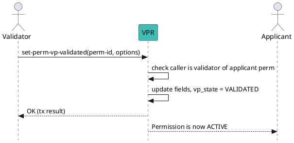

import Tabs from '@theme/Tabs';
import TabItem from '@theme/TabItem';

# Set Permission to Validated

Finalize a **validation process (VP)** by setting the applicant’s permission to `VALIDATED`.  
This activates the permission so the grantee can operate (issue / verify / grant) under the target **Credential Schema**.

:::tip Who can run this?
This method **must** be executed by the **validator** of the applicant permission:
- the Ecosystem controller (root **ECOSYSTEM** permission) **or**
- a relevant **Grantor** (ISSUER_GRANTOR / VERIFIER_GRANTOR) that the applicant chose when starting the VP.
:::

---

## Preconditions

- The target permission exists and its validation process (`vp_state`) is `PENDING` (first-time) or `PENDING_RENEWAL` (renewal).
- You are the **grantee** of the validator permission recorded in the applicant permission (`validator_perm_id`).
- Your account has enough balance to cover gas/fees.

---

## Message Parameters

| Name | Flag | Description | Mandatory |
|---|---|---|---|
| Permission ID | _(positional)_ | ID of the applicant permission to validate. | Yes |
| Effective Until | `--effective-until` | RFC3339 timestamp when the permission expires (exclusive). Omit for “no expiry”. | No |
| Country | `--country` | ISO‑3166‑1 alpha‑2 country code for the applicant permission (overrides requested value if provided). | No |
| Validation Fees | `--validation-fees` | Fee (trust units) paid by a Holder to the Issuer when a **validation process** runs. Only for **ISSUER** perms. | No |
| Issuance Fees | `--issuance-fees` | Fee (trust units) applied on **issuance** actions. Only for **ISSUER** perms. | No |
| Verification Fees | `--verification-fees` | Fee (trust units) paid by a **Verifier** to an **Issuer** when verifying a credential of this schema. Only for **ISSUER** perms. | No |
| VP Summary Digest (SRI) | `--vp-summary-digest-sri` | Optional digest (e.g., `sha384-...`) of the off-chain validation summary kept for audit. | No |

> Notes  
> - Fees you set here become the **effective** fees for this permission and will be used by fee distribution and trust-deposit logic.  
> - For **VERIFIER** permissions, fee flags are ignored.

---

## Post the Message

<Tabs>
  <TabItem value="cli" label="CLI" default>

### Usage

```bash
veranad tx perm set-perm-vp-validated <perm-id> \
  --from $VALIDATOR_ACC \
  --chain-id $CHAIN_ID \
  --keyring-backend test \
  --fees 600000uvna \
  --gas auto \
  --node $NODE_RPC \
  [--effective-until 2026-12-31T23:59:59Z] \
  [--country US] \
  [--validation-fees 1000000] \
  [--issuance-fees 500000] \
  [--verification-fees 200000] \
  [--vp-summary-digest-sri sha384-BASE64...]
```

### Example — Minimal

```bash
VALIDATOR_ACC=test-acc
PERM_ID=101
veranad tx perm set-perm-vp-validated $PERM_ID \
  --from $VALIDATOR_ACC --chain-id $CHAIN_ID \
  --keyring-backend test --fees 600000uvna --gas auto --node $NODE_RPC
```

### Example — Set expiry and fees (Issuer perm)

```bash
PERM_ID=101
veranad tx perm set-perm-vp-validated $PERM_ID \
  --effective-until 2026-09-01T00:00:00Z \
  --validation-fees 1000000 \
  --issuance-fees 500000 \
  --verification-fees 200000 \
  --country US \
  --vp-summary-digest-sri sha384-MzNNbQTWCSUSi0bbz7dbua+RcENv7C6FvlmYJ1Y+I727HsPOHdzwELMYO9Mz68M26 \
  --from $VALIDATOR_ACC --chain-id $CHAIN_ID \
  --keyring-backend test --fees 600000uvna --gas auto --node $NODE_RPC
```

  </TabItem>

  <TabItem value="verify" label="Verify Result">

After broadcasting, confirm the permission is **validated**:

```bash
PERM_ID=101
veranad q perm list-permissions --node $NODE_RPC --output json \
| jq '.permissions[] | select(.id == "'$PERM_ID'")'
```


Check that:

<ul>
  <li><code>.vp_state == "VALIDATION_STATE_VALIDATED"</code></li>
  <li>Optional fields reflect what you set (e.g., <code>.effective_until</code>, fee fields).</li>
</ul>


  </TabItem>
</Tabs>

---

## What This Changes On-Chain

- Sets `vp_state` → `VALIDATED`.
- Updates optional fields you provided (expiry, fees, country).
- Permission becomes **active** for its role:
  - **ISSUER** can issue credentials (subject to fee model).
  - **VERIFIER** can request presentations.
  - **GRANTOR** can validate others.

---

## Flow (Validator completes VP)



---

## Troubleshooting

- **not authorized / permission denied** → The signer is not the recorded validator (`validator_perm_id`) for the applicant permission. Use the correct validator account.
- **invalid timestamp** → Ensure RFC3339 format and `effective-until` is after the current time (and after `effective-from` if it was set previously).
- **fees ignored on VERIFIER** → Only **ISSUER** permissions carry validation/issuance/verification fees.