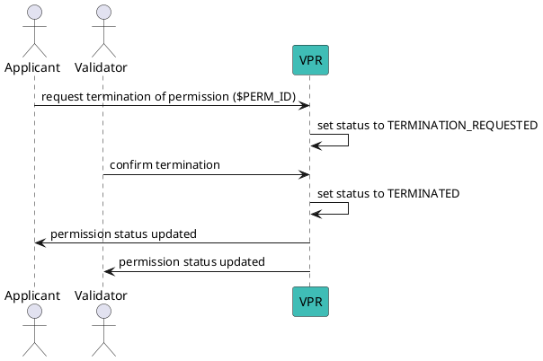

# Confirm Permission Termination

This method is called by a validator to confirm the termination of a vp when permission type is HOLDER, usually after revoking (or not) the verifiable credential of the holder. It can be although called by the grantee after a timeout, defined in GlobalVariables.validation_term_requested_timeout_days.

Fully terminating a permission is required to free the associated trust deposits.

## Flow Diagram



## Message Parameters

|Name               |Description                            |Mandatory|
|-------------------|---------------------------------------|--------|

:::tip[TODO]
@matlux
:::

## Post the Message

import Tabs from '@theme/Tabs';
import TabItem from '@theme/TabItem';

<Tabs>
  <TabItem value="cli" label="CLI" default>

### Usage

```bash
veranad tx perm confirm-vp-termination <perm-id> --from <user> --chain-id <chain-id> --keyring-backend test --fees <amount> --gas auto --node $NODE_RPC
```

:::tip[TODO]
@matlux
:::

### Example

```bash
veranad tx perm confirm-vp-termination $PERM_ID --from $USER_ACC --chain-id $CHAIN_ID --keyring-backend test --fees 600000uvna --node $NODE_RPC
```

:::tip[TODO]
@matlux
:::

  </TabItem>
  
  <TabItem value="frontend" label="Frontend">
    :::tip
    TODO: describe here
    :::
  </TabItem>
</Tabs>
