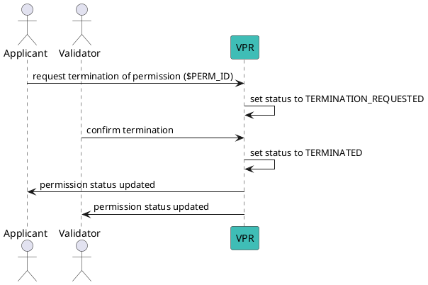
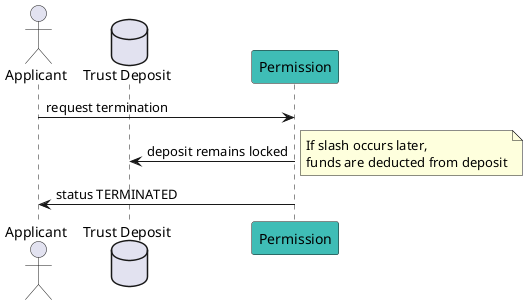
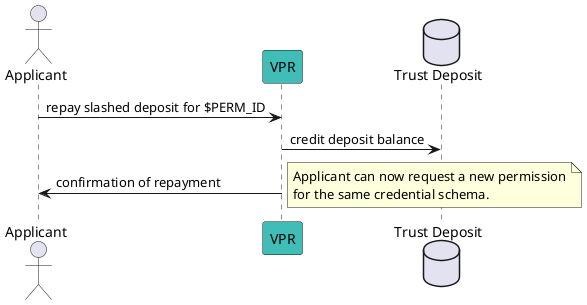

# Terminate a Permission

## Overview

Permission termination is the process of **ending the validity of an existing permission** in the ecosystem.  
This may occur in two scenarios:

- **Applicant-Initiated Termination**: The holder of the permission requests its termination.
- **Validator Confirmation**: The validator or trust registry controller approves and confirms termination.

Once terminated, the permission **cannot be reactivated**. A new validation process will be required to regain the permission.

---

## Prerequisites

- You must know the **Permission ID** of the permission to terminate.
- You must have the **appropriate role**:
  - Applicant: Can request termination.
  - Validator (or Ecosystem controller): Confirms termination.
- Ensure your environment variables are set:

```bash
USER_ACC="mat-test-acc"
CHAIN_ID="vna-testnet-1"
NODE_RPC=http://node1.testnet.verana.network:26657
```

Set the Permission ID for reuse in commands:

```bash
PERM_ID=10
```

---

## Termination Flow



---

## 1. Request Permission Termination (Applicant)

**Syntax:**
```bash
veranad tx perm request-vp-termination <perm-id> --from <user> --chain-id <chain-id> --keyring-backend test --fees <amount> --gas auto
```

**Example:**
```bash
veranad tx perm request-vp-termination $PERM_ID --from $USER_ACC --chain-id $CHAIN_ID --keyring-backend test --fees 600000uvna --node $NODE_RPC
```

---

## 2. Confirm Permission Termination (Validator)

**Syntax:**
```bash
veranad tx perm confirm-vp-termination <perm-id> --from <user> --chain-id <chain-id> --keyring-backend test --fees <amount> --gas auto
```

**Example:**
```bash
veranad tx perm confirm-vp-termination $PERM_ID --from $USER_ACC --chain-id $CHAIN_ID --keyring-backend test --fees 600000uvna --node $NODE_RPC
```

---

## 3. Verify Termination Status

```bash
veranad q perm list-permissions --node $NODE_RPC --output json | jq '.permissions[] | select(.id == "'$PERM_ID'")'
```

**Example Output:**
```json
{
  "id": "10",
  "schema_id": "5",
  "grantee": "verana1sxau0xyttphpck7vhlvt8s82ez70nlzw2mhya0",
  "status": "TERMINATED",
  "type": "ISSUER"
}
```

---

## Trust Deposit Implications

When a permission is terminated:
- Any **linked trust deposit remains in place**.
- If the permission was previously slashed, funds remain deducted.
- To regain rights, the applicant must **repay any slashed deposits** and start a new validation process.

### Diagram



---

## Repay a Slashed Permission Deposit

When a permission is slashed, it **cannot be reused**. Before applying for a new permission, you must **repay the slashed deposit**.

**Syntax:**
```bash
veranad tx perm repay-perm-slashed-td <perm-id> --from <user> --chain-id <chain-id> --keyring-backend test --fees <amount> --gas auto
```

**Example:**
```bash
veranad tx perm repay-perm-slashed-td $PERM_ID --from $USER_ACC --chain-id $CHAIN_ID --keyring-backend test --fees 600000uvna --node $NODE_RPC
```

**Notes:**
- This does **not reactivate the permission**.
- It is a prerequisite for **requesting a new permission** for the same schema.

---

### Repay Flow Diagram



---
