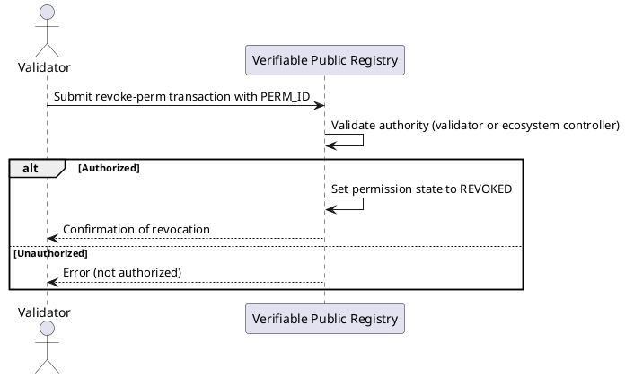

# Revoke a Permission

Permission revocation is the process of invalidating an active permission within an ecosystem. This action is usually performed by:

- A validator who granted the permission during a validation process.
- The ecosystem trust registry controller.

Typical scenarios for revocation include:

- Violation of ecosystem governance framework (EGF) rules.
- Grantee is unable to continue to comply with the EGF.
- Misuse of permissions by the grantee.
- Unilateral decision from validator or trust registry controller.

## Flow Diagram



## Message Parameters

|Name               |Description                            |Mandatory|
|-------------------|---------------------------------------|--------|
|perm-id| Numeric ID of the permission whose deposit you want to slash. | yes |
|amount| Amount to slash (must be less than or equal to the current permission deposit). | yes |

:::tip[TODO]
@matlux
:::

## Post the Message

import Tabs from '@theme/Tabs';
import TabItem from '@theme/TabItem';

<Tabs>
  <TabItem value="cli" label="CLI" default>

### Usage

```bash
veranad tx perm revoke-perm <perm-id> --from <user> --chain-id <chain-id> --keyring-backend test --fees <amount> --gas auto
```

### Example

```bash
PERM_ID=10
veranad tx perm revoke-perm $PERM_ID --from $USER_ACC --chain-id $CHAIN_ID --keyring-backend test --fees 600000uvna --node $NODE_RPC
```

  </TabItem>
  
  <TabItem value="frontend" label="Frontend">
    :::tip
    TODO: describe here
    :::
  </TabItem>
</Tabs>
