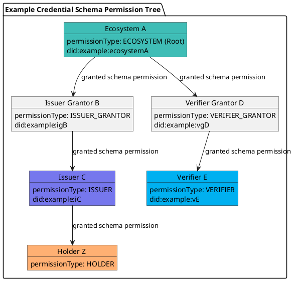

# Revoke a Permission

Revocation invalidates an existing permission. According to the spec, this method can be called by **one of three actors**:

- An **ancestor validator** in the permission branch (up to the root ECOSYSTEM permission).
- The **grantee** (self‑revocation), regardless of schema mode (OPEN, GRANTOR, ECOSYSTEM).
- The **Trust Registry controller** (owner of the credential schema).

---

## Preconditions

### Basic checks
- `id` (uint64) is provided.
- Load `Permission` entry `applicant_perm` from `id`; it must exist.
- `applicant_perm` is a **valid permission** (not terminated or otherwise invalid).

### Advanced checks (one of the three must be true)

**Option #1 — Ancestor validator**

If `applicant_perm.validator_perm_id` is defined:
1. Set `validator_perm = applicant_perm`.
2. While `validator_perm.validator_perm_id` is defined:
   - Load `validator_perm` from `validator_perm.validator_perm_id`.
   - If `validator_perm` is a valid permission **and** `validator_perm.grantee` equals the account executing the method → **allowed**.
3. If none matched → **not allowed**.

**Option #2 — Trust Registry controller**
1. Load `CredentialSchema` `cs` from `applicant_perm.schema_id`.
2. Load `TrustRegistry` `tr` from `cs.tr_id`.
3. If caller equals `tr.controller` → **allowed**, else **not allowed**.

**Option #3 — Grantee**
- Caller equals `applicant_perm.grantee` → **allowed**.

### Fees
- The caller must have sufficient gas/fees; otherwise the transaction aborts.

---

## Effects (execution)
When preconditions pass, the transaction performs:
- Define `now` (current timestamp).
- Load `applicant_perm` from `id`.
- Set:
  - `applicant_perm.revoked = now`
  - `applicant_perm.modified = now`
  - `applicant_perm.revoked_by = <caller account>`

> Note: Per the current spec, revocation **does not** adjust deposits in this method.

---

## CLI

### Usage
```bash
veranad tx perm revoke-perm <perm-id> \
  --from <user> --chain-id <chain-id> --keyring-backend test \
  --fees <amount> --gas auto --node $NODE_RPC
```

### Example
```bash
PERM_ID=10
veranad tx perm revoke-perm $PERM_ID --from $USER_ACC --chain-id $CHAIN_ID \
  --keyring-backend test --fees 600000uvna --node $NODE_RPC
```

### Verify on chain
```bash
veranad q perm list-permissions --node $NODE_RPC --output json \
| jq '.permissions[] | select(.id == "'$PERM_ID'")'
```
Check that `revoked` is set and `revoked_by` matches the caller.

---

## Who can revoke? (Example tree)


---

## See also
- [Create a root permission](./create-a-root-permission)
- [Slash a permission deposit](./slash-a-permission)
- [Request permission termination](./request-permission-termination)