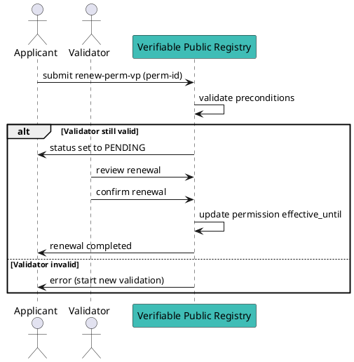

# Renew (Extend) a Permission

Renewing a permission allows the grantee to **extend its validity** without creating a new permission or restarting the full onboarding process. This is useful when the current permission is about to expire but the validator relationship remains valid.

## Preconditions

- You must be the **grantee** of the permission.
- The permission must be in state `VALIDATED`.
- The original validator permission must still be valid (not terminated, not revoked).
- Renewal will **not change**:
  - country
  - validation fees
  - issuance or verification fees

If any of these need to change, you must start a **new validation process**.

## Flow Diagram



## Message Parameters

|Name               |Description                            |Mandatory|
|-------------------|---------------------------------------|--------|
|perm-id| Numeric ID of the permission you want to renew. | yes |

:::tip[TODO]
@matlux
:::

## Post the Message

import Tabs from '@theme/Tabs';
import TabItem from '@theme/TabItem';

<Tabs>
  <TabItem value="cli" label="CLI" default>

### Usage

```bash
veranad tx perm renew-perm-vp <perm-id> --from <user> --chain-id <chain-id> --keyring-backend test --fees <amount> --gas auto --node $NODE_RPC
```

### Example

```bash
PERM_ID=10
veranad tx perm renew-perm-vp $PERM_ID --from $USER_ACC --chain-id $CHAIN_ID --keyring-backend test --fees 600000uvna --node $NODE_RPC
```

Verify renewal status:

```bash
veranad q perm list-permissions --node $NODE_RPC --output json | jq '.permissions[] | select(.id == "'$PERM_ID'")'
```

  </TabItem>
  
  <TabItem value="frontend" label="Frontend">
    :::tip
    TODO: describe here
    :::
  </TabItem>
</Tabs>
