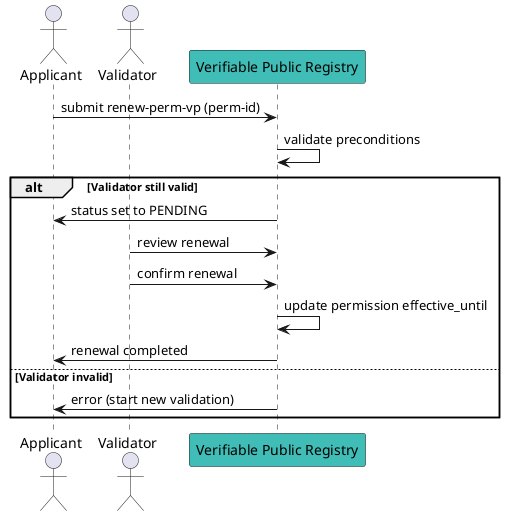

# Renew (Extend) a Permission

Renewing a permission allows the grantee to **extend its validity** without creating a new permission or restarting the full onboarding process. This is useful when the current permission is about to expire but the validator relationship remains valid.

:::warning Prerequisites
1. **Group account (authority)** — You need a [Cosmos SDK group account](https://docs.cosmos.network/v0.50/build/modules/group) that owns the permission to renew.
2. **Operator authorization** — Your operator account must be granted authorization for `MsgRenewPermVp` by the authority. See [Grant Operator Authorization](../delegation/grant-operator-authorization).
3. **Permission in VALIDATED state** — The permission must currently be `VALIDATED`. Renewal is not available for TERMINATED, REVOKED, or PENDING states.
4. **Original validator still valid** — The validator permission (`validator_perm_id`) must still be active (not terminated or revoked).
5. **Fields not changing** — Renewal preserves country, validation fees, issuance fees, and verification fees. To change any of these, start a new validation process instead.
:::

This is a **delegable** message — it requires an `authority` (group account) and can be executed by an authorized `operator`.

## Flow Diagram


```plantuml
@startuml
actor "Applicant" as applicant
actor "Validator" as validator
participant "Verifiable Public Registry" as VPR #3fbdb6

applicant -> VPR: submit renew-perm-vp (perm-id)
VPR -> VPR: validate preconditions
alt Validator still valid
    VPR -> applicant: status set to PENDING
    validator -> VPR: review renewal
    validator -> VPR: confirm renewal
    VPR -> VPR: update permission effective_until
    VPR -> applicant: renewal completed
else Validator invalid
    VPR -> applicant: error (start new validation)
end
@enduml
```

## Message Parameters

|Name               |Description                            |Mandatory|
|-------------------|---------------------------------------|--------|
|perm-id| Numeric ID of the permission you want to renew. | yes |

## Post the Message

import Tabs from '@theme/Tabs';
import TabItem from '@theme/TabItem';

<Tabs>
  <TabItem value="cli" label="CLI" default>

### Usage

```bash
veranad tx perm renew-perm-vp <perm-id> \
  --authority <group-account> \
  --from <operator-account> --chain-id <chain-id> --keyring-backend test --fees <amount> --gas auto --node $NODE_RPC
```

### Example

```bash
PERM_ID=10
veranad tx perm renew-perm-vp $PERM_ID \
  --authority $AUTHORITY_ACC \
  --from $OPERATOR_ACC --chain-id $CHAIN_ID --keyring-backend test --fees 600000uvna --node $NODE_RPC
```

Verify renewal status:

```bash
veranad q perm list-permissions --node $NODE_RPC --output json | jq '.permissions[] | select(.id == "'$PERM_ID'")'
```

  </TabItem>
  
  <TabItem value="frontend" label="Frontend">
    :::tip
    TODO: describe here
    :::
  </TabItem>
</Tabs>
