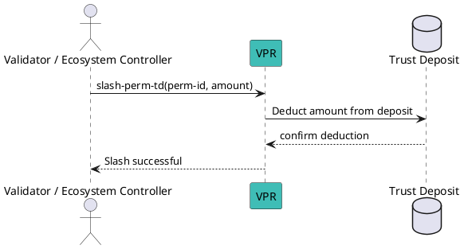

# Slash a Permission Deposit

The Trust Deposit linked to a Permission can be slashed by:

- the validator that granted the Permission;
- the ecosystem trust registry controller (the controller of the root permission of this credential schema).

**Notes:**

- The slashed amount is burned and cannot be recovered.
- Ensure sufficient transaction fees are available before executing.

## Flow Diagram



## Message Parameters

|Name               |Description                            |Mandatory|
|-------------------|---------------------------------------|--------|
|perm-id| Numeric ID of the permission whose deposit you want to slash. | yes |
|amount| Amount to slash (must be less than or equal to the current permission deposit). | yes |

::tip[TODO]
@matlux
:::

## Post the Message

import Tabs from '@theme/Tabs';
import TabItem from '@theme/TabItem';

<Tabs>
  <TabItem value="cli" label="CLI" default>

### Usage

```bash
veranad tx perm slash-perm-td <perm-id> <amount> --from <user> --chain-id <chain-id> --keyring-backend test --fees <amount> --gas auto
```

### Example

```bash
veranad tx perm slash-perm-td 42 1000000 --from $USER_ACC --chain-id $CHAIN_ID --keyring-backend test --fees 600000uvna --node $NODE_RPC
```

  </TabItem>
  
  <TabItem value="frontend" label="Frontend">
    :::todo
    TODO: describe here
    :::
  </TabItem>
</Tabs>

