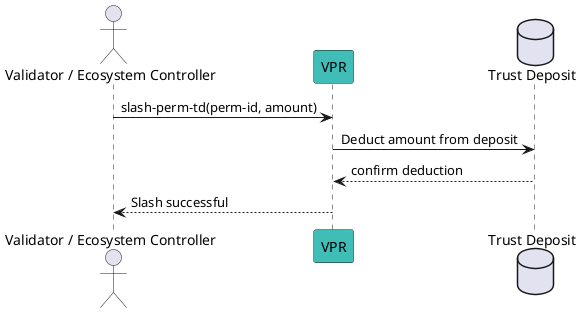

# Slash a Permission Deposit

The Trust Deposit linked to a Permission can be slashed by:

- the validator that granted the Permission;
- the ecosystem trust registry controller (the controller of the root permission of this credential schema).

:::warning Prerequisites
1. **Group account (authority)** — You need a [Cosmos SDK group account](https://docs.cosmos.network/v0.50/build/modules/group) that controls the validator permission or the Trust Registry owning the credential schema.
2. **Operator authorization** — Your operator account must be granted authorization for `MsgSlashPermTd` by the authority. See [Grant Operator Authorization](../delegation/grant-operator-authorization).
3. **Existing permission with deposit** — The permission must exist and have a trust deposit balance sufficient to cover the slash amount.
:::

This is a **delegable** message — it requires an `authority` (group account) and can be executed by an authorized `operator`.

**Notes:**

- The slashed amount is burned and cannot be recovered.
- Ensure sufficient transaction fees are available before executing.

## Flow Diagram


```plantuml
@startuml
scale max 800 width
actor "Validator / Ecosystem Controller" as actor
participant "VPR" as vpr #3fbdb6
database "Trust Deposit" as td

actor -> vpr: slash-perm-td(perm-id, amount)
vpr -> td: Deduct amount from deposit
td --> vpr: confirm deduction
vpr --> actor: Slash successful
@enduml
```

## Message Parameters

|Name               |Description                            |Mandatory|
|-------------------|---------------------------------------|--------|
|perm-id| Numeric ID of the permission whose deposit you want to slash. | yes |
|amount| Amount to slash (must be less than or equal to the current permission deposit). | yes |
|`--authority`| Group account (authority) on whose behalf this message is executed. | yes |

## Post the Message

import Tabs from '@theme/Tabs';
import TabItem from '@theme/TabItem';

<Tabs>
  <TabItem value="cli" label="CLI" default>

### Usage

```bash
veranad tx perm slash-perm-td <perm-id> <amount> \
  --authority <group-account> \
  --from <operator-account> --chain-id <chain-id> --keyring-backend test --fees <amount> --gas auto --node $NODE_RPC
```

### Example

```bash
veranad tx perm slash-perm-td 42 1000000 \
  --authority $AUTHORITY_ACC \
  --from $OPERATOR_ACC --chain-id $CHAIN_ID --keyring-backend test --fees 600000uvna --node $NODE_RPC
```

  </TabItem>
  
  <TabItem value="frontend" label="Frontend">
    :::tip
    TODO: describe here
    :::
  </TabItem>
</Tabs>

