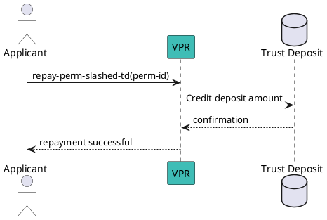

# Repay a Slashed Permission Deposit

This method can only be called by the authority that owns the permission to repay the deposit of a slashed perm. This won’t make the perm re-usable: it will be needed for the grantee to request a new permission, as slashed permissions cannot be revived (same happen for revoked, etc…).

Nevertheless, to get a new permission for a given ecosystem, it is needed, using this method, to repay the deposit of a slashed permission first.

:::warning Prerequisites
1. **Group account (authority)** — You need a [Cosmos SDK group account](https://docs.cosmos.network/v0.50/build/modules/group) that owns the slashed permission.
2. **Operator authorization** — Your operator account must be granted authorization for `MsgRepayPermSlashedTd` by the authority. See [Grant Operator Authorization](../delegation/grant-operator-authorization).
3. **Slashed permission** — The permission must have a slashed deposit balance. Repaying does not revive the permission; a new permission must be requested after repayment.
:::

This is a **delegable** message — it requires an `authority` (group account) and can be executed by an authorized `operator`.

## Flow Diagram


```plantuml
@startuml
scale max 800 width
actor "Applicant" as applicant
participant "VPR" as vpr #3fbdb6
database "Trust Deposit" as td

applicant -> vpr: repay-perm-slashed-td(perm-id)
vpr -> td: Credit deposit amount
td --> vpr: confirmation
vpr --> applicant: repayment successful
@enduml
```

## Message Parameters

|Name               |Description                            |Mandatory|
|-------------------|---------------------------------------|--------|
|perm-id| Numeric ID of the permission whose slashed deposit you want to repay. | yes |
|`--authority`| Group account (authority) that owns the permission. | yes |

## Post the Message

import Tabs from '@theme/Tabs';
import TabItem from '@theme/TabItem';

<Tabs>
  <TabItem value="cli" label="CLI" default>

### Usage

```bash
veranad tx perm repay-perm-slashed-td <perm-id> \
  --authority <group-account> \
  --from <operator-account> --chain-id <chain-id> --keyring-backend test --fees <amount> --gas auto --node $NODE_RPC
```

### Example

```bash
veranad tx perm repay-perm-slashed-td 42 \
  --authority $AUTHORITY_ACC \
  --from $OPERATOR_ACC --chain-id $CHAIN_ID --keyring-backend test --fees 600000uvna --node $NODE_RPC
```


  </TabItem>
  
  <TabItem value="frontend" label="Frontend">
    :::tip
    TODO: describe here
    :::
  </TabItem>
</Tabs>