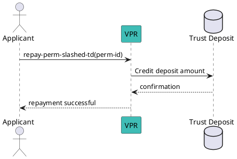

# Repay a Slashed Permission Deposit

This method can only be called by anyone that want to repay the deposit of a slashed perm. This won’t make the perm re-usable: it will be needed for the grantee to request a new permission, as slashed permissions cannot be revived (same happen for revoked, etc…).

Nevertheless, to get a new permission for a given ecosystem, it is needed, using this method, to repay the deposit of a slashed permission first.

## Flow Diagram



## Message Parameters

|Name               |Description                            |Mandatory|
|-------------------|---------------------------------------|--------|
|perm-id| Numeric ID of the permission whose deposit you want to slash. | yes |

:::tip
@matlux
:::

## Post the Message

import Tabs from '@theme/Tabs';
import TabItem from '@theme/TabItem';

<Tabs>
  <TabItem value="cli" label="CLI" default>

### Usage

```bash
veranad tx perm repay-perm-slashed-td <perm-id> --from <user> --chain-id <chain-id> --keyring-backend test --fees <amount> --gas auto --node $NODE_RPC
```

### Example

```bash
veranad tx perm repay-perm-slashed-td 42 --from $USER_ACC --chain-id $CHAIN_ID --keyring-backend test --fees 600000uvna --node $NODE_RPC
```


  </TabItem>
  
  <TabItem value="frontend" label="Frontend">
    :::tip
    TODO: describe here
    :::
  </TabItem>
</Tabs>