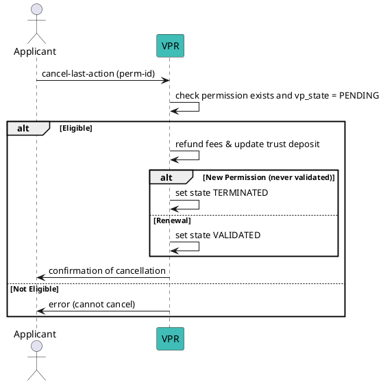

# Cancel Last Action


## Overview

The **Cancel Last Action** command allows an applicant to cancel a pending **validation process (VP)** for a permission before it is completed. This is useful in scenarios where:

- The applicant submitted incorrect details during validation.
- The validator has not yet completed their part, and the applicant wants to withdraw.
- The applicant wishes to stop the process to avoid additional trust deposit usage or fees.

When a validation process is canceled:
- If the process never completed, the permission entry is set to **TERMINATED**.
- If the process had previously been validated and was renewed, the permission state is reset to **VALIDATED**.
- Trust deposit and validation fees are refunded where applicable.

---

## CLI Command

**Syntax:**
```bash
veranad tx perm cancel-last-action <perm-id> --from <user> --chain-id <chain-id> --keyring-backend test --fees <amount> --gas auto
```

**Parameters:**
- `<perm-id>`: The numeric ID of the permission whose pending validation process is to be canceled.

**Example:**
```bash
PERM_ID=12
veranad tx perm cancel-last-action $PERM_ID --from $USER_ACC --chain-id $CHAIN_ID --keyring-backend test --fees 600000uvna --node $NODE_RPC
```

---

## Preconditions

- The permission must exist and belong to the applicant.
- Its validation process (`vp_state`) must be **PENDING**.
- The applicant must have sufficient funds to cover transaction fees.

---

## What Happens After Cancellation?

- If the validation process never reached VALIDATED state, the permission becomes **TERMINATED**.
- If it was previously validated and is currently in renewal (PENDING), the permission returns to **VALIDATED** state.
- Paid validation fees and trust deposit for the pending action are refunded.

---

## Flow Diagram



---

## Verification

Check the updated status of the permission:
```bash
veranad q perm list-permissions --node $NODE_RPC --output json | jq '.permissions[] | select(.id == "'$PERM_ID'")'
```

Expected status: `VALIDATED` (for renewals) or `TERMINATED` (if never validated).
