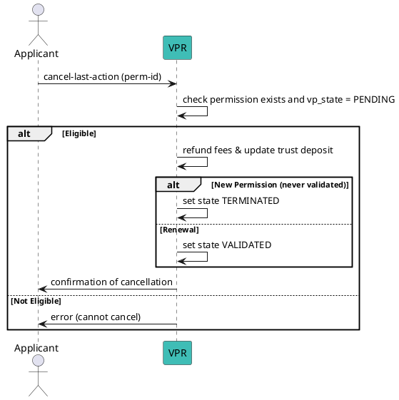

# Cancel Pending VP Request

The **Cancel Pending VP Request** command allows an applicant to cancel a pending **validation process (VP)** for a permission before it is completed. :::warning Prerequisites
1. **Group account (authority)** — You need a [Cosmos SDK group account](https://docs.cosmos.network/v0.50/build/modules/group) that owns the permission with the pending VP request.
2. **Operator authorization** — Your operator account must be granted authorization for `MsgCancelPermVpRequest` by the authority. See [Grant Operator Authorization](../delegation/grant-operator-authorization).
3. **Pending VP** — The permission must have `vp_state = PENDING` or `PENDING_RENEWAL`. Permissions in other states cannot be cancelled with this command.
:::

This is a **delegable** message — it requires an `authority` (group account) and can be executed by an authorized `operator`. This is useful in scenarios where:

- The applicant submitted incorrect details during validation.
- The validator has not yet completed their part, and the applicant wants to withdraw.
- The applicant wishes to stop the process to avoid additional trust deposit usage or fees.

When a validation process is canceled:

- If the process never completed, the permission entry is set to **TERMINATED**.
- If the process had previously been validated and was renewed, the permission state is reset to **VALIDATED**.
- Trust deposit and validation fees are refunded where applicable.

## Flow Diagram


```plantuml
@startuml
scale max 800 width
actor "Applicant" as applicant
participant "VPR" as vpr #3fbdb6

applicant -> vpr: cancel-last-action (perm-id)
vpr -> vpr: check permission exists and vp_state = PENDING
alt Eligible
    vpr -> vpr: refund fees & update trust deposit
    alt New Permission (never validated)
        vpr -> vpr: set state TERMINATED
    else Renewal
        vpr -> vpr: set state VALIDATED
    end
    applicant <- vpr: confirmation of cancellation
else Not Eligible
    applicant <- vpr: error (cannot cancel)
end
@enduml
```

## Message Parameters

|Name               |Description                            |Mandatory|
|-------------------|---------------------------------------|--------|
|perm-id| Numeric ID of the permission for which you want to cancel the current validation process. | yes |
|`--authority`| Group account (authority) on whose behalf this message is executed. | yes |

## Post the Message

import Tabs from '@theme/Tabs';
import TabItem from '@theme/TabItem';

<Tabs>
  <TabItem value="cli" label="CLI" default>

### Usage

```bash
veranad tx perm cancel-perm-vp-request <perm-id> \
  --authority <group-account> \
  --from <operator-account> --chain-id <chain-id> --keyring-backend test --fees <amount> --gas auto --node $NODE_RPC
```

### Example

```bash
PERM_ID=12
veranad tx perm cancel-perm-vp-request $PERM_ID \
  --authority $AUTHORITY_ACC \
  --from $OPERATOR_ACC --chain-id $CHAIN_ID --keyring-backend test --fees 600000uvna --node $NODE_RPC
```

Check the updated status of the permission:
```bash
veranad q perm list-permissions --node $NODE_RPC --output json | jq '.permissions[] | select(.id == "'$PERM_ID'")'
```

Expected status: `VALIDATED` (for cancelation of a renewal) or `TERMINATED` (if never validated).

  </TabItem>
  
  <TabItem value="frontend" label="Frontend">
    :::tip
    TODO: describe here
    :::
  </TabItem>
</Tabs>
