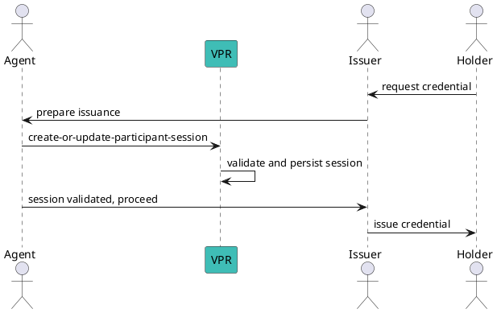

import Tabs from '@theme/Tabs';
import TabItem from '@theme/TabItem';

# Create or Update Participant Session

Before issuing a credential or requesting a presentation, if payment is required, the acting party must first create a transaction that proves the payment took place, using the `sessionId` shared by the peer (`MOD-PP-MSG-10`, `MsgCreateOrUpdateParticipantSession`).

Use [find-beneficiaries](./find-beneficiaries) first to compute the trust fees and confirm your account has enough balance (including gas) to execute the transaction.

:::warning Prerequisites
This is a **delegable** transaction executed on behalf of a Corporation, typically signed by the **VS operator**. Before running it you need:
1. A **Corporation** (`policy_address`) that owns the acting Verifiable Service — see [Create a Corporation](../../corporation/create-a-corporation).
2. The policy (or VS operator) funded with `uvna` for fees and trust fees.
3. Authorization for `/verana.pp.v1.MsgCreateOrUpdateParticipantSession` — granted to the VS operator via the participant's VS-operator authorization or via [Grant Operator Authorization](../../corporation/delegation/grant-operator-authorization).

Sign with `--from <operator>` and pass the corporation with `--corporation <policy_address>`.
:::

## Message Parameters

| Name | Description | Mandatory |
|------|-------------|-----------|
| `id` | UUID of the peer's sessionId for which to create/update the session. | yes |
| `--issuer-participant-id <uint>` | Issuer participant ID (issuance). | conditional |
| `--verifier-participant-id <uint>` | Verifier participant ID (verification). | conditional |
| `--agent-participant-id <uint>` | Agent participant ID — set **only** when the peer is a Verifiable User Agent. | no |
| `--wallet-agent-participant-id <uint>` | Wallet agent participant ID — set **only** when the peer is a Verifiable User Agent. | no |
| `--digest <string>` | Optional digest derived from the issued or verified credential. | no |
| `--corporation` | `policy_address` of the acting Corporation. | yes |

**At least one** of `--issuer-participant-id` or `--verifier-participant-id` must be provided.

## Post the Message

<Tabs>
  <TabItem value="cli" label="CLI" default>

### Usage

```bash
veranad tx pp create-or-update-participant-session [id] \
  --issuer-participant-id <id> | --verifier-participant-id <id> \
  [--agent-participant-id <id>] [--wallet-agent-participant-id <id>] \
  --corporation <policy_address> \
  --from <operator> --chain-id <chain-id> --keyring-backend test --fees 750000uvna --gas auto --node $NODE_RPC
```

### Issuance example

```bash
CORPORATION=verana1n64en27u7qckklkk4twkkun5h6v5dsur7g6l4pfmfhydvfru9upq5w4nlu
VS_OPERATOR=verana16mzeyu9l6kua2cdg9x0jk5g6e7h0kk8q6uadu4
SESSION_ID=d9f96456-fe25-46a2-b115-4a6198b1bf7d

veranad tx pp create-or-update-participant-session $SESSION_ID \
  --issuer-participant-id 6 \
  --agent-participant-id 8 --wallet-agent-participant-id 8 \
  --corporation $CORPORATION \
  --from $VS_OPERATOR --chain-id $CHAIN_ID --keyring-backend test --fees 750000uvna --gas auto --node $NODE_RPC --yes
```

### Real result

Succeeds with `code: 0` and emits `create_update_csps` (txhash `5EA754A78D890680BDB217A55808FB3DD2E2A01C20AAAFCCD6D7BDA29C7EE2B3`). The journey verified: "session ID d9f96456-... with correct authority, agent participant ID 8, issuer participant ID 6".

```yaml
- type: message
  attributes:
  - key: action
    value: /verana.pp.v1.MsgCreateOrUpdateParticipantSession
- type: create_update_csps
  attributes:
  - key: corporation
    value: verana1n64en27u7qckklkk4twkkun5h6v5dsur7g6l4pfmfhydvfru9upq5w4nlu
  - key: operator
    value: verana16mzeyu9l6kua2cdg9x0jk5g6e7h0kk8q6uadu4
```

Re-running with the same session ID **updates** the session — appending a new session record (see [List Participant Sessions](./list-participant-sessions)).

### Verification example

```bash
veranad tx pp create-or-update-participant-session $(uuidgen) \
  --verifier-participant-id 6 \
  --corporation $CORPORATION \
  --from $VS_OPERATOR --chain-id $CHAIN_ID --keyring-backend test --fees 750000uvna --gas auto --node $NODE_RPC --yes
```

  </TabItem>

  <TabItem value="frontend" label="Frontend">
    :::tip
    TODO: When available in the UI, links and screenshots will be added here.
    :::
  </TabItem>
</Tabs>

## Verify

```bash
veranad query pp get-participant-session d9f96456-fe25-46a2-b115-4a6198b1bf7d --node $NODE_RPC --output json
```

See [Get Participant Session](./get-participant-session) for the full response structure.

## Flow (issuance)


