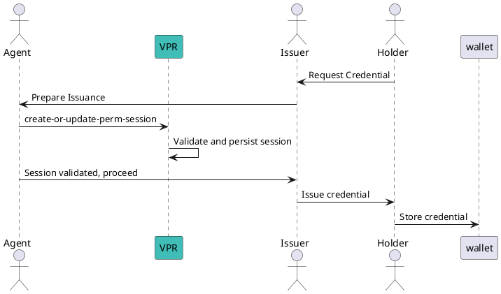
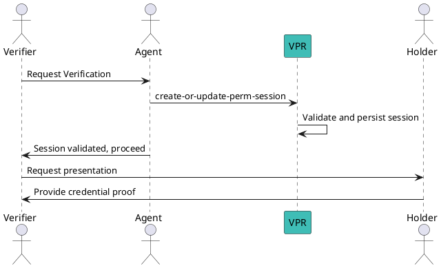

# Create or Update Permission Session

Before issuing the credential or requesting the presentation of a credential, if payment is required, the entity that would like to perform the action must first create a transaction to prove the payment took place, using the `sessionid` shared by the peer.

Anyone can use this method.

You must use the [find beneficiaries](find-beneficiaries) method first to calculate the needed trust fees and make sure your account has enough balance (including gas fees) to execute the transaction.

## Message Parameters

|Name               |Description                            |Mandatory|
|-------------------|---------------------------------------|--------|
|id| uuid of the sessionId of the peer for which we want to create the permission session | yes |
|agent-perm-id| id of the agent permission | yes |
|wallet-agent-perm-id| id of the wallet agent permission (can be equal to agent-perm-id) | yes |
|issuer-perm-id| id of the issuer permission | no |
|verifier-perm-id| id of the verifier permission | no |

**Important:** At least one of `issuer-perm-id` or `verifier-perm-id` must be provided.

:::tip[TODO]
@matlux
:::

## Post the Message

import Tabs from '@theme/Tabs';
import TabItem from '@theme/TabItem';

<Tabs>
  <TabItem value="cli" label="CLI" default>

### Usage

```
veranad tx perm create-or-update-perm-session [id] [agent-perm-id] [flags]
```

### Issuance Example



```bash
SESSION_ID=$(uuidgen)
veranad tx perm create-or-update-perm-session $SESSION_ID 45 --issuer-perm-id 30 --wallet-agent-perm-id 50 \
  --from $USER_ACC --keyring-backend test --chain-id $CHAIN_ID --fees 600000uvna --node $NODE_RPC
```

Explanation:
- `agent-perm-id` = 45 (Agent handling issuance).
- `wallet-agent-perm-id` = 50 (Wallet where credential will be stored).
- `issuer-perm-id` = 30 (Permission of the Issuer).

 ### Verification Example



```bash
SESSION_ID=$(uuidgen)
veranad tx perm create-or-update-perm-session $SESSION_ID 45 --verifier-perm-id 60 --wallet-agent-perm-id 50 \
  --from $USER_ACC --keyring-backend test --chain-id $CHAIN_ID --fees 600000uvna --node $NODE_RPC
```

Explanation:
- `agent-perm-id` = 45 (Agent handling verification).
- `wallet-agent-perm-id` = 50 (Wallet where credential will be stored).
- `verifier-perm-id` = 60 (Permission of the Verifier).

 </TabItem>
  
  <TabItem value="frontend" label="Frontend">
    :::tip
    TODO: describe here
    :::
  </TabItem>
</Tabs>
